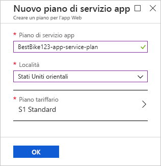
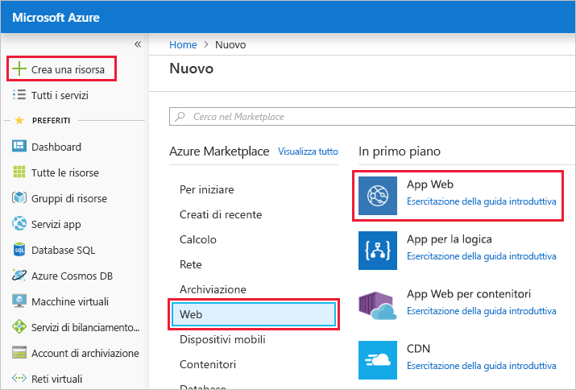
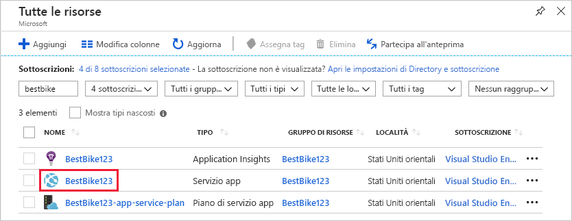
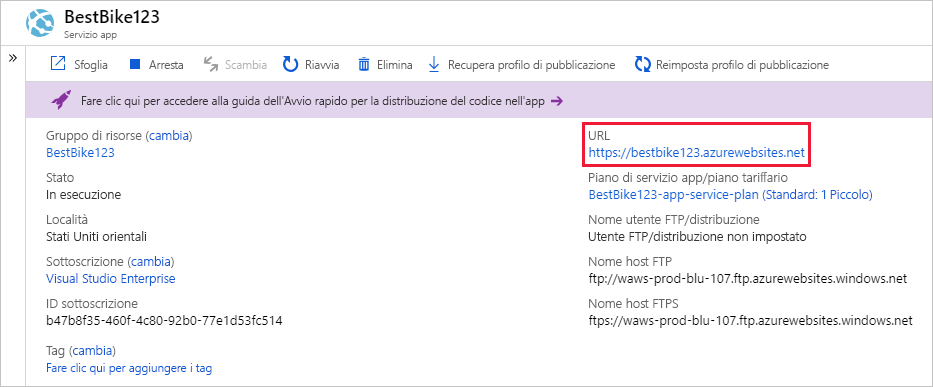

In questa unità si userà il portale di Azure per creare un'app Web.In this unit, you will use the Azure portal to create a web app.

[!include]

## Creare un'app WebCreate a web app

Accedere al [portale di Azure](https://portal.azure.com/learn.docs.microsoft.com?azure-portal=true) usando lo stesso account con cui è stato attivato l'ambiente sandbox.Sign into the [Azure portal](https://portal.azure.com/learn.docs.microsoft.com?azure-portal=true) using the same account you activated the sandbox with.

1. Fare clic sul collegamento **Crea una risorsa** nella parte superiore del riquadro di spostamento a sinistra.Click the **Create a resource** link at the top of the left-hand navigation. Tutti gli oggetti creati in Azure sono risorse.Everything you create on Azure is a resource.

1. Nel portale viene visualizzata la pagina **Marketplace**.The portal navigates you to the **Marketplace** page. Da qui è possibile cercare la risorsa da creare oppure selezionare una delle risorse più comuni create da altri utenti nel portale di Azure.From here, you can search for the resource you want to create or select one of the popular resources that people create in the Azure portal.

1. Fare clic su **Web** > **App Web**.Click **Web** > **Web App**. Il portale reindirizza alla pagina **Crea una nuova app Web**.The portal redirects you to the **Create New Web App** page.

1. Quando si crea una nuova app Web, il portale di Azure richiede alcune informazioni per creare l'app.When you create a new web app, the Azure portal requests some information to create the app for you. In questa sezione è necessario specificare le seguenti informazioni di base:In this section, you need to provide the following basic information:

    1. **Nome dell'app**: il cliente vuole assegnare all'applicazione il nome `BestBike`.**App name**: Your client wants to name the application `BestBike`. Digitare il nome in questo campo.Type the name in this field. Questo valore deve essere globalmente univoco tra tutte le altre app web ospitate in Azure e il portale si assicurerà che nessun altro utente abbia usato il nome dell'app.This value must be globally unique among all other web apps hosted on Azure, and the portal will make sure no one else has used the app name. Per assicurarsi che il nome sia univoco, aggiungere alcuni numeri al nome dell'app finché non si trova una variante univoca.To ensure your name is unique, add some numbers to your app's name until you find a unique variant.

    2. **Sottoscrizione**: in questo campo è necessario selezionare una sottoscrizione di Azure attiva dall'elenco a discesa.**Subscription**: In this field, you need to select an active Azure subscription from the drop-down list. Selezionare la sottoscrizione Concierge.Select the Concierge subscription.

    3. **Sistema operativo**: in questo campo è necessario decidere se usare **Windows** o **Linux** per ospitare la nuova app Web.**OS**: In this field, you need to decide whether to use **Windows** or **Linux** to host your new web app. Questa impostazione influisce direttamente sul piano di servizio app che verrà selezionato o creato di seguito.This setting directly affects the App Service plan that you are going to select or create below. Come già visto, un piano di servizio app è simile a una macchina virtuale ovvero un sistema operativo con tutte le risorse (CPU, RAM e così via) necessarie per eseguire l'applicazione su quel computer.If you remember, an App Service plan resembles a virtual machine that is an operating system with all the resource (CPU, RAM, etc.) needed on that machine to run your application. In questo caso, il cliente preferisce usare l'app Web in un computer Windows.In this case, your client prefers to host the web app over a Windows machine. Quindi, selezionare **Windows**.Therefore, make the selection **Windows**.

    4. **Application Insights**: Azure Application Insights consente di rilevare e diagnosticare i problemi relativi alla qualità nelle app Web e nei servizi Web nonché di capire quali sono le operazioni effettivamente eseguite dagli utenti.**Application Insights**: Azure Application Insights helps you detect and diagnose quality issues in your web apps and web services, and helps you understand what your users actually do with it. Uno dei requisiti del cliente è la possibilità di visualizzare alcuni report con informazioni dettagliate sul traffico in ingresso nel sito Web e di studiare alcune tendenze riguardo all'aumento e alla diminuzione del traffico.One of the requirements of your client is the ability to view some insight reports about the traffic coming over their website and to study some trends of when the traffic goes high and when it goes low. In questo caso, selezionare l'opzione **Attivato** per attivare Application Insights per questa app Web.In this case, select the **On** option to turn on Application Insights for this web app. Quando si seleziona l'opzione **Attivato** viene anche richiesto di selezionare la località o l'area in cui verranno archiviati i dati di Application Insights.Once you select the **On** option, you are also required to select the location or region that will store the Application Insights data. Si noti che Application Insights è disponibile solo in un numero limitato di aree.Note that Application Insights are available in only a limited number of regions. Per questa demo, selezionare una delle aree disponibili.For this demo, select any of the available regions.

## Usare il gruppo di risorse sandboxUse the sandbox resource group

Un'app Web di Azure deve far parte di un gruppo di risorse.An Azure web app must be part of a resource group. Selezionare **Usa esistente** e scegliere <rgn>[Nome gruppo di risorse sandbox]</rgn>.Select **Use existing** and choose <rgn>[sandbox resource group name]</rgn>.

## Creare un piano di servizio appCreate an App Service plan

In questo campo è necessario selezionare un piano di servizio app per eseguire l'applicazione.In this field, you need to select an App Service plan to run your application. Per impostazione predefinita, il portale seleziona il piano di servizio app più recente creato.By default, the portal selects the most recent App Service plan that you created. Fare clic sul campo **Piano di servizio app/Località** per passare alla pagina **Piano di servizio app**.Click on the **App Service plan/Location** field to navigate to the **App Service plan** page.

Fare clic sul collegamento **Crea nuovo** per passare alla pagina **Nuovo piano di servizio app**.Click on the **Create new** link to navigate to the **New App Service Plan** page. Il portale richiede all'utente di immettere alcune informazioni per creare il nuovo piano di servizio app.The portal requests some information from you in order to create the new App Service plan.

1. **Piano di servizio app**: in questo campo specificare un nome per il nuovo piano di servizio app.**App Service plan**: In this field, you provide a name for the new App Service plan. Per questa app digitare lo stesso nome dell'app Web scelto in precedenza e aggiungere il suffisso `-app-service-plan` per distinguere facilmente questa risorsa dalle altre.For this app, type the same web app name you chose above and append a suffix of `-app-service-plan` to easily distinguish this resource from others.

2. **Località**: in questo campo è necessario selezionare l'area in cui si trova questo piano di servizio app.**Location**: In this field, you need to select the region where this App Service plan resides. In altre parole, selezionare la località geografica in cui il piano di servizio app configurerà le macchine virtuali necessarie per eseguire l'applicazione.In other words, select the geographical location where the App Service plan will set up the virtual machine(s) that are required to run your application. In questo caso è possibile selezionare una delle opzioni dell'elenco seguente.In this case, you can select any of the options in the list below.

[!include]

3. **Piano tariffario**: in questo campo è necessario selezionare le dimensioni della macchina virtuale che ospiterà l'applicazione.**Pricing tier**: In this field, you need to select the size of the virtual machine that is going to host your application. Fare clic su **>** per passare alla pagina **Piano tariffario**.Click on the **>** sign to navigate to the **Pricing tier** page.

    È possibile scegliere tra diverse opzioni.Here you have many options to choose from. Il portale raggruppa tali opzioni in base al livello del carico di lavoro necessario.The portal groups those options by the level of workload needed. Le tre categorie di carico di lavoro disponibili sono Sviluppo/test, Produzione e Isolato.The three workload categories available are Dev/Test, Production, and Isolated. A seconda dei requisiti dell'applicazione da ospitare in Azure, si selezionerà la categoria di carico di lavoro pertinente.Depending on the requirements of the application you want to host on Azure, you will select the relevant workload category. Poiché l'applicazione **BestBike** è in fase di compilazione e perfezionamento, si inizia con la categoria minima di carico di lavoro più adatta.As the **BestBike** application is building and shaping up, you will start with the minimal workload category that works for you. Tenere presente che uno dei requisiti del cliente è la possibilità di testare in tempo reale ogni nuova modifica apportata all'applicazione.Remember, one of the client's requirements was the ability to test live any new changes coming over the application. Nelle unità successive si noterà che per soddisfare questo requisito è necessario aggiungere **slot di distribuzione**.In the coming units, you will see that to achieve this requirement, you will need to add **deployment slots**. Gli slot di distribuzione sono disponibili a partire da un piano tariffario minimo di **S1**.Deployment slots are available starting at a minimum pricing tier of **S1**. Selezionare quindi il piano tariffario **S1** nella categoria **Carico di lavoro di produzione**.Therefore, select the **S1** pricing tier under the **Production Workload** category. Fare clic su **Applica** per confermare il piano tariffario selezionato in precedenza.Then, click on **Apply** to confirm the pricing tier you have selected above.

    > [!NOTE]
    > Si noterà in tutto il modulo che solo le categorie di carico di lavoro **Produzione** e **Isolato** consentono di aggiungere **slot di distribuzione** all'app Web.You will notice throughout this module that only **Production** and **Isolated** workload categories allow you to add **deployment slots** to your web app.

    A questo punto, si torna alla pagina **Nuovo piano di servizio app**.Now, you are back to the **New App Service plan** page.

    

4. Fare clic sul pulsante **OK** per usare il nuovo piano di servizio app.Click the **OK** button to use your new App Service Plan.

    Nel portale viene di nuovo visualizzata la pagina **Crea app Web**.The portal navigates you back to the main **Create Web App** page.

    

5. Fare clic sul pulsante **Crea** per avviare il processo di creazione dell'app Web.Click the **Create** button to start the process of creating the web app.

    > [!NOTE]
    > La creazione dell'app Web e la relativa preparazione all'uso possono richiedere alcuni secondi.It can take a few seconds to get your web app created and ready for your use.

Il portale reindirizza alla pagina Dashboard e invia una notifica quando la creazione dell'app Web è completata.The portal redirects you to the dashboard page and notifies you once it creates the web app.

Quando l'app è pronta, passare alla nuova app nel portale di Azure.Once the app is ready, navigate to the new app in the Azure portal.

1. Fare clic sul menu **Tutte le risorse** nel riquadro di spostamento a sinistra.Click the **All resources** menu on the left side navigation. Nella pagina **Tutte le risorse** sono elencate tutte le risorse create nel portale di Azure.The **All resources** page lists all the resources that you have created in the Azure portal.

2. Esplorare il servizio app BestBike appena creato.Click through the BestBike App Service just created for you.

    > [!NOTE]
    > Se si esegue una ricerca dell'app in base al nome "BestBike", è possibile trovare anche le risorse di Application Insights e del piano di servizio app create per la nuova app Web.If you search for your app by the name "BestBike", you may also find the Application Insights and App Service Plan resources created for your new web app. Assicurarsi di esplorare la risorsa con il tipo **Servizio app**.Make sure you are clicking through the resource with the type of **App Service**.

    

Il portale apre la home page del servizio app Web con la sezione **Panoramica** selezionata.The portal opens the web app service home page with the **Overview** section selected.

Per visualizzare in anteprima il contenuto predefinito della nuova app Web, fare clic sull'**URL** in alto a destra nel portale di Azure.To preview your new web app's default content, click on the **URL** in the top right of the Azure portal. Se viene visualizzata una pagina Web segnaposto, significa che l'app Web è stata creata correttamente.If you see a placeholder web page, it means you have successfully created the web app.
