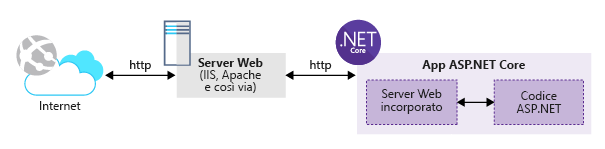

Si è deciso di utilizzare una tecnologia open source per la compilazione dell'applicazione Web. Si sa che ASP.NET Core è un framework open source e multipiattaforma. Si decide di sviluppare l'app Web in ambiente Linux tramite ASP.NET Core.

Servizio app di Azure consente di usare la tecnologia Web preferita, inclusi Node.js, PHP o .NET Core.

In questo caso, si apprenderà come creare un'applicazione ASP.NET Core usando l'interfaccia della riga di comando di .NET.

## <a name="what-is-aspnet-core"></a>Che cos'è ASP.NET Core

ASP.NET Core è l'evoluzione più recente del famoso framework Web ASP.NET di Microsoft, un framework multipiattaforma, open source per la compilazione di applicazioni moderne, basate su cloud e connesse a Internet.

Le applicazioni ASP.NET Core possono essere scritte per avere come destinazione .NET Core Framework o la versione esistente e completa .NET Framework.

Poiché si tratta di un framework open source e multipiattaforma, è possibile compilare le app ASP.NET Core su una vasta gamma di piattaforme, tra cui Windows, macOS e Linux. Microsoft offre l'ambiente di sviluppo integrato di Visual Studio per gli ambienti Windows e macOS. Inoltre, l'editor Visual Studio Code è multipiattaforma e compatibile con essi, oltre che con Linux.

>Per supportare la creazione di applicazioni ASP.NET Core su diverse piattaforme, Microsoft ha introdotto gli strumenti della riga di comando .NET Core che consentono di compilare, testare e pubblicare le applicazioni usando un set completo, coerente e multipiattaforma di API.

Grazie ad ASP.NET Core, è possibile compilare servizi e app Web, app IoT e back-end mobili. Le applicazioni ASP.NET Core possono essere ospitate nel cloud oppure in locale.

Per impostazione predefinita, ASP.NET Core è costituito da un server Web incorporato e da un ambiente di runtime che esegue il codice dell'applicazione. Il codice dell'applicazione viene scritto usando un framework di ASP.NET MVC rielaborato che si basa su moduli e pacchetti più piccoli. Il risultato è un progetto di applicazione Web più piccolo che è facile gestire e ospitare in ambienti cloud. La figura seguente mostra un'applicazione ASP.NET Core ospitata in .NET Core e il server Web esterno che gestisce il traffico HTTP Internet.



Le applicazioni ASP.NET Core sono applicazioni **console** autonome richiamate tramite lo strumento del driver **dotnet**. Le applicazioni ASP.NET Core non vengono caricate nel processo di lavoro IIS, ma caricate tramite un modulo IIS nativo chiamato **AspNetCoreModule** che esegue l'applicazione console esterna.

## <a name="how-to-create-an-aspnet-core-web-project"></a>Come creare un progetto Web ASP.NET Core

Sono disponibili due opzioni comuni per la creazione di un nuovo progetto ASP.NET Core:

- È possibile usare i modelli di Visual Studio, versioni Windows e macOS, per generare un nuovo progetto. Visual Studio offre un'ampia gamma di modelli che è possibile usare per creare progetti Web. Ad esempio, è possibile usare il modello **vuoto** per creare un progetto ASP.NET Core essenziale con la configurazione di base. Inoltre, è possibile usare il modello **Applicazione Web (finestra modale-View-Controller)** per generare un'applicazione ASP.NET Core MVC completa, con **controller** e **viste** di esempio che consentono di iniziare a scrivere il codice dell'applicazione. L'arrivo più recente è il modello di progetto **Applicazione Web** da usare per creare un progetto ASP.NET Core basato su Razor Pages anziché sulla struttura di progetto MVC tradizionale.

- È possibile usare gli strumenti dell'interfaccia della riga di comando di .NET Core per generare un nuovo progetto ASP.NET Core. Microsoft gestisce un set di modelli di progetto di ASP.NET Core per gli strumenti dell'interfaccia della riga di comando pressoché identico ai modelli di Visual Studio. L'unica differenza è che, per gli strumenti dell'interfaccia della riga di comando, è necessario digitare i comandi per creare un nuovo progetto ASP.NET Core.
> Gli strumenti dell'interfaccia della riga di comando di .NET utilizzano il **motore di creazione modello** per supportare diversi modelli di progetto.  Per altre informazioni, visitare il repository GitHub per il [motore di creazione modello](https://github.com/dotnet/templating) usato internamente dagli strumenti dell'interfaccia della riga di comando di .NET.

Questi sono gli strumenti più comuni per la creazione di progetti ASP.NET Core. Tuttavia, esistono altri strumenti che è possibile cercare ed esplorare.

Vale la pena sottolineare che i progetti generati con altri strumenti possono essere leggermente diversi, tuttavia, tutti generano progetti ASP.NET Core validi e ottimizzati.

## <a name="net-cli-tools"></a>Strumenti dell'interfaccia della riga di comando di .NET

Gli strumenti dell'interfaccia della riga di comando di .NET, chiamati anche strumenti dell'interfaccia della riga di comando di .NET Core, sono strumenti multipiattaforma che comprendono comandi per la creazione e il ripristino dei pacchetti e per la compilazione, l'esecuzione e la pubblicazione di applicazioni .NET dalla riga di comando senza la necessità di ricorrere a un ambiente di sviluppo integrato completo.

L'interfaccia della riga di comando di .NET viene installata come parte di .NET Core SDK. Nello stesso computer possono coesistere più versioni dell'interfaccia della riga di comando che possono essere eseguire affiancate.

Se si sviluppa in locale, per iniziare a usare l'interfaccia della riga di comando di .NET, è necessario installare il corrispondente .NET Core SDK. In Azure Cloud Shell l'interfaccia della riga di comando di .NET è già installata.

Aprire la riga di comando e immettere quanto segue:

```console
dotnet --version
```

Questo comando visualizza la versione dell'interfaccia della riga di comando di .NET installata.

Al momento della stesura di questo articolo, l'esecuzione del comando in Azure Cloud Shell restituisce: `2.0.0`. Sono disponibili versioni più recenti e nel computer locale potrebbe essere presente una versione più aggiornata.

Si esamineranno ora alcuni dei comandi comuni dell'interfaccia della riga di comando di .NET.

Il comando *dotnet* ha la sintassi generale seguente:

```console
dotnet [verb] [arguments]
```

Il verbo rappresenta l'azione da eseguire. Gli argomenti rappresentano l'elenco di argomenti di input richiesti per eseguire il verbo.

Per ottenere informazioni sull'utilizzo di *dotnet* e per elencare tutti i *verbi* disponibili e altre informazioni correlate, digitare il comando seguente:

```console
dotnet --help
```

Questo comando visualizza quanto segue:

```console
.NET Command Line Tools (2.1.302)
Usage: dotnet [runtime-options] [path-to-application]
Usage: dotnet [sdk-options] [command] [arguments] [command-options]

path-to-application:
  The path to an application .dll file to execute.

SDK commands:
  new              Initialize .NET projects.
  restore          Restore dependencies specified in the .NET project.
  run              Compiles and immediately executes a .NET project.
  build            Builds a .NET project.
  publish          Publishes a .NET project for deployment (including the runtime).
  test             Runs unit tests using the test runner specified in the project.

...
```

Sotto **SDK commands** è possibile visualizzare l'elenco completo dei comandi che possono essere eseguiti in .NET Core SDK.

I comandi più utili in assoluto sono i seguenti:

- **dotnet new**: questo comando viene usato per lo scaffolding o la generazione di una nuova applicazione .NET.

- **dotnet restore**: questo comando viene usato per il ripristino o il download di tutti i pacchetti a cui l'applicazione fa riferimento.

- **dotnet run**: questo comando viene utilizzato per eseguire l'applicazione .NET.

Per ottenere assistenza sull'uso di un comando specifico, digitare quanto segue:

```console
dotnet new --help
```

Questo comando restituisce:

```console
Usage: new [options]

Options:
  -h, --help          Displays help for this command.
  -l, --list          Lists templates containing the specified name. If no name is specified, lists all templates.
  -n, --name          The name for the output being created. If no name is specified, the name of the current directory is used.
  -o, --output        Location to place the generated output.
  -i, --install       Installs a source or a template pack.
  -u, --uninstall     Uninstalls a source or a template pack.
  --nuget-source      Specifies a NuGet source to use during install.
  --type              Filters templates based on available types. Predefined values are "project", "item" or "other".
  --force             Forces content to be generated even if it would change existing files.
  -lang, --language   Filters templates based on language and specifies the language of the template to create.


Templates                                         Short Name         Language          Tags
----------------------------------------------------------------------------------------------------------------------------
Console Application                               console            [C#], F#, VB      Common/Console
Class library                                     classlib           [C#], F#, VB      Common/Library
...

Razor Page                                        page               [C#]              Web/ASP.NET
MVC ViewImports                                   viewimports        [C#]              Web/ASP.NET
MVC ViewStart                                     viewstart          [C#]              Web/ASP.NET
ASP.NET Core Empty                                web                [C#], F#          Web/Empty
ASP.NET Core Web App (Model-View-Controller)      mvc                [C#], F#          Web/MVC
ASP.NET Core Web App                              razor              [C#]              Web/MVC/Razor Pages
ASP.NET Core with Angular                         angular            [C#]              Web/MVC/SPA
...

Solution File                                     sln                                  Solution

Examples:
    dotnet new mvc --auth Individual
    dotnet new webapi
    dotnet new --help
```

Questo comando elenca tutte le opzioni disponibili che è possibile usare con il comando `dotnet new`. Inoltre, elenca tutti i modelli di progetto disponibili che è possibile usare per generare la successiva applicazione .NET. Infine, una sezione contiene esempi su come usare il comando per generare una nuova applicazione .NET.

È possibile ottenere informazioni sui comandi restanti usando l'argomento `--help` per qualsiasi comando disponibile nell'interfaccia della riga di comando di .NET.

## <a name="summary"></a>Riepilogo

Quando si decide di creare un'applicazione Web, è possibile scegliere tra molti linguaggi e framework. Servizio app rende questa scelta più semplice in quanto consente di ospitare tipi diversi di applicazioni, ad esempio Node.js, PHP o .NET Core. In questo modo è possibile usare i linguaggi e i framework con cui si ha più familiarità invece di cambiarli per soddisfare i requisiti dell'host Web.
