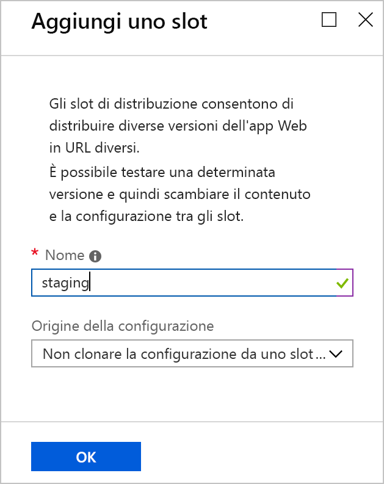
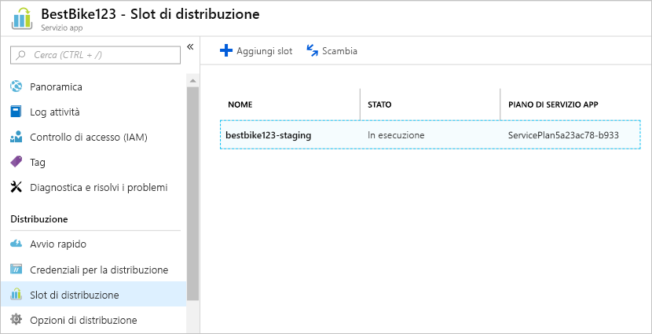
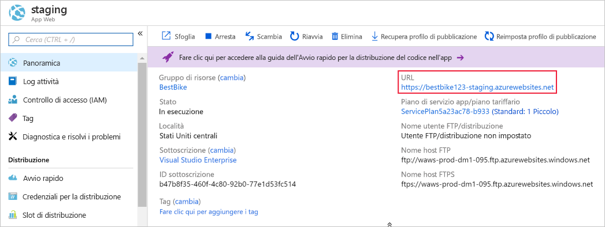
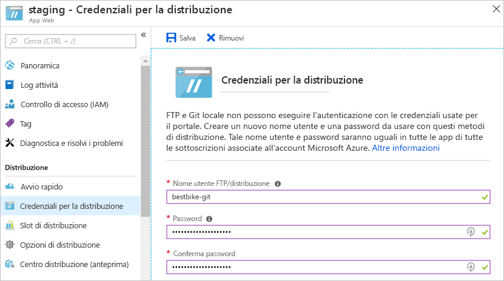
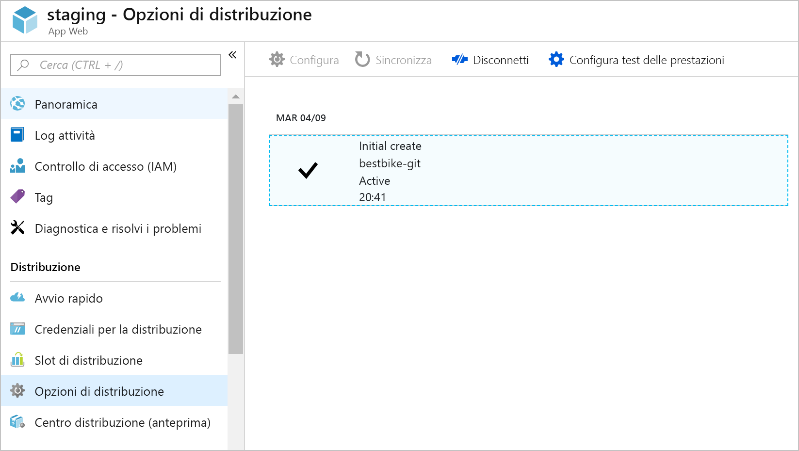
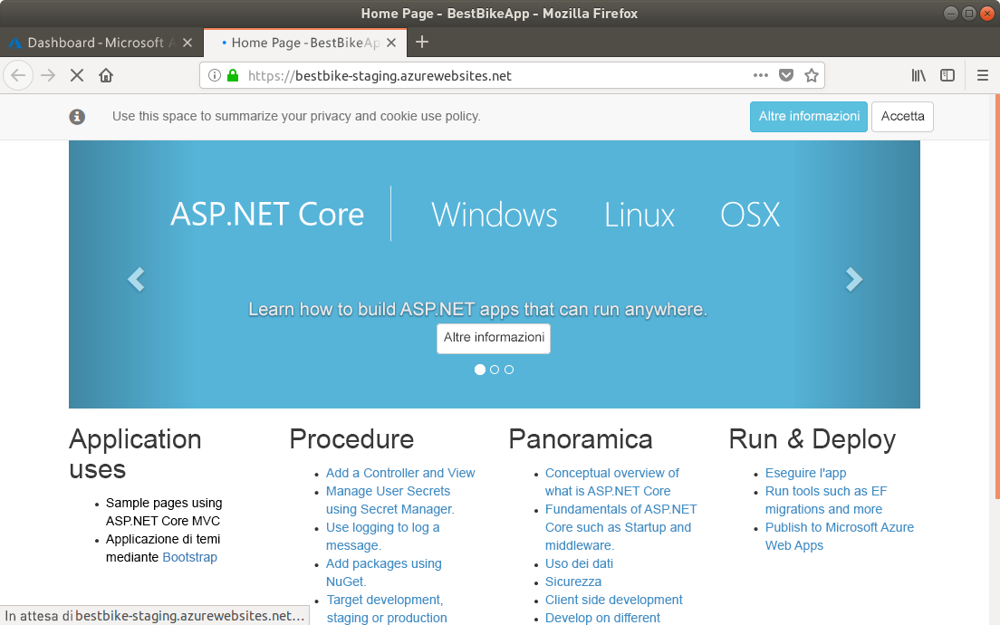
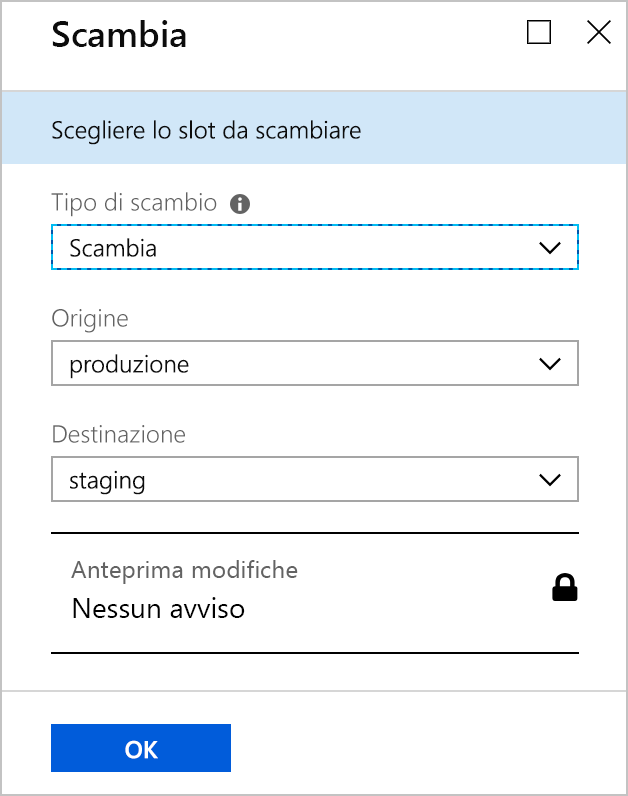
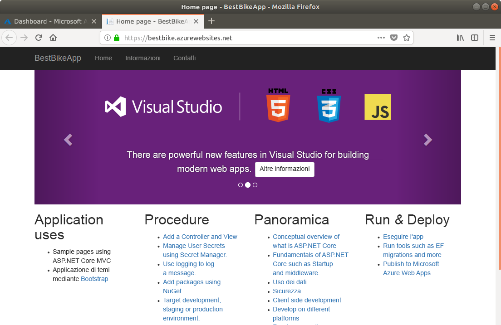
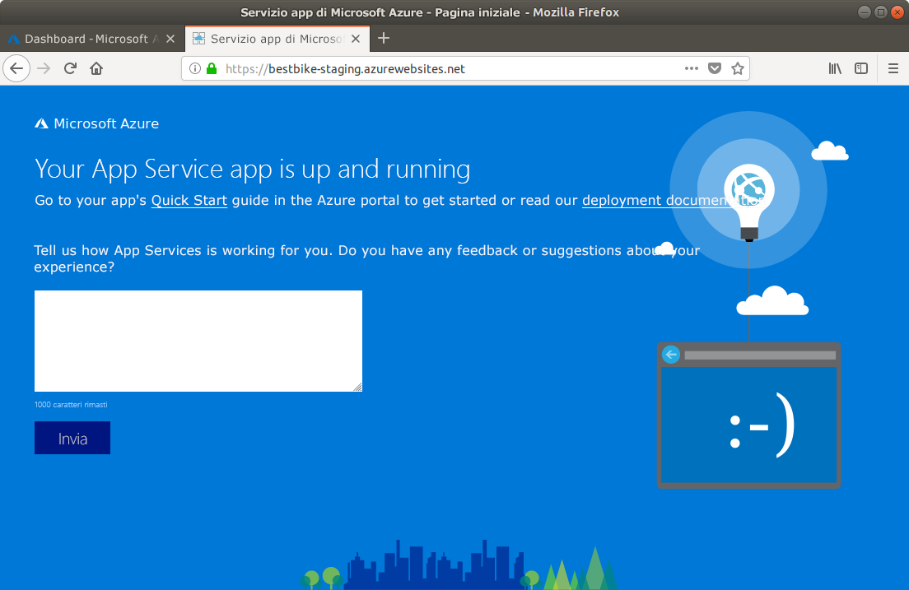

<span data-ttu-id="8c267-101">In questa unità l'applicazione ASP.NET Core verrà caricata in Servizio app di Azure.</span><span class="sxs-lookup"><span data-stu-id="8c267-101">In this unit, you'll upload your ASP.NET Core application to Azure App Service.</span></span>

## <a name="create-a-staging-deployment-slot"></a><span data-ttu-id="8c267-102">Creare uno slot di distribuzione di staging</span><span class="sxs-lookup"><span data-stu-id="8c267-102">Create a staging deployment slot</span></span>

1. <span data-ttu-id="8c267-103">Tornare al [portale di Azure](https://portal.azure.com/learn.docs.microsoft.com?azure-portal=true).</span><span class="sxs-lookup"><span data-stu-id="8c267-103">Switch back to the [Azure portal](https://portal.azure.com/learn.docs.microsoft.com?azure-portal=true).</span></span>

1. <span data-ttu-id="8c267-104">Aprire la risorsa Servizio app (l'app Web) creata in precedenza.</span><span class="sxs-lookup"><span data-stu-id="8c267-104">Open the App Service resource (the web app) you created previously.</span></span> <span data-ttu-id="8c267-105">È possibile ritrovarla cercando l'app in **Tutte le risorse** oppure cercando il gruppo di risorse che la contiene in **Gruppi di risorse**.</span><span class="sxs-lookup"><span data-stu-id="8c267-105">You can find it again by searching for the app in **All resources** or the containing resource group in **Resource groups**.</span></span>

1. <span data-ttu-id="8c267-106">Fare clic sulla voce di menu **Slot di distribuzione** nel riquadro di spostamento a sinistra.</span><span class="sxs-lookup"><span data-stu-id="8c267-106">Click the **Deployment slots** menu item on the left-side navigation.</span></span>

1. <span data-ttu-id="8c267-107">Nella pagina **Slot di distribuzione** fare clic sul pulsante **Aggiungi slot** sulla barra di spostamento superiore della pagina Slot di distribuzione.</span><span class="sxs-lookup"><span data-stu-id="8c267-107">Inside the **Deployment slots** page, click the **Add Slot** button on the top navigation bar of the deployment slots page.</span></span>

1. <span data-ttu-id="8c267-108">Nel portale di Azure si aprirà la pagina **Aggiungi uno slot** come illustrato di seguito.</span><span class="sxs-lookup"><span data-stu-id="8c267-108">The Azure portal opens the **Add a slot** page as shown below.</span></span>

    1. <span data-ttu-id="8c267-109">Assegnare un nome allo slot di distribuzione.</span><span class="sxs-lookup"><span data-stu-id="8c267-109">Give your deployment slot a name.</span></span> <span data-ttu-id="8c267-110">In questo caso, usare `staging`.</span><span class="sxs-lookup"><span data-stu-id="8c267-110">In this case, use `staging`.</span></span>

    2. <span data-ttu-id="8c267-111">Per scegliere un'**Origine configurazione**, sono disponibili due opzioni.</span><span class="sxs-lookup"><span data-stu-id="8c267-111">To choose a **Configuration Source**, you have two options.</span></span>

        * <span data-ttu-id="8c267-112">È possibile scegliere di clonare gli elementi di configurazione da qualsiasi slot di distribuzione esistente o app del servizio app.</span><span class="sxs-lookup"><span data-stu-id="8c267-112">You can choose to clone the configuration elements from any existing deployment slot or App Service app.</span></span>
        * <span data-ttu-id="8c267-113">In alternativa, è possibile scegliere di non clonare alcun elemento di configurazione.</span><span class="sxs-lookup"><span data-stu-id="8c267-113">Or you can choose not to clone any configuration elements.</span></span> <span data-ttu-id="8c267-114">Selezionare l'opzione **Non clonare la configurazione da uno slot esistente**.</span><span class="sxs-lookup"><span data-stu-id="8c267-114">Select the option **Don't clone configuration from an existing slot**.</span></span>

        <span data-ttu-id="8c267-115">Per questo slot di distribuzione scegliere la seconda opzione, **Non clonare la configurazione da uno slot esistente**.</span><span class="sxs-lookup"><span data-stu-id="8c267-115">For this deployment slot, choose the second option: **Don't clone configuration from an existing slot**.</span></span> <span data-ttu-id="8c267-116">Verrà eseguita la configurazione diretta.</span><span class="sxs-lookup"><span data-stu-id="8c267-116">You will configure it directly.</span></span>

    

1. <span data-ttu-id="8c267-118">Fare clic sul pulsante **OK** nella parte inferiore della pagina per creare un nuovo slot di distribuzione.</span><span class="sxs-lookup"><span data-stu-id="8c267-118">Click the **OK** button at the bottom of the page to create your new deployment slot.</span></span>

1. <span data-ttu-id="8c267-119">Dopo aver creato lo slot di distribuzione, il portale di Azure torna alla pagina **Slot di distribuzione** dell'app Web.</span><span class="sxs-lookup"><span data-stu-id="8c267-119">Once the deployment slot is successfully created, the Azure portal navigates you back to the **Deployment slots** page of your web app.</span></span>

    <span data-ttu-id="8c267-120">A questo punto, è possibile visualizzare il nuovo slot di distribuzione appena creato.</span><span class="sxs-lookup"><span data-stu-id="8c267-120">Now, you can see the new deployment slot that you have just created.</span></span>

    

1. <span data-ttu-id="8c267-122">Selezionare il nuovo slot di distribuzione.</span><span class="sxs-lookup"><span data-stu-id="8c267-122">Select the new deployment slot.</span></span>

1. <span data-ttu-id="8c267-123">Il portale di Azure passerà alla pagina **Panoramica** relativa allo slot di distribuzione appena creato.</span><span class="sxs-lookup"><span data-stu-id="8c267-123">The Azure portal navigates to the **Overview** page of the newly created deployment slot.</span></span>

    

    <span data-ttu-id="8c267-125">Si noti l'**URL** dello slot di distribuzione di staging.</span><span class="sxs-lookup"><span data-stu-id="8c267-125">Notice the **URL** of the staging deployment slot.</span></span> <span data-ttu-id="8c267-126">Si tratta di un URL diverso rispetto a quello mostrato in precedenza, con il nome dello slot aggiunto come suffisso.</span><span class="sxs-lookup"><span data-stu-id="8c267-126">It is a different URL from what you saw previously, with the slot name appended.</span></span>

    <span data-ttu-id="8c267-127">Uno slot di distribuzione viene considerato come un'app del servizio app completa in Azure.</span><span class="sxs-lookup"><span data-stu-id="8c267-127">A deployment slot is treated as a full App Service app inside Azure.</span></span> <span data-ttu-id="8c267-128">Si tratta tuttavia di un tipo speciale, un elemento figlio dell'app originale che può essere scambiato con l'app originale.</span><span class="sxs-lookup"><span data-stu-id="8c267-128">However, it is a special type that is a child of the original app and can be swapped with the original app.</span></span>

    <span data-ttu-id="8c267-129">Se si fa clic sull'**URL**, verrà visualizzata la stessa pagina predefinita creata da Azure per l'app dello slot di distribuzione la prima volta in cui è stata creata nel portale di Azure.</span><span class="sxs-lookup"><span data-stu-id="8c267-129">If you click the **URL**, you will see the same default page that Azure created for the deployment slot "app" the first time we created it in the Azure portal.</span></span>

<span data-ttu-id="8c267-130">Dopo aver creato lo slot di distribuzione di staging, è necessario configurare le **credenziali per la distribuzione**.</span><span class="sxs-lookup"><span data-stu-id="8c267-130">Now that the staging deployment slot is created successfully, you need to configure **deployment credentials**.</span></span>

## <a name="create-deployment-credentials"></a><span data-ttu-id="8c267-131">Creare le credenziali per la distribuzione</span><span class="sxs-lookup"><span data-stu-id="8c267-131">Create deployment credentials</span></span>

<span data-ttu-id="8c267-132">In Azure è necessario che le credenziali di distribuzione siano configurate prima di iniziare l'effettivo processo di distribuzione.</span><span class="sxs-lookup"><span data-stu-id="8c267-132">Azure requires deployment credentials to be set up before you can start the actual deployment process.</span></span> <span data-ttu-id="8c267-133">Per questo motivo, si apprenderà come creare le credenziali di distribuzione.</span><span class="sxs-lookup"><span data-stu-id="8c267-133">For that reason, you will learn how to create your own deployment credentials.</span></span>

1. <span data-ttu-id="8c267-134">Selezionare la voce di menu **Credenziali per la distribuzione** nel riquadro di spostamento a sinistra.</span><span class="sxs-lookup"><span data-stu-id="8c267-134">Click the **Deployment credentials** menu item on the left-side navigation.</span></span>

1. <span data-ttu-id="8c267-135">Il portale di Azure passerà alla pagina **Credenziali per la distribuzione** come illustrato di seguito.</span><span class="sxs-lookup"><span data-stu-id="8c267-135">The Azure portal navigates to the **Deployment credentials** page as shown below.</span></span>

    <span data-ttu-id="8c267-136">Immettere un **nome utente** e una **password** e riconfermare la password.</span><span class="sxs-lookup"><span data-stu-id="8c267-136">Enter a **username** and **password** of your choice, and then confirm your password once again.</span></span>

    > [!NOTE]
    > <span data-ttu-id="8c267-137">Assicurarsi di non dimenticare nome utente e password.</span><span class="sxs-lookup"><span data-stu-id="8c267-137">Make sure you don't forget your username and password!</span></span> <span data-ttu-id="8c267-138">Queste credenziali saranno necessarie in seguito per avviare il caricamento e la distribuzione del codice in Azure.</span><span class="sxs-lookup"><span data-stu-id="8c267-138">You will need them later when we start uploading and deploying our code to Azure.</span></span>

    

1. <span data-ttu-id="8c267-140">Fare clic sul pulsante **Salva** nella parte superiore della pagina **Credenziali per la distribuzione**.</span><span class="sxs-lookup"><span data-stu-id="8c267-140">Click the **Save** button at the top of the **Deployment credentials** page.</span></span>

<span data-ttu-id="8c267-141">Le credenziali per la distribuzione sono state create. Ora è necessario configurare altre opzioni di distribuzione.</span><span class="sxs-lookup"><span data-stu-id="8c267-141">Now that the deployment credentials are created successfully, you need to configure other deployment options.</span></span>

## <a name="use-a-local-git-repository-as-your-deployment-option"></a><span data-ttu-id="8c267-142">Usare un repository GIT locale come opzione per la distribuzione</span><span class="sxs-lookup"><span data-stu-id="8c267-142">Use a local Git repository as your deployment option</span></span>

<span data-ttu-id="8c267-143">Verrà creato un repository Git locale in Azure per consentire di avviare il caricamento del codice.</span><span class="sxs-lookup"><span data-stu-id="8c267-143">Next, we'll create a local Git repository in Azure, so you can start uploading your code.</span></span>

1. <span data-ttu-id="8c267-144">Nell'app dello slot di distribuzione di **staging** selezionare la voce di menu **Opzioni di distribuzione** dal riquadro di spostamento a sinistra.</span><span class="sxs-lookup"><span data-stu-id="8c267-144">Within the **staging** deployment slot "app", click the **Deployment options** menu item on the left-hand navigation.</span></span>

1. <span data-ttu-id="8c267-145">Il portale di Azure passerà alla pagina **Opzioni di distribuzione**.</span><span class="sxs-lookup"><span data-stu-id="8c267-145">The Azure portal navigates to the **Deployment options** page.</span></span>

1. <span data-ttu-id="8c267-146">Fare clic su **Scegliere l'origine** per configurare le impostazioni necessarie.</span><span class="sxs-lookup"><span data-stu-id="8c267-146">Click on the **Choose Source** to configure the required settings.</span></span>

1. <span data-ttu-id="8c267-147">Il portale di Azure visualizza le opzioni disponibili che è possibile configurare e usare.</span><span class="sxs-lookup"><span data-stu-id="8c267-147">The Azure portal displays the available options that you can configure and use.</span></span> <span data-ttu-id="8c267-148">In questo caso scegliere l'opzione **Repository Git locale**.</span><span class="sxs-lookup"><span data-stu-id="8c267-148">In our case, choose the **Local Git Repository** option.</span></span>

1. <span data-ttu-id="8c267-149">Si tornerà alla pagina **Opzioni di distribuzione**.</span><span class="sxs-lookup"><span data-stu-id="8c267-149">You will be returned to the **Deployment option** page.</span></span> <span data-ttu-id="8c267-150">Fare clic sul pulsante **OK** nella parte inferiore della pagina per configurare l'origine della distribuzione.</span><span class="sxs-lookup"><span data-stu-id="8c267-150">Click the **OK** button at the bottom of the page to set up the deployment source.</span></span>

1. <span data-ttu-id="8c267-151">A questo punto passare alla sezione **Panoramica** nel riquadro di spostamento a sinistra.</span><span class="sxs-lookup"><span data-stu-id="8c267-151">Now, navigate to the **Overview** section on the left-side navigation.</span></span>

    <span data-ttu-id="8c267-152">L'informazione rilevante in questo contesto è l'**URI di git clone**, ovvero l'URL del repository Git locale che verrà usato come **remoto** per il repository del codice dell'applicazione locale.</span><span class="sxs-lookup"><span data-stu-id="8c267-152">The important information to note here is the **Git Clone Uri**, which is the local Git repository URL that you will use as a **remote** for your local application code repository.</span></span>

<span data-ttu-id="8c267-153">A questo punto è possibile iniziare a caricare il codice nello slot di distribuzione di staging.</span><span class="sxs-lookup"><span data-stu-id="8c267-153">It is time to start uploading your code to the staging deployment slot.</span></span>

## <a name="set-up-git-on-cloud-shell"></a><span data-ttu-id="8c267-154">Configurare Git in Cloud Shell</span><span class="sxs-lookup"><span data-stu-id="8c267-154">Set up git on Cloud Shell</span></span>

<span data-ttu-id="8c267-155">Git è già installato in Azure Cloud Shell, ma è opportuno configurare il nome utente e l'indirizzo di posta elettronica per l'account di Cloud Shell.</span><span class="sxs-lookup"><span data-stu-id="8c267-155">Git is already installed Azure Cloud Shell but you'll want to set your username and email for your cloud shell account.</span></span>

1. <span data-ttu-id="8c267-156">In Cloud Shell a destra digitare i comandi seguenti, sostituendo i segnaposto `[your name]` e `[your email]` con il proprio nome e il proprio indirizzo di posta elettronica, senza le parentesi graffe:</span><span class="sxs-lookup"><span data-stu-id="8c267-156">In the Cloud Shell on the right, type the following commands, replacing the `[your name]` and `[your email]` placeholders with your own name and email (without the braces):</span></span>

    ```bash
    git config --global user.name "[your name]"
    git config --global user.email "[your email]"
    ```

1. <span data-ttu-id="8c267-157">Per verificare che le informazioni siano state registrate da Git, digitare il comando seguente:</span><span class="sxs-lookup"><span data-stu-id="8c267-157">To verify that your information has been recorded by Git, type the following command:</span></span>

    ```bash
    cat ~/.gitconfig
    ```

   <span data-ttu-id="8c267-158">Sarà visualizzato quanto riportato di seguito insieme a nome e indirizzo di posta elettronica:</span><span class="sxs-lookup"><span data-stu-id="8c267-158">You should be seeing the following, with your name and email shown:</span></span>

    ```output
    [user]
        name = {your name}
        email = {your email}
    ```

## <a name="initialize-a-local-git-repository-for-your-code"></a><span data-ttu-id="8c267-159">Inizializzare un repository Git locale per il codice</span><span class="sxs-lookup"><span data-stu-id="8c267-159">Initialize a local Git repository for your code</span></span>

<span data-ttu-id="8c267-160">Per iniziare a usare Git, è necessario inizializzare un repository Git locale per il codice dell'applicazione .NET Core.</span><span class="sxs-lookup"><span data-stu-id="8c267-160">To start using Git, you need to initialize a local Git repository for your .NET Core application code.</span></span>

1. <span data-ttu-id="8c267-161">Assicurarsi di trovarsi nella cartella del progetto creata in precedenza.</span><span class="sxs-lookup"><span data-stu-id="8c267-161">Make sure you are in the project folder you created earlier.</span></span>

    ```bash
    cd ~/BestBikeApp/
    ```

1. <span data-ttu-id="8c267-162">Eseguire il comando seguente per inizializzare un nuovo repository Git:</span><span class="sxs-lookup"><span data-stu-id="8c267-162">Initialize a new Git repository by issuing the following command:</span></span>

    ```bash
    git init
    ```

    <span data-ttu-id="8c267-163">Se il comando ha esito positivo, viene visualizzato un messaggio simile al seguente:</span><span class="sxs-lookup"><span data-stu-id="8c267-163">If the command is successful, you receive a message like the following:</span></span>

    ```output
    Initialized empty Git repository in /home/{your-user}/BestBikeApp/.git/
    ```

1. <span data-ttu-id="8c267-164">Eseguire lo staging di tutti i file dell'applicazione in Git.</span><span class="sxs-lookup"><span data-stu-id="8c267-164">Stage all the application files to Git.</span></span>

   <span data-ttu-id="8c267-165">Il passaggio successivo consiste nel segnalare i file dell'applicazione a Git.</span><span class="sxs-lookup"><span data-stu-id="8c267-165">The next step is to let Git know about your application files.</span></span> <span data-ttu-id="8c267-166">Aggiungere quindi tutti i file della directory di lavoro in modo che siano **inclusi nello staging** da Git.</span><span class="sxs-lookup"><span data-stu-id="8c267-166">Do that by adding all the files of the working directory so that they get **staged** by Git.</span></span> <span data-ttu-id="8c267-167">Digitare il comando seguente:</span><span class="sxs-lookup"><span data-stu-id="8c267-167">Type the following command:</span></span>

    ```bash
    git add .
    ```

    <span data-ttu-id="8c267-168">Il comando precedente aggiunge tutti i file, rappresentati da ".", allo stato di staging di GIT.</span><span class="sxs-lookup"><span data-stu-id="8c267-168">The command above adds all files, represented by the ".", to the staging state of Git.</span></span>

1. <span data-ttu-id="8c267-169">A questo punto, eseguire il commit delle modifiche in GIT.</span><span class="sxs-lookup"><span data-stu-id="8c267-169">Now, you need to commit your changes to Git.</span></span>

   <span data-ttu-id="8c267-170">Dopo aver completato lo staging dei file in GIT, è necessario eseguire il commit dei file nella **cronologia del commit GIT** nel computer locale.</span><span class="sxs-lookup"><span data-stu-id="8c267-170">Once you stage the files with Git, you need to commit your files to the **Git commit history** on your local machine.</span></span> <span data-ttu-id="8c267-171">A tal scopo, digitare il comando seguente:</span><span class="sxs-lookup"><span data-stu-id="8c267-171">You do that by typing the following command:</span></span>

    ```bash
   git commit -m "Initial create"
    ```

   <span data-ttu-id="8c267-172">Il comando `commit` accetta l'argomento `-m` per includere un messaggio con il commit che si sta creando.</span><span class="sxs-lookup"><span data-stu-id="8c267-172">The `commit` command accepts  `-m` argument to include a message with the commit you are creating.</span></span> <span data-ttu-id="8c267-173">Quando si effettuerà il push del codice in Azure, sarà possibile visualizzare lo stesso messaggio archiviato con questo commit specifico.</span><span class="sxs-lookup"><span data-stu-id="8c267-173">Later on, when you push your code to Azure, you will be able to see the same message stored with this particular commit.</span></span>

## <a name="add-a-remote-for-the-local-git-repository"></a><span data-ttu-id="8c267-174">Aggiungere un repository remoto per il repository GIT locale</span><span class="sxs-lookup"><span data-stu-id="8c267-174">Add a remote for the local Git repository</span></span>

<span data-ttu-id="8c267-175">A questo punto è stato inizializzato un nuovo repository Git locale.</span><span class="sxs-lookup"><span data-stu-id="8c267-175">At this point, you have successfully initialized a new local Git repository.</span></span> <span data-ttu-id="8c267-176">È stato anche eseguito il commit di tutti i file dell'applicazione in Git.</span><span class="sxs-lookup"><span data-stu-id="8c267-176">In addition, you've committed all of your application files to Git.</span></span> <span data-ttu-id="8c267-177">Rimane da aggiungere un repository **remoto** per connettere il repository Git locale a quello ospitato in Azure.</span><span class="sxs-lookup"><span data-stu-id="8c267-177">What remains is to add a **remote** to connect your local Git repository to that hosted on Azure.</span></span>

<span data-ttu-id="8c267-178">A tale scopo, eseguire le operazioni seguenti:</span><span class="sxs-lookup"><span data-stu-id="8c267-178">To do so, you need to:</span></span>

1. <span data-ttu-id="8c267-179">Copiare l'**URL di git clone** visto in precedenza.</span><span class="sxs-lookup"><span data-stu-id="8c267-179">Copy the **Git clone url** that you saw above.</span></span>

1. <span data-ttu-id="8c267-180">Dopo averlo copiato, tornare alla finestra **Terminale** ed eseguire il comando Git seguente con l'URL in uso:</span><span class="sxs-lookup"><span data-stu-id="8c267-180">Once copied, you go back to the **Terminal** window and issue the following Git command with your url:</span></span>

    ```bash
    git remote add origin https://BESTBIKE-git@BESTBIKE-staging.scm.azurewebsites.net:443/BESTBIKE.git
    ```

    <span data-ttu-id="8c267-181">Il comando Git precedente consente al repository Git locale di collegarsi a quello ospitato in Azure.</span><span class="sxs-lookup"><span data-stu-id="8c267-181">The above Git command hooks your local Git repository to the one hosted on Azure.</span></span> <span data-ttu-id="8c267-182">È ora possibile effettuare il push e il pull tra il repository GIT locale e quello remoto.</span><span class="sxs-lookup"><span data-stu-id="8c267-182">Now, you can start pushing and pulling between the local and remote Git repositories!</span></span>

1. <span data-ttu-id="8c267-183">Per verificare il comando precedente, digitare il comando GIT seguente:</span><span class="sxs-lookup"><span data-stu-id="8c267-183">To verify the above command, type the following Git command:</span></span>

    ```bash
    git remote -v
    ```

    <span data-ttu-id="8c267-184">Il comando precedente genera l'output seguente:</span><span class="sxs-lookup"><span data-stu-id="8c267-184">The command above generates the following output:</span></span>

    ```output
    origin  https://BESTBIKE-git@BESTBIKE-staging.scm.azurewebsites.net:443/BESTBIKE.git (fetch)
    origin  https://BESTBIKE-git@BESTBIKE-staging.scm.azurewebsites.net:443/BESTBIKE.git (push)
    ```

## <a name="push-your-code-to-azure"></a><span data-ttu-id="8c267-185">Effettuare il push del codice in Azure</span><span class="sxs-lookup"><span data-stu-id="8c267-185">Push your code to Azure</span></span>

<span data-ttu-id="8c267-186">Ora che in Azure il repository Git locale è collegato al repository Git remoto, sarà possibile sviluppare e compilare l'app ed eseguire il push del codice dell'applicazione in Azure.</span><span class="sxs-lookup"><span data-stu-id="8c267-186">Now that you have your local Git repository hooked to the remote Git repository on Azure, you will develop and build the app, and then push your application code to Azure.</span></span>

1. <span data-ttu-id="8c267-187">Digitare il comando Git seguente per effettuare il push del ramo **master** nel repository Git remoto in Azure:</span><span class="sxs-lookup"><span data-stu-id="8c267-187">Type the following Git command to push your **master** branch to the remote Git repository on Azure:</span></span>

    ```bash
    git push origin master
    ```

1. <span data-ttu-id="8c267-188">Verrà richiesto di immettere la password configurata nella sezione precedente **Credenziali per la distribuzione**.</span><span class="sxs-lookup"><span data-stu-id="8c267-188">You will be prompted to enter the password that you have configured in the **Deployment credentials** section above.</span></span> <span data-ttu-id="8c267-189">Immetter la password e premere INVIO.</span><span class="sxs-lookup"><span data-stu-id="8c267-189">Enter your password and hit Enter.</span></span> <span data-ttu-id="8c267-190">Git inizia a caricare i file di cui è stato eseguito il commit nel repository Git remoto di Azure configurato, all'interno dello slot di distribuzione di staging.</span><span class="sxs-lookup"><span data-stu-id="8c267-190">Git starts uploading your committed files to the Azure remote Git repository configured under the staging deployment slot.</span></span>

## <a name="verify-the-code-is-uploaded-to-azure"></a><span data-ttu-id="8c267-191">Verificare che il codice venga caricato in Azure</span><span class="sxs-lookup"><span data-stu-id="8c267-191">Verify the code is uploaded to Azure</span></span>

1. <span data-ttu-id="8c267-192">Tornare al portale di Azure.</span><span class="sxs-lookup"><span data-stu-id="8c267-192">Switch back to the Azure portal.</span></span>

1. <span data-ttu-id="8c267-193">Selezionare la voce di menu **Tutte le risorse** nel riquadro di spostamento a sinistra.</span><span class="sxs-lookup"><span data-stu-id="8c267-193">Click on the **All Resources** menu item on the left-side navigation.</span></span>

1. <span data-ttu-id="8c267-194">Il portale di Azure passerà all'elenco di tutte le risorse create in Azure fino a questo momento.</span><span class="sxs-lookup"><span data-stu-id="8c267-194">The Azure portal navigates you to the list of all resources created on Azure so far.</span></span>

1. <span data-ttu-id="8c267-195">Fare clic sullo slot di staging creato in precedenza.</span><span class="sxs-lookup"><span data-stu-id="8c267-195">Click on the staging slot created above.</span></span> <span data-ttu-id="8c267-196">Tenere presente che uno slot di distribuzione viene considerato un'app, pertanto verrà visualizzato come risorsa Servizio app in **Tutte le risorse**.</span><span class="sxs-lookup"><span data-stu-id="8c267-196">Remember, a deployment slot is considered as an app, and hence, it will appear as an App Service resource under **All Resources**.</span></span>

1. <span data-ttu-id="8c267-197">Quando viene visualizzata la pagina dello slot di distribuzione di staging, passare a **Opzioni di distribuzione**.</span><span class="sxs-lookup"><span data-stu-id="8c267-197">Once you arrive to the staging deployment slot page, go to **Deployment options**.</span></span>

    <span data-ttu-id="8c267-198">Si noti che il primo commit disponibile in locale nel computer è ora caricato nel portale di Azure.</span><span class="sxs-lookup"><span data-stu-id="8c267-198">You will see that your first commit that you have locally on your machine is now uploaded to the Azure portal.</span></span>

    <span data-ttu-id="8c267-199">Quando si effettua il push del codice in locale nel repository Git remoto in Servizio app, Azure registra l'operazione.</span><span class="sxs-lookup"><span data-stu-id="8c267-199">When you push your code locally to the remote Git repository in App Service, Azure records this operation.</span></span>

    <span data-ttu-id="8c267-200">Ogni volta che si effettua il push del codice in Azure, verrà visualizzato un nuovo record insieme al messaggio digitato durante il commit delle modifiche in locale nel computer.</span><span class="sxs-lookup"><span data-stu-id="8c267-200">Every time you push your code to Azure, you will see a new record, together with the message that you type when committing your changes locally on your machine.</span></span>

    

1. <span data-ttu-id="8c267-202">Visitare ora l'URL dello **slot di staging**.</span><span class="sxs-lookup"><span data-stu-id="8c267-202">Let's visit the **staging slot** URL.</span></span> <span data-ttu-id="8c267-203">L'URL è stato specificato in precedenza. Se però è stato dimenticato, è sempre possibile accedere alla pagina **Panoramica** dello slot di distribuzione di staging per recuperarlo.</span><span class="sxs-lookup"><span data-stu-id="8c267-203">The URL was mentioned above, however, if you forget that URL, you can always go to the **Overview** page of the staging deployment slot and pick up the URL.</span></span>

1. <span data-ttu-id="8c267-204">Digitare l'URL seguente nella barra degli indirizzi del browser: [https://BESTBIKE-staging.azurewebsites.net/](https://BESTBIKE-staging.azurewebsites.net/).</span><span class="sxs-lookup"><span data-stu-id="8c267-204">Type the following URL in your browser address bar: [https://BESTBIKE-staging.azurewebsites.net/](https://BESTBIKE-staging.azurewebsites.net/).</span></span>

    

<span data-ttu-id="8c267-206">I file dell'applicazione locale sono stati caricati nello slot di distribuzione di staging in Azure.</span><span class="sxs-lookup"><span data-stu-id="8c267-206">You have successfully uploaded your local application files to the staging deployment slot on Azure.</span></span>

## <a name="swapping-the-staging-and-production-deployment-slots"></a><span data-ttu-id="8c267-207">Scambio di slot di distribuzione di staging e di produzione</span><span class="sxs-lookup"><span data-stu-id="8c267-207">Swapping the staging and production deployment slots</span></span>

<span data-ttu-id="8c267-208">Ora che l'applicazione è attiva e in esecuzione nello slot di distribuzione di staging ospitato in Azure, è possibile scambiare questo slot con quello di produzione.</span><span class="sxs-lookup"><span data-stu-id="8c267-208">Now that the application is up and running on the staging deployment slot hosted on Azure, it is time to swap this slot with the production one.</span></span> <span data-ttu-id="8c267-209">A questo scopo, seguire questa procedura:</span><span class="sxs-lookup"><span data-stu-id="8c267-209">To do so, follow these steps:</span></span>

1. <span data-ttu-id="8c267-210">Passare alla pagina dell'app originale creata in precedenza.</span><span class="sxs-lookup"><span data-stu-id="8c267-210">Navigate to the original app page created earlier.</span></span> <span data-ttu-id="8c267-211">L'app Web originale è disponibile nella pagina **Tutte le risorse**.</span><span class="sxs-lookup"><span data-stu-id="8c267-211">You can find the original web app from the **All resources** page.</span></span>

1. <span data-ttu-id="8c267-212">Fare clic sulla voce di menu **Slot di distribuzione** nel riquadro di spostamento a sinistra.</span><span class="sxs-lookup"><span data-stu-id="8c267-212">Click the **Deployment slots** menu item on the left-side navigation.</span></span>

1. <span data-ttu-id="8c267-213">Fare clic sul pulsante **Scambia** nella parte superiore della pagina.</span><span class="sxs-lookup"><span data-stu-id="8c267-213">Click on the **Swap** button at the top of the page.</span></span>

1. <span data-ttu-id="8c267-214">Nel portale di Azure viene visualizzata la pagina **Scambia**.</span><span class="sxs-lookup"><span data-stu-id="8c267-214">The Azure portal navigates you to the **Swap** page.</span></span>

1. <span data-ttu-id="8c267-215">Per il campo **Scambia** selezionare **Scambia**.</span><span class="sxs-lookup"><span data-stu-id="8c267-215">For the **Swap** field, select **Swap**.</span></span>

1. <span data-ttu-id="8c267-216">Per il campo **Origine**, selezionare **Staging**.</span><span class="sxs-lookup"><span data-stu-id="8c267-216">For the **Source** field, select **Staging**.</span></span>

1. <span data-ttu-id="8c267-217">Per il campo **Destinazione** selezionare **Produzione**.</span><span class="sxs-lookup"><span data-stu-id="8c267-217">For the **Destination** field, select **Production**.</span></span>

    

1. <span data-ttu-id="8c267-219">Fare clic sul pulsante **OK** nella parte inferiore della pagina.</span><span class="sxs-lookup"><span data-stu-id="8c267-219">Click on the **OK** button at the bottom of the page.</span></span>

1. <span data-ttu-id="8c267-220">Azure avvierà il processo di scambio.</span><span class="sxs-lookup"><span data-stu-id="8c267-220">Azure starts the swapping process.</span></span> <span data-ttu-id="8c267-221">Questa operazione richiede generalmente pochi secondi, a seconda delle dimensioni dell'app Web sottoposta a scambio.</span><span class="sxs-lookup"><span data-stu-id="8c267-221">Usually, this operation takes a few seconds, depending on the size of the web app being swapped.</span></span>

1. <span data-ttu-id="8c267-222">Al termine dell'operazione, visitare l'URL dell'app Web, disponibile nella pagina Panoramica per il servizio app nel portale: [https://bestbike.azurewebsites.net/](https://bestbike.azurewebsites.net/).</span><span class="sxs-lookup"><span data-stu-id="8c267-222">Once the operation ends, visit your web app URL; you can find it in the Overview page for your app service in the portal: [https://bestbike.azurewebsites.net/](https://bestbike.azurewebsites.net/).</span></span>

    

    <span data-ttu-id="8c267-224">L'operazione di scambio è stata completata.</span><span class="sxs-lookup"><span data-stu-id="8c267-224">The swapping operation has been successful!</span></span> <span data-ttu-id="8c267-225">È ora possibile osservare che il codice che è stato caricato nello slot di distribuzione di staging è anche ospitato nello slot di produzione.</span><span class="sxs-lookup"><span data-stu-id="8c267-225">You can now see the code that you uploaded to the staging deployment slot also being hosted on the production slot.</span></span>

1. <span data-ttu-id="8c267-226">A questo punto, visitare l'URL dello slot di staging [https://bestbike-staging.azurewebsites.net/](https://bestbike-staging.azurewebsites.net/).</span><span class="sxs-lookup"><span data-stu-id="8c267-226">Now, visit the URL of the staging slot: [https://bestbike-staging.azurewebsites.net/](https://bestbike-staging.azurewebsites.net/).</span></span>

    

    <span data-ttu-id="8c267-228">Lo slot di distribuzione di staging fornisce ora i file HTML predefiniti e originali che erano in precedenza forniti dallo slot di produzione.</span><span class="sxs-lookup"><span data-stu-id="8c267-228">The staging deployment slot now serves the original, default HTML files that were previously served from the production slot.</span></span>

<span data-ttu-id="8c267-229">Congratulazioni.</span><span class="sxs-lookup"><span data-stu-id="8c267-229">Congratulations!</span></span> <span data-ttu-id="8c267-230">Il codice dell'applicazione è stato caricato in Azure e gli slot di distribuzione sono stati scambiati.</span><span class="sxs-lookup"><span data-stu-id="8c267-230">You have successfully uploaded your application code to Azure and swapped deployment slots.</span></span>
