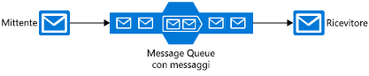

Ci sono molte piattaforme di comunicazione che consentono di migliorare l'affidabilità di un'applicazione distribuita, tra cui diverse in Azure. Ognuno di questi strumenti svolge una funzione diversa. Verranno ora analizzati i singoli strumenti di Azure per aiutare a scegliere quello più appropriato.

L'architettura dell'applicazione per l'ordinazione di una pizza e il monitoraggio dell'ordine richiede diversi componenti: un sito Web, spazio di archiviazione dei dati, servizio back-end e così via. È possibile associare i componenti dell'applicazione tra loro in molti modi diversi e una singola applicazione può sfruttare i vantaggi di più tecniche. 

È necessario stabilire quali tecniche usare nell'applicazione Contoso Slices. Il primo passaggio consiste nel valutare ogni posizione in cui avviene una comunicazione tra più parti. Alcuni componenti _devono_ venire eseguiti in modo tempestivo per il corretto funzionamento dell'applicazione. Altri componenti sono importanti ma non hanno requisiti di tempo critici. Infine, altri componenti, ad esempio le notifiche dell'app per dispositivi mobili, possono essere facoltativi.

In questo modulo si apprenderanno informazioni sulle piattaforme di comunicazione disponibili in Azure, in modo da poter scegliere quella più adatta per ogni requisito dell'applicazione.

## Scegliere tra messaggi ed eventi

Messaggi ed eventi sono entrambi **datagrammi**: pacchetti di dati inviati da un componente a un altro. Le differenze tra di essi a prima vista possono sembrare minime, ma possono determinare differenze significative nella progettazione dell'applicazione.

### Messaggi

Nella terminologia delle applicazioni distribuite, la caratteristica distintiva di un messaggio è il fatto che l'integrità complessiva dell'applicazione può basarsi sulla ricezione dei messaggi. È possibile pensare all'invio di un messaggio come un componente che passa il testimone di un flusso di lavoro a un altro componente. L'intero flusso di lavoro può essere un processo di business fondamentale e il messaggio è il cemento che tiene uniti i componenti.

Un messaggio contiene in genere i dati stessi e non solo un riferimento (come un ID o un URL) ai dati. L'invio dei dati come parte del datagramma è meno fragile rispetto all'invio di un riferimento. L'architettura di messaggistica garantisce il recapito del messaggio e poiché non sono richieste ricerche aggiuntive, il messaggio viene gestito in modo affidabile. Tuttavia, l'applicazione mittente deve sapere esattamente quali dati includere, per evitare l'invio di troppi dati che comporterebbero un lavoro non necessario da parte del componente destinatario. Da questo punto di vista, il mittente e il destinatario di un messaggio sono spesso collegati da un rigoroso contratto di dati.

Nella nuova architettura di Contoso Slices, quando viene immesso un ordine per una pizza, vengono probabilmente usati messaggi. Il front-end Web o l'app per dispositivi mobili invia un messaggio ai componenti di elaborazione back-end. Nel back-end vengono eseguiti passaggi come l'instradamento al negozio vicino al cliente e l'addebito sulla carta di credito.

### Eventi

Un evento attiva una notifica indicante che si è verificato qualcosa. Gli eventi sono più "leggeri" rispetto ai messaggi e vengono più spesso usati per le comunicazioni broadcast.

Gli eventi hanno le caratteristiche seguenti:

* L'evento può essere inviato a più destinatari o a nessuno
* Gli eventi sono spesso destinati a una distribuzione estesa, ovvero hanno un numero elevato di sottoscrittori per ogni origine di pubblicazione
* Il componente di pubblicazione dell'evento non ha aspettative sull'azione eseguita da un componente destinatario

La catena di pizzerie userebbe probabilmente gli eventi per inviare notifiche agli utenti relative alle modifiche di stato. Gli eventi di modifica dello stato possono essere inviati a Griglia di eventi di Azure, quindi a Funzioni di Azure e a Hub di notifica di Azure, per una soluzione completamente _serverless_.

Questa differenza tra eventi e messaggi è fondamentale perché le piattaforme di comunicazione sono in genere progettate per gestire uno o l'altro elemento. Il bus di servizio è progettato per gestire i messaggi. Se si vuole inviare eventi, scegliere Griglia di eventi.

Azure offre anche Hub eventi di Azure, che tuttavia viene usato più spesso per un tipo specifico di streaming con flusso elevato di comunicazioni in ambito di analisi. Se, ad esempio, i forni delle pizze avessero sensori connessi in rete, si potrebbe usare Hub eventi con Analisi di flusso di Azure per esaminare i modelli di variazione della temperatura che potrebbero indicare un incendio indesiderato o l'usura di un componente.

## Argomenti, code e inoltri del bus di servizio

Il bus di servizio di Azure è in grado di scambiare messaggi in tre modi diversi: code, argomenti e inoltri.

### Che cos'è una coda?

Una **coda** è una semplice posizione di archiviazione temporanea per i messaggi. Un componente mittente aggiunge un messaggio alla coda. Un componente di destinazione preleva il messaggio all'inizio della coda. In circostanze normali, ogni messaggio viene ricevuto da un solo destinatario.

Le code disaccoppiano i componenti di origine e di destinazione per isolare i componenti di destinazione in caso di domanda elevata. 

Durante i periodi di picco, i messaggi possono venire inviati a una velocità maggiore di quella con cui i componenti di destinazione possono gestirli. Poiché i componenti di origine non hanno alcuna connessione diretta con la destinazione, ciò non ha alcun effetto sull'origine e la lunghezza della coda aumenta. I componenti di destinazione rimuoveranno i messaggi dalla coda man mano che sono in grado di gestirli. Quando la domanda diminuisce, i componenti di destinazione possono recuperare e la lunghezza della coda si riduce.

Una coda risponde a una situazione di domanda elevata di questo tipo senza che sia necessario aggiungere risorse al sistema. Tuttavia, per i messaggi che devono essere gestiti in modo relativamente rapido, l'aggiunta di altre istanze del componente di destinazione può consentire la condivisione del carico. Ogni messaggio viene gestito da una sola istanza. Si tratta di un metodo efficace per ridimensionare l'intera applicazione aggiungendo solo le risorse per i componenti che ne hanno effettivamente bisogno.

### Che cos'è un argomento?

Un **argomento** è simile a una coda ma può avere più sottoscrizioni. Ciò significa che più componenti di destinazione possono sottoscrivere un singolo argomento, quindi ogni messaggio viene recapitato a più destinatari. Le sottoscrizioni consentono anche di filtrare i messaggi nell'argomento per ricevere solo i messaggi rilevanti. Le sottoscrizioni offrono le stesse comunicazioni disaccoppiate delle code e rispondono nello stesso modo in caso di domanda elevata. Usare un argomento se si vuole che ogni messaggio venga recapitato a più di un componente di destinazione.

Gli argomenti non sono supportati nel piano tariffario Basic.

### Che cos'è un inoltro?

Un **inoltro** è un oggetto che esegue una comunicazione sincrona bidirezionale tra applicazioni. Non si tratta di una posizione di archiviazione temporanea per i messaggi come nel caso di code e argomenti. Fornisce invece connessioni bidirezionali senza memorizzazione nel buffer attraverso i limiti di rete, ad esempio i firewall. Usare un inoltro per ottenere comunicazioni dirette tra i componenti, come se si trovassero nello stesso segmento di rete ma separati da dispositivi di sicurezza di rete.

> [!NOTE]
> Anche se gli inoltri fanno parte del bus di servizio di Azure, non implementano flussi di lavoro di messaggistica con accoppiamento debole e non vengono ulteriormente esaminati in questo modulo.

## Code di archiviazione e code del bus di servizio

Ci sono due funzionalità di Azure che includono le code di messaggi: il bus di servizio e gli account di archiviazione di Azure. In generale, le code di archiviazione sono più semplici da usare ma sono meno sofisticate e flessibili rispetto alle code del bus di servizio.

I principali vantaggi delle code del bus di servizio includono:

* Sono supportati messaggi di dimensioni maggiori (256 KB per ogni messaggio rispetto a 64 KB)
* Sono supportati sia il recapito di tipo At-Least-Once che quello di tipo At-Most-Once: è possibile scegliere tra una probabilità molto piccola che un messaggio vada perso o una probabilità molto piccola che venga gestito due volte
* Viene garantito l'ordine **FIFO (First-In-First-Out)**: i messaggi vengono gestiti nello stesso ordine con cui vengono aggiunti (anche se l'ordine FIFO rappresenta il normale funzionamento di una coda, non è garantito per ogni messaggio)
* È possibile raggruppare più messaggi in una transazione: se un messaggio nella transazione non viene recapitato, non vengono recapitati nemmeno gli altri messaggi nella transazione
* È supportata la sicurezza basata sui ruoli
* Non è necessario che i componenti di destinazione eseguano continuamente il polling della coda

Vantaggi delle code di archiviazione:

* Non ci sono limiti per le dimensioni delle code (rispetto al limite di 80 GB per le code del bus di servizio)
* Viene conservato un log di tutti i messaggi

## Come scegliere una tecnologia di comunicazione

Sono stati analizzati i diversi concetti e le implementazioni offerte da Azure. Verrà ora esaminato il processo decisionale per ognuna delle comunicazioni.

#### Prendere in considerazione le domande seguenti:

1. La comunicazione è un evento? In tal caso, usare Griglia di eventi o Hub eventi.

1. Un singolo messaggio deve essere recapitato a più di una destinazione? In tal caso, usare un argomento del bus di servizio. In caso contrario, usare una coda.

Se si decide che è necessaria una coda:

#### Scegliere le code del bus di servizio se:

* È necessaria una garanzia di recapito At-Most-Once
* È necessaria una garanzia FIFO
* È necessario raggruppare i messaggi in transazioni
* Si vuole ricevere i messaggi senza eseguire il polling della coda
* È necessario fornire accesso basato sui ruoli alle code
* È necessario gestire messaggi di dimensioni superiori a 64 KB, ma inferiori a 256 KB
* Le dimensioni della coda non supereranno gli 80 GB
* Si vuole poter pubblicare e usare batch di messaggi

#### Scegliere l'archivio code se:

* È necessaria una coda semplice senza particolari requisiti aggiuntivi
* È necessario un audit trail di tutti i messaggi che passano attraverso la coda
* Si prevede che le dimensioni della coda possano superare gli 80 GB
* Si vuole tenere traccia dello stato di elaborazione di un messaggio all'interno della coda

Anche se i componenti di un'applicazione distribuita possono comunicare direttamente, è spesso possibile migliorare l'affidabilità delle comunicazioni usando una piattaforma di comunicazione intermedia come Griglia di eventi Di Azure o il bus di servizio di Azure.

Griglia di eventi è una soluzione progettata per gli eventi, che invia una notifica ai destinatari solo per un evento e non contiene i dati non elaborati associati all'evento. Hub eventi di Azure è progettato per tipi di eventi di analisi con un flusso elevato. Le code di archiviazione e del bus di servizio di Azure sono destinate ai messaggi e possono essere usate per associare le parti principali del flusso di lavoro di un'applicazione.

Se i requisiti sono semplici, se si vuole inviare ogni messaggio solo a una destinazione o se si vuole scrivere codice il più rapidamente possibile, una coda di archiviazione può rappresentare la scelta migliore. In caso contrario, le code del bus di servizio offrono molte più opzioni e flessibilità.

Se si vuole inviare messaggi a più sottoscrittori, usare un argomento del bus di servizio.
