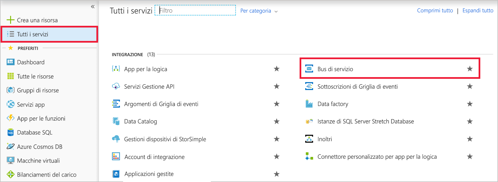
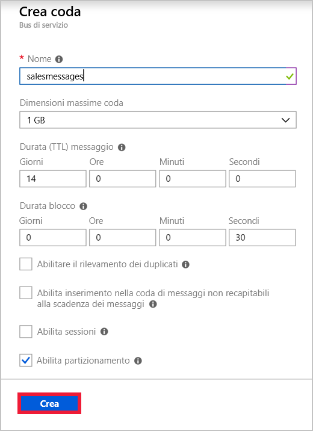
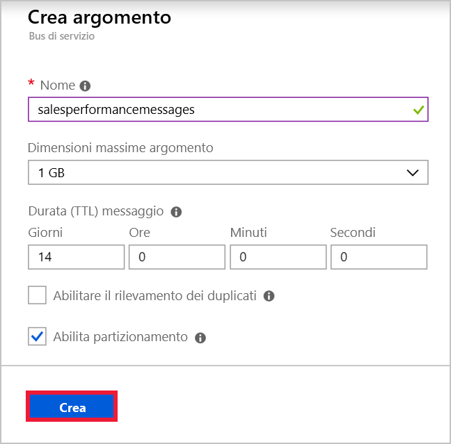

Si supponga di avere un'applicazione per il team di vendita di un'azienda globale. Ogni membro del team ha un telefono cellulare in cui verrà installata l'app. Un servizio Web ospitato in Azure implementa la logica di business per l'applicazione e archivia le informazioni nel database SQL di Azure. C'è un'istanza del servizio Web per ogni area geografica. Sono stati identificati gli scopi seguenti per l'invio di messaggi tra l'app per dispositivi mobili e il servizio Web:

- I messaggi relativi a singole vendite devono essere inviati solo all'istanza del servizio Web nell'area dell'utente.
- I messaggi relativi alle prestazioni di vendita devono essere inviati a tutte le istanze del servizio Web.

Si è deciso di implementare una coda del bus di servizio per il primo caso d'uso e l'argomento del bus di servizio per il secondo caso d'uso.

In questo esercizio si creerà uno spazio dei nomi del bus di servizio, che conterrà sia una coda che un argomento con sottoscrizioni.

## Creare uno spazio dei nomi del bus di servizio

[!include]

[!include]

Nel bus di servizio di Azure uno spazio dei nomi è un contenitore, con un nome di dominio completo univoco, per code, argomenti e inoltri. È necessario iniziare creando lo spazio dei nomi.

Ogni spazio dei nomi ha anche chiavi di crittografia di firma di accesso condiviso primarie e secondarie. Un componente mittente o destinatario deve fornire queste chiavi quando si connette per ottenere l'accesso agli oggetti nello spazio dei nomi.

Per creare uno spazio dei nomi del Bus di servizio usando il portale di Azure, seguire questa procedura:

1. Accedere al [portale di Azure](https://portal.azure.com/?azure-portal=true).

1. Nel riquadro di spostamento a sinistra fare clic su **Tutti i servizi**.

1. Nel **tutti i servizi** scorrere verso il basso fino al pannello il **INTEGRATION** sezione e quindi fare clic su **del Bus di servizio**.

    

1. In alto a sinistra nel pannello **Bus di servizio** fare clic su **Aggiungi**.

1. Nel **nome** testo, digitare un nome univoco per lo spazio dei nomi. Ad esempio "salesteamapp" + *le iniziali seguite* + *data corrente*.

1. Nell'elenco a discesa **Piano tariffario** selezionare **Standard**.

1. Nell'elenco a discesa **Sottoscrizione** selezionare la sottoscrizione in uso.

1. Sotto **gruppo di risorse**, selezionare **Usa esistente** e scegliere <rgn>[nome gruppo di risorse di tipo Sandbox]</rgn>.

1. Nel **ubicazione** dall'elenco a discesa, seleziona una località vicino a te e quindi fare clic su **crea**. Azure creerà il nuovo spazio dei nomi del bus di servizio.

    

## Creare una coda del bus di servizio

Dopo aver creato uno spazio dei nomi, è possibile creare una coda per i messaggi relativi alle singole vendite. A questo scopo, seguire questa procedura:

1. Nel pannello **Bus di servizio** fare clic su **Aggiorna**. Verrà visualizzato lo spazio dei nomi appena creato.

1. Fare clic sullo spazio dei nomi appena creato.

1. In alto a sinistra nel pannello dello spazio dei nomi fare clic su **Coda**.

1. Nel **Crea coda** pannello nella **nome** casella di testo, digitare **salesmessages**e quindi fare clic su **Create**. Azure creerà la coda nello spazio dei nomi.

    

## Creare un argomento del bus di servizio e le sottoscrizioni

Si vuole creare anche un argomento che verrà usato per i messaggi relativi alle prestazioni di vendita. Più istanze del servizio Web per la logica di business eseguiranno la sottoscrizione di questo argomento da paesi diversi. Ogni messaggio verrà recapitato a più istanze.

Seguire questa procedura:

1. Nel pannello **Spazio dei nomi del bus di servizio** fare clic su **+ Argomento**.

1. Nel **Crea argomento** pannello nella **nome** casella di testo, digitare **salesperformancemessages**e quindi fare clic su **Create**. Azure creerà l'argomento nello spazio dei nomi.

    

1. Quando l'argomento è stato creato, nelle **Service Bus Namespace** pannello, in **entità**, fare clic su **argomenti**.

1. Nell'elenco di argomenti, fare clic su **salesperformancemessages**, quindi fare clic su **+ sottoscrizione**.

1. Nel **nome** casella di testo, digitare **Americas**, quindi fare clic su **Create**.

1. Fare clic su **+ Sottoscrizione**.

1. Nel **Name** casella di testo, digitare **EuropeAndAfrica**, quindi fare clic su **crea**.

È stata creata l'infrastruttura necessaria per usare il bus di servizio per aumentare la resilienza dell'applicazione distribuita per la forza vendita. Sono stati creati una coda per i messaggi relativi alle singole vendite e un argomento per i messaggi relativi alle prestazioni di vendita. L'argomento include più sottoscrizioni perché i messaggi inviati all'argomento possono essere recapitati a più servizi Web di destinazione in tutto il mondo.
