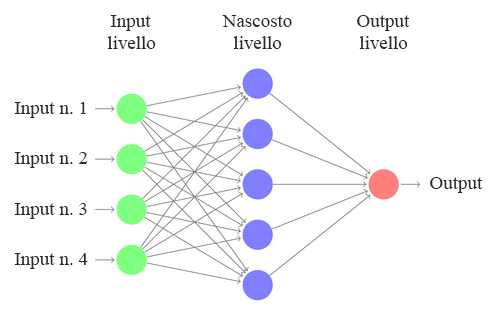
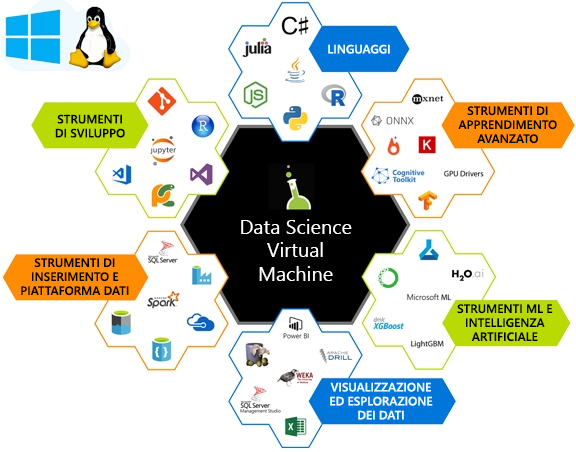

L'obiettivo dell'apprendimento automatico (ML, Machine Learning) è quello di trovare le funzioni per eseguire il training di un modello che trasforma i dati di input (ad esempio immagini, serie temporali o audio) in un determinato output (ad esempio didascalie, valori dei prezzi, trascrizioni).The goal of Machine Learning (ML) is to find features to train a model that transforms input data (such as pictures, time series, or audio) to a given output (for example captions, price values, transcriptions). In uno scenario di data science tradizionale, le funzioni vengono spesso selezionate manualmente.In traditional data science, features are often handcrafted. Queste funzioni selezionate manualmente vengono inserite in un algoritmo di apprendimento superficiale, ad esempio la rete illustrata nel diagramma seguente.These handcrafted features are fed into a shallow learning algorithm, such as the network shown in the following diagram. 

Nell'apprendimento avanzato il processo di estrazione delle funzioni viene appreso tramite la rappresentazione degli input come vettori e la loro trasformazione, con una serie di operazioni algebriche lineari intelligenti, in un determinato output.In Deep Learning (DL), the process of feature extraction is learned through representing inputs as vectors and transforming them, with a series of clever linear algebra operations, into a given output.  L'output del modello viene confrontato con l'output previsto usando un'equazione detta funzione di perdita.The model output is compared against the expected output using an equation called a loss function. Il valore restituito dalla funzione di perdita di ogni input di training viene usato per guidare il modello nell'estrazione delle funzioni, con una conseguente riduzione del valore della perdita al passaggio successivo.The value returned by the loss function of each training input is used to guide the model to extract features that will result in a lower loss value on the next pass. Questo processo è denominato *training*.This process is called *training*. 

Attraverso il training, questi algoritmi apprendono le funzioni più appropriate e con prestazioni migliori per il set di dati specificato.Through training, these algorithms learn the best performing and most appropriate features for the given dataset. Vengono chiamati profondi per via del numero di livelli nella rete.They are called deep because of the number of layers in the network.  

Le serie di operazioni della matrice che vengono calcolate nell'ambito del componente algebrico lineare sono dispendiose in termini di calcolo.The series of matrix operations that we compute as part of the linear algebra component are computationally expensive. Queste operazioni possono spesso essere elaborate in parallelo, rendendole ottimi candidati per calcoli specializzati, per il calcolo efficiente delle unità di elaborazione grafica (GPU).These operations can often be processed in parallel, making them great candidates for specialized compute such as Graphics Processing Units (GPUs) to compute efficiently.

La configurazione di un ambiente di apprendimento profondo è considerevole.Setting up an environment to do deep learning is non-trivial. Qual è la configurazione hardware? Il training del modello e con GPU o CPU? Quantità memoria devono avere i computer?What's the hardware setup, do you train your model with CPUs or GPUs, and how much memory should these machines have? La creazione e il training di una rete di apprendimento profondo richiedono l'installazione del software appropriato.Creating and training a deep learning network needs the right software to be installed. Sono disponibili diversi framework di apprendimento profondo, ma è necessario tenere conto delle dipendenze tra ogni componente.You've lots of  deep learning frameworks to choose from, but need to be mindful of dependencies between each component. Al termine di questa configurazione si potrebbe individuare un modello ideale creato in un altro framework e si potrebbe provarlo. È tuttavia il caso di evitare le complessità associate al recupero di un nuovo framework di apprendimento profondo con tutte le relative dipendenze configurate nel computer.After all of this setup, you might find a great model created on another framework and would like to try it out. You don’t want the overhead of getting a new deep learning framework with all of its dependencies set up on your machine. Data Science Virtual Machine può risolvere questi problemi.The Data Science Virtual Machine can help solve these problems. 

## Che cos'è Data Science Virtual Machine (DSVM)?What is a Data Science Virtual Machine (DSVM)?

Data Science Virtual Machine è un'immagine di macchina virtuale (VM) in Azure.The Data Science Virtual Machine is a virtual machine (VM) image on Azure. Al suo interno sono installati e configurati numerosi strumenti comuni per il data science e l'apprendimento profondo.It has many popular data science and deep learning tools already installed and configured. Queste immagini includono strumenti comuni per il data science e l'apprendimento automatico, tra cui Microsoft R Server Developer Edition, Microsoft R Open, Anaconda Python, Julia, Jupyter Notebook, Visual Studio Code, RStudio, xgboost e molti altri.These images come with popular data science and machine learning tools, including Microsoft R Server Developer Edition, Microsoft R Open, Anaconda Python, Julia, Jupyter notebooks, Visual Studio Code, RStudio, xgboost, and many more.  Anziché implementare un'area di lavoro analoga, è possibile eseguire il provisioning di una Data Science Virtual Machine e risparmiare un'enorme quantità di tempo per i processi di installazione, configurazione e gestione dei pacchetti.Instead of rolling out a comparable workspace on your own, you can provision a DSVM - saving you lots of time on the installation, configuration, and package management processes. Dopo aver allocato la Data Science Virtual Machine, sarà possibile iniziare immediatamente a lavorare al progetto di data science.Once your DSVM has been deployed, you can immediately begin working on your data science project.

La DSVM può essere usata per il training dei modelli usando gli algoritmi di apprendimento profondo sull'hardware basato su GPU (unità di elaborazione grafica).The DSVM can be used for training models using deep learning algorithms on Graphics processing units (GPUs) hardware. Grazie alle funzioni di scalabilità delle VM del cloud di Azure, la DSVM consente di usare hardware basato su GPU nel cloud in base alle necessità.Utilizing VM scaling capabilities of Azure cloud, DSVM helps you use GPU-based hardware on the cloud as per need. È possibile passare a una VM basata su GPU durante il training di modelli di grandi dimensioni o quando sono necessari calcoli ad alta velocità, mantenendo lo stesso disco del sistema operativo.You can switch to a GPU-based VM when training large models or need high-speed computations while keeping the same OS disk. Nell'edizione Windows Server 2016 della DSVM sono preinstallati i driver GPU, i framework e la versione GPU dei framework di apprendimento profondo.The Windows Server 2016 edition of DSVM comes pre-installed with GPU drivers, frameworks, and GPU versions of deep learning frameworks. Su Linux, l'apprendimento profondo su GPU è abilitato sulle DSVM CentOS e Ubuntu.On the Linux, deep learning on GPU is enabled on both the CentOS and Ubuntu DSVMs. È possibile distribuire l'edizione Ubuntu, CentOS o Windows 2016 della DSVM in macchine virtuali di Azure non basate su GPU, nel qual caso tutti i framework di apprendimento profondo eseguiranno il fallback alla modalità CPU.You can also deploy the Ubuntu, CentOS, or Windows 2016 edition of the Data Science VM to CPU-based Azure virtual machines, in which case all the deep learning frameworks will fallback to CPU mode. 

Per altre informazioni sulle operazioni che è possibile eseguire con una DSVM, vedere [Data science con una macchina virtuale di data science Linux in Azure](https://docs.microsoft.com/azure/machine-learning/data-science-virtual-machine/linux-dsvm-walkthrough)For more information on what you can do with a DSVM, see [Data science with a Linux Data Science Virtual Machine on Azure](https://docs.microsoft.com/azure/machine-learning/data-science-virtual-machine/linux-dsvm-walkthrough)

