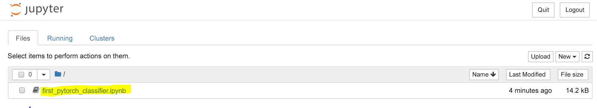
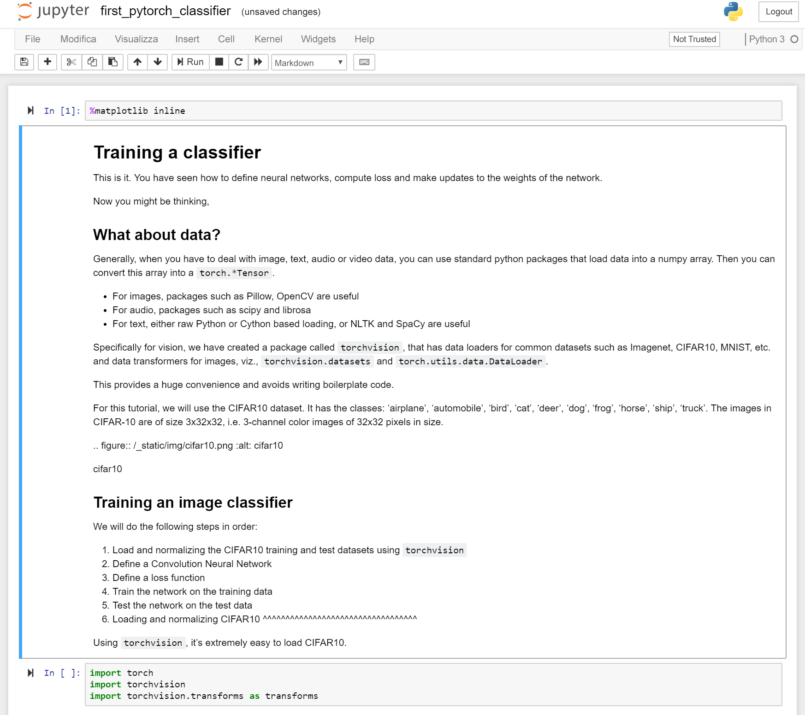

 

Gli ingegneri specializzati in apprendimento profondo non implementano in genere a mano tutte le operazioni algebriche su matrici hardcoded,Typically deep learning engineers don't implement the matrix algebra operations all by hand. ma si servono di framework come PyTorch o TensorFlow.Instead, they use frameworks such as PyTorch or TensorFlow.  

PyTorch è un framework basato su Python che offre flessibilità come piattaforma di sviluppo per l'apprendimento profondo.PyTorch is a python-based framework that provides flexibility as a deep learning development platform. È basato su NumPy, la libreria di calcolo scientifico Python.It's built on the Python scientific computing library, NumPy. 

A questo punto ci si potrebbe chiedere perché usare PyTorch per creare modelli di apprendimento avanzato?Now you might ask, why would we use PyTorch to build deep learning models?  

- L'API è intuitiva: l'apprendimento è rapido se l'utente già conosce Python.Easy to use API – If you know Python, you can ramp up quickly.
- Include il supporto per Python. PyTorch si integra infatti con lo stack di calcolo scientifico.Python support – PyTorch smoothly integrates with the scientific computing stack.
- Include i grafici di calcolo dinamico. Invece di grafici predefiniti con funzionalità specifiche, PyTorch crea dinamicamente grafici di calcolo che è possibile modificare in fase di esecuzione.Dynamic computation graphs – Instead of predefined graphs with specific functionality, PyTorch builds computational graphs dynamically that can be modified during runtime. I grafici di calcolo dinamico sono utili per l'invio in batch annidato e quando non si conosce la memoria necessaria per la creazione di una determinata rete.Dynamic computation graphs are valuable for nested batching and when we do not know how much memory will be needed for creating a given network.

Per altre informazioni su PyTorch, vedere la [documentazione ufficiale su PyTorch.org](https://pytorch.org/about/).For more information about PyTorch, see [PyTorch.org official documentation](https://pytorch.org/about/).

## Eseguire il primo modello PyTorchRun your first PyTorch model

Dopo aver creato un contenitore Docker sottoposto a provisioning da un'immagine PyTorch, è il momento di iniziare a sperimentare.Now that you have a Docker container provisioned from a PyTorch image, it's time to experiment. Come si ricorderà, è stato scaricato un notebook da [python.org](https://python.org). Questo notebook di esempio illustra la procedura per eseguire il training di una rete finalizzato alla classificazione di immagini in categorie diverse.If you recall, we downloaded a notebook from [python.org](https://python.org). That sample notebook walks you through training a network to classify images  into different categories. Definisce una rete neurale convoluzionale (CNN) profonda.It defines a deep Convolutional Neural Network (CNN).

1. Passare nel browser locale al server Jupyter Notebook configurato nell'esercizio precedente.Navigate in your local browser to the Jupyter Notebook server that you set up in the last exercise. L'URL sarà nel formato:The URL will be of the form:

    `<HOSTNAME>.<REGION>.cloudapp.azure.com:8888/?token={sometoken}`

1. Selezionare il notebook `first_pytorch_classifier.ipynb` nel dashboard.Select the `first_pytorch_classifier.ipynb` notebook in the dashboard.

    

    Seguire le istruzioni contenute nel notebook per eseguire il training del primo classificatore PyTorch.Follow the instructions in the notebook to train your first PyTorch classifier.

    

2. Iniziare dalla parte superiore del notebook ed eseguire ogni cella in ordine.Start from the top of the notebook and run each cell in order. Tenere presente quanto segue:Note the following:

    - L'esecuzione di alcune celle richiede molto tempo.Some of the cells take a long time to run. Osservare il puntino in alto a destra del notebook accanto alle parole "Python 3".Observe the small dot in the top right of the notebook beside the words "Python 3". Quando il kernel è occupato con un'operazione, il punto diventa un cerchio pieno più scuro.When the kernel is busy with an operation, the dot becomes a filled, darker, circle. Rimarrà visualizzato in questo modo fino al termine dell'operazione.It remains that way until the operation is complete. 
    - Si esegue il training di una rete CNN per classificare le immagini.You're training a CNN to classify images. Una volta completato il training, il notebook testerà le immagini etichettate a fronte del modello.Once the network is trained, the notebook will test labeled images against the model. Registra la stima eseguita per ogni immagine e calcola l'accuratezza del modello.It records the prediction made for each image and calculates the accuracy of the model. I risultati verranno visualizzati nel formato seguente.You'll see results in the following format.

    
    
    - È possibile acquisire familiarità con il notebook nella [documentazione delle esercitazioni di PyTorch](https://pytorch.org/tutorials/beginner/blitz/cifar10_tutorial.html) online.You can learn more about the notebook in the [PyTorch Tutorials documentation](https://pytorch.org/tutorials/beginner/blitz/cifar10_tutorial.html) online.
    
    - Verso la fine del notebook, le note indicano un training su una GPU.Towards the end of the notebook, the notes talk about training on a GPU. Se si sono eseguiti gli esercizi in questo modulo, è stata configurata una VM basata su CPU.If you followed the exercises in this module, you have set up a CPU-based VM. Questa situazione è ideale per un modello di queste dimensioni e potrebbero non essere riscontrati miglioramenti significativi nel tempo di training con una GPU.This is fine for a model this size and you may not see any significant improvements in training time with a GPU. Per provare il modulo usando una macchina virtuale con GPU, è necessario apportare due modifiche:If you do want to try the module using a  virtual machine with GPUs, then there are two changes you need to make:
    - Effettuare il provisioning di DSVM in una dimensione di VM serie N abilitata per la GPU.Provision DSVM on a GPU enabled, N-series VM size.
    - Creare un contenitore usando `nvidia-docker` invece di `docker` nell'esercizio precedente.Create a container using `nvidia-docker` instead of `docker` in the previous exercise.