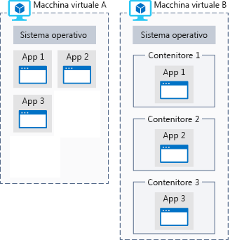

Il team di ricerca ha raccolto una quantità di dati di immagine talmente enorme da portare a una scoperta su Marte.Your research team has collected massive amounts of image data that might lead to a discovery on Mars. Deve ora eseguire un processo di elaborazione dei dati a elevata intensità di calcolo, ma non ha gli strumenti adatti.They need to perform computationally intense data processing but don't have the equipment to do the work. Di seguito viene illustrato perché Azure è un'ottima scelta per l'analisi dei dati.Let's see why Azure is a good choice to do the data analysis.

## Che cos'è il calcolo di Azure?What is Azure compute?
Il calcolo di Azure è un servizio di calcolo on demand per l'esecuzione di applicazioni basate sul cloud.Azure compute is an on-demand computing service for running cloud-based applications. Offre risorse di calcolo, ad esempio processori multi-core e supercomputer, tramite macchine virtuali e contenitori.It provides computing resources like multi-core processors and supercomputers via virtual machines and containers. Offre inoltre l'elaborazione serverless per eseguire le app senza la necessità di installare o configurare l'infrastruttura.It also provides serverless computing to run apps without requiring infrastructure setup or configuration. Le risorse sono disponibili on demand e in genere possono essere create in pochi minuti o addirittura secondi.The resources are available on-demand and can typically be created in minutes or even seconds. Si paga solo per le risorse usate e solo per il periodo in cui le si usa.You pay only for the resources you use and only for as long as you're using them.

Esistono tre tecniche comuni per l'esecuzione del calcolo in Azure:There are three common techniques for performing compute in Azure:

- Macchine virtualiVirtual machines
- ContenitoriContainers
- Elaborazione serverlessServerless computing

## Che cosa sono le macchine virtuali?What are virtual machines?

Le **macchine virtuali**, o VM, sono emulazioni software di computer fisici.**Virtual machines**, or VMs, are software emulations of physical computers. Includono un processore virtuale, memoria, archiviazione e risorse di rete.They include a virtual processor, memory, storage, and networking resources. Ospitano un sistema operativo e consentono di installare ed eseguire software come in un computer fisico.They host an operating system, and you're able to install and run software just like a physical computer. Tramite un client desktop remoto è inoltre possibile usare e controllare la macchina virtuale proprio come se ci si trovasse di fronte a un computer fisico.And by using a remote desktop client, you can use and control the virtual machine as if you were sitting in front it.

:::row:::
  :::column:::
    
  :::column-end:::
    :::column span="3"::: **Macchine virtuali in Azure**:::column span="3"::: **Virtual machines in Azure**

È possibile creare e ospitare macchine virtuali in Azure.Virtual machines can be created and hosted in Azure. In genere, è possibile creare nuove macchine virtuali ed eseguirne il provisioning in pochi minuti selezionando l'immagine di una macchina virtuale preconfigurata.Typically, new virtual machines can be created and provisioned in minutes by selecting a pre-configured virtual machine image.

La scelta di un'immagine è una delle decisioni più importanti durante la creazione di una macchina virtuale.Selecting an image is one of the most important decisions you'll make when creating a VM. Un'immagine è un modello usato per creare una macchina virtuale.An image is a template used to create a virtual machine. Questi modelli includono già un sistema operativo e, spesso, anche altri software, ad esempio strumenti di sviluppo o ambienti di hosting web.These templates already include an operating system (OS) and often other software, such as development tools or web hosting environments.

  :::column-end:::
:::row-end:::

## Che cosa sono i contenitori?What are containers?

> [!VIDEO https://www.microsoft.com/videoplayer/embed/RE2yMhY]

I contenitori sono ambienti di virtualizzazione ma, a differenza di una macchina virtuale, non includono un sistema operativo.Containers are a virtualization environment but, unlike a virtual machine, they do not include an operating system. Al contrario, fanno riferimento al sistema operativo dell'ambiente host che esegue il contenitore.Instead, they reference the operating system of the host environment that runs the container. Ad esempio, se cinque contenitori sono in esecuzione su un server con un kernel Linux specifico, tutti e cinque i contenitori sono in esecuzione sullo stesso kernel.For example, if five containers are running on a server with a specific Linux kernel, all five containers are running on that same kernel.

La figura seguente illustra un confronto tra le applicazioni in esecuzione direttamente in una macchina virtuale e le applicazioni in esecuzione all'interno di contenitori in una macchina virtuale.The following illustration shows a comparison between applications running directly on a VM and applications running inside containers on a VM.

I contenitori includono in genere un'applicazione scritta dall'utente insieme alle librerie necessarie per eseguire l'applicazione nel kernel dell'ambiente host.Containers typically contain an application that you write &mdash; along with any libraries required for your application to run on the host environment's kernel.

I contenitori sono concepiti per essere leggeri e sono stati progettati per essere creati, scalati e arrestati in modo dinamico.Containers are meant to be lightweight and are designed to be created, scaled out, and stopped dynamically. Ciò consente di rispondere ai cambiamenti della domanda e di riavviarli rapidamente in caso di arresto anomalo del sistema o interruzione hardware.This allows you to respond to changes on demand and quickly restart in case of a crash or hardware interruption.

Un altro vantaggio dell'uso dei contenitori è la possibilità di eseguire più applicazioni isolate in una macchina virtuale.An additional benefit of using containers is the ability to run multiple isolated applications on a virtual machine. Poiché i contenitori stessi sono protetti e isolati, non è necessario separare le macchine virtuali per carichi di lavoro separati.Since containers themselves are secured and isolated, you don't necessarily need separate VMs for separate workloads.

Azure supporta i contenitori Docker, nonché diverse modalità per la loro gestione.Azure supports Docker containers and several ways to manage those containers. I contenitori possono essere gestiti manualmente o con servizi di Azure, ad esempio Azure Kubernetes Service.Containers can be managed manually or with Azure services such as Azure Kubernetes Service.

### Che cos'è l'elaborazione serverless?What is serverless computing?

L'elaborazione serverless è un ambiente di esecuzione ospitato sul cloud che esegue il codice ma che astrae completamente l'ambiente di hosting sottostante.Serverless computing is a cloud-hosted execution environment that runs your code but completely abstracts the underlying hosting environment. Si crea un'istanza del servizio e si aggiunge il codice: non è necessaria, né tantomeno consentita, alcuna configurazione o manutenzione dell'infrastruttura.You create an instance of the service, and you add your code; no infrastructure configuration or maintenance is required, or even allowed.

#### Che cos'è l'elaborazione serverless?What is Serverless Computing?

> [!VIDEO https://www.microsoft.com/videoplayer/embed/RE2yzjL]

Le app serverless vengono configurate per rispondere ad _eventi_.You configure your serverless apps to respond to _events_. Può trattarsi di un endpoint REST, un timer o anche un messaggio ricevuto da un altro servizio di Azure.This could be a REST endpoint, a periodic timer, or even a message received from another Azure service. L'app serverless viene eseguita solo quando viene attivata da un evento.The serverless app runs only when it's triggered by an event.

In pratica, l'utente non è responsabile dell'infrastruttura.Essentially, infrastructure isn't your responsibility. La scalabilità e le prestazioni vengono gestite automaticamente e vengono addebitate solo le risorse effettivamente usate.Scaling and performance are handled automatically, and you are billed only for the exact resources you use. Non è necessario prenotare la capacità.There's no need to even reserve capacity.

:::row:::
  :::column:::
    
  :::column-end:::
    :::column span="3"::: **Elaborazione serverless in Azure**:::column span="3"::: **Serverless computing in Azure**

Azure offre due tipi di implementazione dell'elaborazione serverless:Azure has two implementations of serverless compute:

- **Funzioni di Azure**, che possono eseguire codice praticamente in tutti i linguaggi moderni.**Azure Functions** which can execute code in almost any modern language.
- **App per la logica di Azure**, che sono state progettate in una finestra di progettazione basata su Web e possono eseguire la logica attivata dai servizi di Azure senza scrivere alcun codice.**Azure Logic Apps** which are designed in a web-based designer and can execute logic triggered by Azure services without writing any code.

  :::column-end:::
:::row-end:::