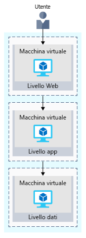
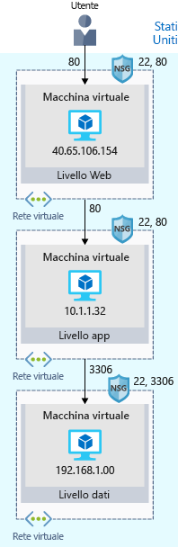

La prima operazione sarà probabilmente ricreare la configurazione locale nel cloud.Your first step will likely be to re-create your on-premises configuration in the cloud.

Questa configurazione di base offre un'idea di come vengono configurate le reti e di come il traffico di rete entra ed esce da Azure.This basic configuration will give you a sense of how networks are configured, and how network traffic moves in and out of Azure.

## Riepilogo del sito di e-commerceYour e-commerce site at a glance

I sistemi aziendali più grandi sono spesso costituiti da più applicazioni e servizi interconnessi che interagiscono tra loro.Larger enterprise systems are often composed of multiple inter-connected applications and services that work together. Potrebbe essere presente un sistema Web front-end che visualizza l'inventario e consente ai clienti di creare un ordine.You might have a front-end web system that displays inventory and allows customers to create an order. Tale sistema potrebbe comunicare con svariati servizi Web per fornire i dati dell'inventario, gestire i profili utente, elaborare le carte di credito e richiedere l'evasione degli ordini elaborati.That might talk to a variety of web services to provide the inventory data, manage user profiles, process credit cards, and request fulfillment of processed orders.

Esistono diverse strategie e modelli adottati dagli architetti e progettisti di software per semplificare la progettazione, la compilazione, la gestione e la manutenzione di questi sistemi complessi.There are several strategies and patterns employed by software architects and designers to make these complex systems easier to design, build, manage, and maintain. Ne verranno analizzati alcuni, tra cui le _architetture a regime di controllo libero_.Let's look at a few of them, starting with _loosely coupled architectures_.

#### Vantaggi delle architetture a regime di controllo liberoBenefits of Loosely Coupled Architectures

> [!VIDEO https://www.microsoft.com/videoplayer/embed/RE2yHrc]

### Uso di un'architettura a più livelliUsing an N-tier architecture

Un modello architettonico che può essere usato per compilare sistemi a regime di controllo libero è _a più livelli_.An architectural pattern that can be used to build loosely coupled systems is _N-tier_.

Un'[architettura a più livelli](https://docs.microsoft.com/azure/architecture/guide/architecture-styles/n-tier) consente di dividere un'applicazione in due o più livelli logici.An [N-tier architecture](https://docs.microsoft.com/azure/architecture/guide/architecture-styles/n-tier) divides an application into two or more logical tiers. Dal punto di vista dell'architettura, un livello superiore può accedere ai servizi da un livello inferiore, ma un livello inferiore non deve mai accedere a un livello superiore.Architecturally, a higher tier can access services from a lower tier, but a lower tier should never access a higher tier.

I livelli consentono di separare le problematiche e idealmente sono progettati in modo da poter essere usati più volte.Tiers help separate concerns, and are ideally designed to be reusable. L'uso di un'architettura a livelli semplifica anche la manutenzione.Using a tiered architecture also simplifies maintenance. I livelli possono essere aggiornati o sostituiti in modo indipendente e, se necessario, si possono inserire nuovi livelli.Tiers can be updated or replaced independently, and new tiers can be inserted if needed.

_A tre livelli_ si riferisce a un'applicazione a più livelli che include tre livelli._Three-tier_ refers to an n-tier application that has three tiers. L'applicazione Web di e-commerce segue questa architettura a tre livelli:Your e-commerce web application follows this three-tier architecture:

* Il **livello Web** rende disponibile agli utenti l'interfaccia Web in un browser.The **web tier** provides the web interface to your users through a browser.
* Il **livello applicazione** esegue la logica di business.The **application tier** runs business logic.
* Il **livello dati** include i database e altre risorse di archiviazione che contengono le informazioni sui prodotti e gli ordini dei clienti.The **data tier** includes databases and other storage that hold product information and customer orders.

La figura seguente illustra il flusso della richiesta dall'utente al livello dati.The following illustration shows the flow of request from the user to the data tier.

Quando l'utente fa clic sul pulsante per effettuare l'ordine, la richiesta viene inviata al livello Web, insieme all'indirizzo dell'utente e alle informazioni di pagamento.When the user clicks the button to place the order, the request is sent to the web tier, along with the user's address and payment information. Il livello Web passa queste informazioni al livello applicazione per la convalida delle informazioni di pagamento e il controllo dell'inventario.The web tier passes this information to the application tier, which would validate payment information and check inventory. Il livello applicazione può quindi archiviare l'ordine nel livello dati in modo da selezionarlo in un secondo tempo per evadere l'ordine.The application tier might then store the order in the data tier, to be picked up later for fulfillment.

## Il sito di e-commerce in esecuzione in AzureYour e-commerce site running on Azure

Azure offre diversi modi per ospitare le applicazioni Web, da ambienti completamente preconfigurati che ospitano il codice per le macchine virtuali configurate, personalizzate e gestite dall'utente.Azure provides many different ways to host your web applications, from fully pre-configured environments that host your code, to virtual machines that you configure, customize, and manage.

Si supponga di scegliere di eseguire il sito di e-commerce in macchine virtuali.Let's say you choose to run your e-commerce site on virtual machines. Di seguito è riportato un esempio di ciò che potrebbe apparire nell'ambiente di test in esecuzione in Azure.Here's what that might look like in your test environment running on Azure. La figura seguente mostra un'architettura a tre livelli in esecuzione in macchine virtuali con funzionalità di sicurezza abilitate per limitare le richieste in ingresso.The following illustration shows a three-tier architecture running on virtual machines with security features enabled to restrict inbound requests. 

L'app si può scomporre come segue.Let's break this down.

:::row:::
  :::column:::
    
  :::column-end:::
    :::column span="3"::: **Che cos'è un'area di Azure?**:::column span="3"::: **What's an Azure region?**

Un'_area_ è un data center di Azure in un'area geografica specifica.A _region_ is an Azure data center within a specific geographic location. Stati Uniti orientali, Stati Uniti occidentali ed Europa settentrionale sono esempi di aree.East US, West US, and North Europe are examples of regions. In questo caso l'applicazione viene eseguita nell'area Stati Uniti orientali.In this instance, you see that the application is running in the East US region.

  :::column-end:::
:::row-end:::
:::row:::
  :::column:::
    
  :::column-end:::
    :::column span="3"::: **Che cos'è una rete virtuale?**:::column span="3"::: **What's a virtual network?**

Una _rete virtuale_ è una rete isolata logicamente in Azure.A _virtual network_ is a logically isolated network on Azure. L'utente avrà dimestichezza con le reti virtuali di Azure se ha configurato le reti in Hyper-V, VMware o anche in altri cloud pubblici.Azure virtual networks will be familiar to you if you've set up networks on Hyper-V, VMware, or even on other public clouds.

Ogni livello Web, applicazione e dati ha un'unica macchina virtuale.The web, application, and data tiers each have a single VM. Ogni macchina virtuale appartiene a una rete virtuale.Each VM belongs to a virtual network.

Gli utenti interagiscono con il livello Web direttamente, quindi la macchina virtuale ha un indirizzo IP pubblico.Users interact with the web tier directly, so that VM has a public IP address. Gli utenti non interagiscono con i livelli dati o applicazione.Users don't interact with the application or data tiers. Quindi queste macchine virtuali hanno un indirizzo IP privato.So these VMs each have a private IP address.

I data center di Azure gestiscono l'hardware fisico per l'utente.Azure data centers manage the physical hardware for you. Le reti virtuali si configurano usando il software, che consente di gestire una rete virtuale esattamente come la propria rete.You configure virtual networks through software, which enables you to treat a virtual network just like your own network. Ad esempio, è possibile suddividere una rete virtuale in subnet per controllare meglio il modo in cui la rete assegna gli indirizzi IP.For example, you can divide a virtual network into subnets to better control how the network assigns IP addresses. È anche possibile scegliere quali altre reti può raggiungere la rete virtuale, se la rete Internet pubblica o altre reti nello spazio indirizzi IP privato.You also choose which other networks your virtual network can reach, whether that's the public internet or other networks in the private IP address space.

  :::column-end:::
:::row-end:::
:::row:::
  :::column:::
    
  :::column-end:::
    :::column span="3"::: **Che cos'è un gruppo di sicurezza di rete?**:::column span="3"::: **What's a network security group?**

Un _gruppo di sicurezza di rete_, o NSG, consente o nega il traffico di rete in ingresso alle risorse di Azure.A _network security group_, or NSG, allows or denies inbound network traffic to your Azure resources. Un gruppo di sicurezza di rete può essere paragonato a un firewall a livello cloud per la rete.Think of a network security group as a cloud-level firewall for your network.

Si può notare ad esempio che la macchina virtuale nel livello Web consente il traffico in ingresso sulle porte 22 (SSH) e 80 (HTTP).For example, notice that the VM in the web tier allows inbound traffic on ports 22 (SSH) and 80 (HTTP). Il gruppo di sicurezza di rete della macchina virtuale consente il traffico in ingresso attraverso queste porte da tutte le origini.This VM's network security group allows inbound traffic over these ports from all sources. È possibile configurare un gruppo di sicurezza di rete per accettare il traffico solo da origini note, ad esempio gli indirizzi IP considerati attendibili.You can configure a network security group to accept traffic only from known sources, such as IP addresses that you trust.

> [!NOTE]
> La porta 22 consente di connettersi direttamente ai sistemi Linux con SSH.Port 22 enables you to connect directly to Linux systems over SSH. Di seguito è illustrata la porta 22 aperta ai fini dell'apprendimento.Here we show port 22 open for learning purposes. In pratica, è possibile configurare l'accesso VPN alla rete virtuale per avere una maggiore protezione.In practice, you might configure VPN access to your virtual network to increase security.

  :::column-end:::
:::row-end:::

## RiepilogoSummary

L'applicazione a tre livelli è ora in esecuzione in Azure nell'area Stati Uniti orientali.Your three-tier application is now running on Azure in the East US region. Un'_area_ è un data center di Azure in un'area geografica specifica.A _region_ is an Azure data center within a specific geographic location.

Ogni livello può accedere ai servizi solo da un livello inferiore.Each tier can access services only from a lower tier. La macchina virtuale in esecuzione nel livello Web ha un indirizzo IP pubblico perché riceve il traffico da Internet.The VM running in the web tier has a public IP address because it receives traffic from the internet. Le macchine virtuali nei livelli inferiori, ovvero i livelli applicazione e dati, hanno tutte indirizzi IP privati perché non comunicano direttamente su Internet.The VMs in the lower tiers, the application and data tiers, each have private IP addresses because they don't communicate directly over the internet.

Le _reti virtuali_ consentono di raggruppare e isolare i sistemi correlati._Virtual networks_ enable you to group and isolate related systems. Si definiscono i _gruppi di sicurezza di rete_ per stabilire quale traffico può passare attraverso una rete virtuale.You define _network security groups_ to control what traffic can flow through a virtual network.

La configurazione illustrata qui è un buon punto di partenza.The configuration you saw here is a good start. Quando tuttavia si distribuisce il sito di e-commerce nell'ambiente di produzione nel cloud, è probabile che si incontrino gli stessi problemi incontrati nella distribuzione a livello locale.But when you deploy your e-commerce site to production in the cloud, you'll likely run into the same problems as you did in your on-premises deployment.
