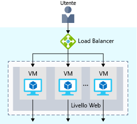
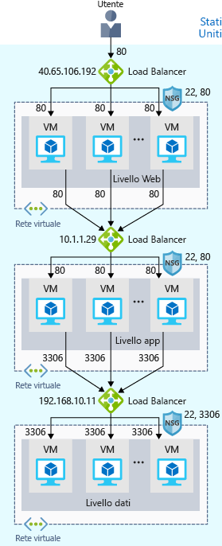
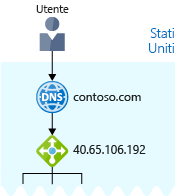

Ora il sito è operativo in Azure.You now have your site up and running on Azure. Ma come fare in modo che il sito rimanga in esecuzione ininterrottamente?But how can you help ensure your site is running 24/7?

Cosa accade, ad esempio, quando è necessario eseguire la manutenzione settimanale?For instance, what happens when you need to do weekly maintenance? Il servizio continuerà a essere non disponibile durante il periodo di manutenzione.Your service will still be unavailable during your maintenance window. E poiché il sito raggiunge gli utenti in tutto il mondo, non esiste un buon momento per arrestare i sistemi per la manutenzione.And because your site reaches users all over the world, there's no good time to take down your systems for maintenance. È anche possibile riscontrare problemi di prestazioni se troppi utenti si connettono allo stesso tempo.You may also run into performance issues if too many users connect at the same time.

## Che cosa sono la durabilità e la disponibilità elevata?What are availability and high availability?

:::row:::
  :::column:::
    
  :::column-end:::
    :::column span="3"::: Il termine _disponibilità_ indica il periodo di tempo in cui il servizio rimane operativo senza interruzioni.:::column span="3"::: _Availability_ refers to how long your service is up and running without interruption. Il termine _disponibilità elevata_ oppure _a disponibilità elevata_ indica che un servizio rimane operativo per un lungo periodo di tempo._High availability_, or _highly available_, refers to a service that's up and running for a long period of time.

È notoriamente frustrante non poter accedere alle informazioni necessarie.You know how frustrating it is when you can't access the information you need. Si pensi a un sito di social media o di notizie che si visita ogni giorno.Think of a social media or news site that you visit daily. È sempre possibile accedere al sito o spesso vengono visualizzati messaggi di errore, ad esempio "503 - Servizio non disponibile"?Can you always access the site, or do you often see error messages like "503 Service Unavailable"?
  :::column-end:::
 :::row-end:::

È probabile che si siano già sentite espressioni come "disponibilità cinque nove".You may have heard terms like "five nines availability." Disponibilità cinque nove significa che l'esecuzione del servizio è garantita per il 99,999% del tempo.Five nines availability means that the service is guaranteed to be running 99.999 percent of the time. Nonostante sia difficile ottenere una disponibilità pari al 100%, molti team si impegnano per ottenere almeno quella cinque nove.Although it's difficult to achieve 100 percent availability, many teams strive for at least five nines.

## Cos'è la resilienza?What is resiliency?

:::row:::
  :::column:::
    
  :::column-end:::
    :::column span="3"::: Il termine _resilienza_ indica la capacità di un sistema di rimanere operativo in condizioni anomale.:::column span="3"::: _Resiliency_ refers to a system's ability to stay operational during abnormal conditions.

Queste condizioni includono:These conditions include:

- Calamità naturali.Natural disasters.
- Manutenzione del sistema, sia pianificata che non pianificata, con aggiornamenti software e patch di sicurezza.System maintenance, both planned and unplanned, including software updates and security patches.
- Picchi di traffico verso il sito.Spikes in traffic to your site.
- Minacce effettuate da malintenzionati, ad esempio attacchi Distributed Denial of Service (DDoS).Threats made by malicious parties, such as distributed denial of service, or DDoS, attacks.
  :::column-end:::
:::row-end:::

Si immagini che il team di marketing voglia organizzare una vendita lampo per promuovere una nuova linea di integratori vitaminici.Imagine your marketing team wants to have a flash sale to promote a new line of vitamin supplements. Durante questo periodo si può prevedere un notevole picco di traffico.You might expect a huge spike in traffic during this time. Questo picco potrebbe sovraccaricare il sistema di elaborazione, fino a rallentarlo o interromperlo, creando disappunto tra gli utenti.This spike could overwhelm your processing system, causing it to slow down or halt, disappointing your users. È probabile che si sia già provata questa delusione in prima persona.You may have experienced this disappointment for yourself. È mai capitato di provare ad accedere a una vendita online e scoprire che il sito Web non risponde?Have you ever tried to access an online sale only to find the website wasn't responding?

## Informazioni sui servizi di bilanciamento del caricoWhat is a load balancer?

:::row:::
  :::column:::
    
  :::column-end:::
    :::column span="3"::: Un _servizio di bilanciamento del carico_ distribuisce uniformemente il traffico tra ogni sistema di un pool.:::column span="3"::: A _load balancer_ distributes traffic evenly among each system in a pool. Un servizio di bilanciamento del carico può consentire di ottenere la disponibilità elevata e la resilienza.A load balancer can help you achieve both high availability and resiliency.

Si potrebbe iniziare aggiungendo a ogni livello altre VM, ognuna con configurazione identica.Say you start by adding additional VMs, each configured identically, to each tier. L'obiettivo è avere altri sistemi pronti nel caso in cui uno diventi inattivo o gestisca troppi utenti contemporaneamente.The idea is to have additional systems ready, in case one goes down or is serving too many users at the same time.
  :::column-end:::
:::row-end:::

Il problema in questo caso è che ogni VM avrà il proprio indirizzo IP.The problem here is that each VM would have its own IP address. Non è inoltre possibile distribuire il traffico, nel caso in cui un sistema diventi inattivo o sia occupato.Plus, you don't have a way to distribute traffic in case one system goes down or is busy. Come connettere le VM in modo che per l'utente siano un unico sistema?How do you connect your VMs so that they appear to the user as one system?

La risposta consiste nell'usare un servizio di bilanciamento del carico per distribuire il traffico.The answer is to use a load balancer to distribute traffic. Il servizio di bilanciamento del carico diventa il punto di ingresso per l'utente.The load balancer becomes the entry point to the user. L'utente non sa (o non deve necessariamente sapere) quale sistema venga scelto dal servizio di bilanciamento del carico per ricevere la richiesta.The user doesn't know (or need to know) which system the load balancer chooses to receive the request.

L'illustrazione seguente mostra il ruolo di un servizio di bilanciamento del carico.The following illustration shows the role of a load balancer.

Si noterà che il servizio di bilanciamento del carico riceve la richiesta dell'utente.You see that the load balancer receives the user's request. Il servizio di bilanciamento del carico indirizza la richiesta a una delle VM nel livello Web.The load balancer directs the request to one of the VMs in the web tier. Se una VM non è disponibile o smette di rispondere, il servizio di bilanciamento del carico smette di inviarle il traffico.If a VM is unavailable or stops responding, the load balancer stops sending traffic to it. Il servizio di bilanciamento del carico indirizza quindi il traffico a uno dei server reattivi.The load balancer then directs traffic to one of the responsive servers.

Il bilanciamento del carico consente di eseguire le attività di manutenzione senza interrompere il servizio.Load balancing enables you to run maintenance tasks without interrupting service. È ad esempio possibile sfalsare la finestra di manutenzione per ogni VM.For example, you can stagger the maintenance window for each VM. Durante la finestra di manutenzione, il servizio di bilanciamento del carico rileva che la VM non risponde e indirizza il traffico ad altre VM nel pool.During the maintenance window, the load balancer detects that the VM is unresponsive, and directs traffic to other VMs in the pool.

Per un sito di e-commerce, anche i livelli app e dati possono avere un servizio di bilanciamento del carico.For your e-commerce site, the app and data tiers can also have a load balancer. Tutto dipende dai requisiti del servizio.It all depends on what your service requires.

## Che cos'è Azure Load Balancer?What is Azure Load Balancer?

Azure Load Balancer è un servizio di bilanciamento del carico fornito da Microsoft, che esegue automaticamente la manutenzione.Azure Load Balancer is a load balancer service that Microsoft provides that helps take care of the maintenance for you.

Quando si configura manualmente un software di bilanciamento del carico tipico in una macchina virtuale, esiste lo svantaggio di dover eseguire la manutenzione di un altro sistema.When you manually configure typical load balancer software on a virtual machine, there's a downside: you now have an additional system that you need to maintain. Se il servizio di bilanciamento del carico si arresta o necessita di manutenzione di routine, si ripresenta il problema originale.If your load balancer goes down or needs routine maintenance, you're back to your original problem.

Se tuttavia si usa in alternativa Azure Load Balancer, non è necessario occuparsi della manutenzione di infrastrutture o software.If instead, however, you use Azure Load Balancer, there's no infrastructure or software for you to maintain.

L'illustrazione seguente mostra il ruolo dei servizi di bilanciamento del carico di Azure in un'architettura multilivello.The following illustration shows  the role of Azure load balancers in a multi-tier architecture.

## Informazioni sul DNSWhat about DNS?

:::row:::
  :::column:::
    
  :::column-end:::
    :::column span="3"::: Il DNS (Domain Name System) è un modo per eseguire il mapping dei nomi descrittivi ai rispettivi indirizzi IP.:::column span="3"::: DNS, or Domain Name System, is a way to map user-friendly names to their IP addresses. Si può immaginare il DNS come una rubrica di Internet.You can think of DNS as the phonebook of the internet.

Il nome di dominio contoso.com, ad esempio, potrebbe essere mappato all'indirizzo IP del servizio di bilanciamento del carico nel livello Web, 40.65.106.192.For example, your domain name, contoso.com, might map to the IP address of the load balancer at the web tier, 40.65.106.192.

È possibile usare il proprio server DNS oppure DNS di Azure, un servizio di hosting per i domini DNS che viene eseguito nell'infrastruttura di Azure.You can bring your own DNS server or use Azure DNS, a hosting service for DNS domains that runs on Azure infrastructure.
  :::column-end:::
:::row-end:::

Nella figura seguente viene illustrato DNS di Azure.The following illustration shows Azure DNS. Quando l'utente passa a contoso.com, DNS di Azure indirizza il traffico al servizio di bilanciamento del carico.When the user navigates to contoso.com, Azure DNS routes traffic to the load balancer.

## RiepilogoSummary

Con il bilanciamento del carico il sito di e-commerce è ora a disponibilità più elevata e più resiliente.With load balancing in place, your e-commerce site is now more highly available and resilient. In caso di manutenzione o un aumento del traffico, il servizio di bilanciamento del carico può distribuire il traffico a un altro sistema disponibile.When you perform maintenance or receive an uptick in traffic, your load balancer can distribute traffic to another available system.

Anche se è possibile configurare un servizio di bilanciamento del carico personalizzato in una VM, Azure Load Balancer riduce le attività di manutenzione perché non sono presenti infrastrutture o software che la richiedono.Although you can configure your own load balancer on a VM, Azure Load Balancer reduces upkeep because there's no infrastructure or software to maintain.

Il DNS esegue il mapping dei nomi descrittivi ai rispettivi indirizzi IP, così come una rubrica associa i nomi di persone o aziende ai numeri di telefono.DNS maps user-friendly names to their IP addresses, much like how a phonebook maps names of people or businesses to phone numbers. È possibile usare un proprio server DNS o DNS di Azure.You can bring your own DNS server, or use Azure DNS.
