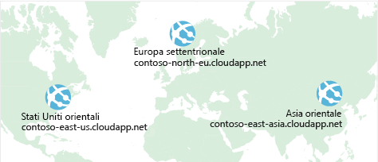
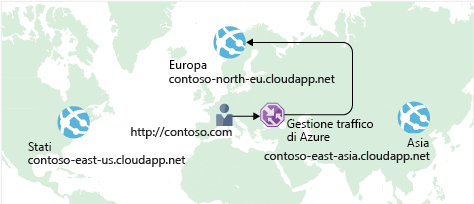

In precedenza si è visto come **Azure Load Balancer** consente di ottenere la disponibilità elevata e ridurre al minimo il tempo di inattività.

Anche se il sito di e-commerce presenta una disponibilità più elevata, non risolve il problema della latenza o crea resilienza nelle varie aree geografiche.

Come si può fare in modo che il sito, che si trova negli Stati Uniti, venga caricato più rapidamente per gli utenti che si trovano in Europa o Asia?

## Che cos'è la latenza di rete?

Il termine _latenza_ indica il tempo necessario perché i dati vengano trasferiti attraverso la rete. La latenza viene in genere misurata in millisecondi.

Confrontare la latenza con la larghezza di banda. Per larghezza di banda si intende la quantità di dati che possono essere contenuti nella connessione. Per latenza si intende il tempo necessario affinché tali dati raggiungano la destinazione finale.

Sulla latenza possono influire fattori come il tipo di connessione usata e il modo in cui è stata progettata l'applicazione. Il fattore principale è probabilmente la distanza.

Si pensi al sito di e-commerce in Azure situato nell'area degli Stati Uniti orientali. In genere sarebbe necessario meno tempo per trasferire i dati ad Atlanta (a una distanza di circa 400 miglia) che per trasferirli a Londra (a una distanza di circa 4.000 miglia).

Il sito di e-commerce offre HTML, CSS, JavaScript e immagini standard. La latenza di rete per più file può risultare superiore. Come si può ridurre la latenza per gli utenti che si trovano geograficamente lontani?

## Applicare la scalabilità orizzontale a diverse regioni

Si ricorda che Azure offre data center in tutto il mondo.

Tenere in considerazione il costo della creazione di un data center. I costi delle apparecchiature non sono l'unico fattore. È necessario predisporre l'alimentazione, i sistemi di raffreddamento e il personale necessari per garantire il corretto funzionamento dei sistemi in tutte le posizioni. La replica dell'intero data center potrebbe quindi risultare eccessivamente dispendiosa. Se tuttavia la replica viene eseguita con Azure può avere un costo molto inferiore, perché sono già presenti le attrezzature e il personale necessari.

Un modo per ridurre la latenza è offrire copie esatte del servizio in più aree. La figura seguente mostra un esempio di distribuzione globale.

Il diagramma illustra il sito di e-commerce in esecuzione in tre aree di Azure: Stati Uniti orientali, Europa settentrionale e Asia orientale. Si noti il nome DNS per ognuna di esse. Come è possibile connettere gli utenti al servizio che si trova geograficamente più vicino ma all'interno del dominio contoso.com?

## Usare Gestione traffico per instradare gli utenti all'endpoint più vicino

Una soluzione è **Gestione traffico di Azure**. Gestione traffico usa il server DNS più vicino all'utente per indirizzare il traffico dell'utente verso un endpoint distribuito a livello globale. L'illustrazione seguente mostra il ruolo di Gestione traffico.

Gestione traffico non vede il traffico tra il client e il server. Indirizza invece il Web browser del client verso un endpoint preferito. Gestione traffico può indirizzare il traffico in modi diversi, ad esempio verso l'endpoint con latenza più bassa.

Anche se non viene illustrata qui, questa configurazione può includere anche la distribuzione locale in esecuzione in California. È possibile connettere Gestione traffico alle proprie reti locali, per mantenere gli investimenti nei data center esistenti. È anche possibile spostare l'applicazione interamente nel cloud. La scelta spetta all'utente.

## Confrontare Load Balancer con Gestione traffico

Azure Load Balancer distribuisce il traffico nella stessa area per rendere i servizi a disponibilità più elevata e più resilienti. Gestione traffico opera a livello di DNS e indirizza il client verso un endpoint preferito. Tale endpoint può essere l'area più vicina agli utenti.

Load Balancer e Gestione traffico consentono entrambi di rendere i servizi più resilienti, ma in modi leggermente diversi. Quando Load Balancer rileva una macchina virtuale che non risponde, indirizza il traffico ad altre macchine virtuali nel pool. Gestione traffico monitora l'integrità degli endpoint. Al contrario, quando Gestione traffico rileva un endpoint che non risponde, indirizza il traffico all'endpoint più vicino successivo che è reattivo.

## Riepilogo

La distanza geografica è uno dei fattori principali che contribuisce alla latenza. Con Gestione traffico è possibile ospitare le copie esatte del servizio in più aree geografiche. In questo modo, gli utenti che si trovano in Stati Uniti, Europa e Asia avranno un'esperienza ottimale nell'uso del sito di e-commerce.
