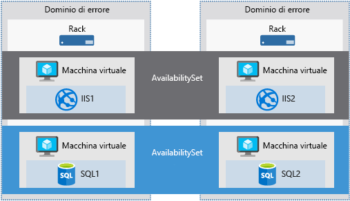

Il successo di una società di servizi spesso dipende direttamente dai contratti di servizio che la società stabilisce con i clienti.Often, the success of a services company is directly related to the service level agreements (SLA) the company has with its customers. I clienti si aspettano che i servizi forniti siano sempre disponibili e che i dati siano protetti.Your customers expect the services you provide always to be available and their data kept safe. Microsoft prende molto seriamente questo aspetto.This is something that Microsoft takes very seriously. Azure fornisce strumenti che è possibile usare per gestire disponibilità, sicurezza dei dati e monitoraggio ed essere quindi certi che i servizi siano sempre disponibili per i clienti.Azure provides tools you can use to manage availability, data security, and monitoring, so you know your services are always available for your customers.

L'amministrazione di una VM di Azure non si limita alla gestione del sistema operativo o del software in esecuzione nella VM.Administration of an Azure VM isn't limited to managing the operating system or software that runs on the VM. Consente di sapere quali sono i servizi forniti da Azure, assicurando la disponibilità dei servizi e supportando l'automazione.It helps to know which services Azure provides that ensure service availability and support automation. Questi servizi consentono di pianificare la strategia di continuità aziendale e ripristino di emergenza dell'organizzazione.These services help you to plan your organization's business continuity and disaster recovery strategy.

Verrà qui illustrato un servizio di Azure che consente di migliorare la disponibilità della VM, semplifica le attività di gestione della VM e conserva i dati della VM di cui è stato eseguire un backup, tenendoli al sicuro.Here, we'll cover an Azure service that helps you improve VM availability, streamlines VM management tasks, and keeps your VM data backed up and safe. Si inizierà definendo la disponibilità.Let's start by defining availability.

## Che cos'è la disponibilità?What is availability?

La disponibilità è la percentuale di tempo in cui un servizio è disponibile per l'uso.Availability is the percentage of time a service is available for use.

Si supponga di avere un sito Web e di voler fare in modo che i clienti possano accedere alle informazioni in qualsiasi momento.Let's assume you have a website and you want your customers to be able to access information at all times. Per l'accesso al sito Web è prevista una disponibilità del 100%.Your expectation is 100% availability concerning website access.

### Perché preoccuparsi della disponibilità quando si usa Azure?Why do I need to think about availability when using Azure?

Le VM di Azure vengono eseguite in server fisici ospitati nei data center di Microsoft.Azure VMs run on physical servers hosted within Microsoft's data centers. Come per la maggior parte dei dispositivi fisici, potrebbe verificarsi un guasto.As with most physical devices, there's a chance that there could be a failure. Se si verifica un guasto nel server fisico, si verifica un errore anche nelle macchine virtuali ospitate in tale server.If the physical server fails, the virtual machines hosted on that server will also fail. In questo caso Azure sposterà automaticamente la VM in un server host integro.If this happens, Azure will move the VM to a healthy host server automatically. Questa migrazione automatica potrebbe tuttavia richiedere alcuni minuti, durante i quali le applicazioni ospitate in tale VM non saranno disponibili.However, this self-healing migration could take several minutes, during which, the application(s) hosted on that VM will not be available.

Le VM potrebbero anche essere interessate da aggiornamenti periodici avviati da Azure.The VMs could also be affected by periodic updates initiated by Azure itself. Questi eventi di manutenzione comprendono aggiornamenti software e hardware e sono necessari per migliorare l'affidabilità e le prestazioni della piattaforma.These maintenance events range from software updates to hardware upgrades and are required to improve platform reliability and performance. Questi eventi vengono in genere eseguiti senza conseguenze per le VM guest, ma in alcuni casi le macchine virtuali verranno riavviate per completare un aggiornamento.These events usually are performed without impacting any guest VMs, but sometimes the virtual machines will be rebooted to complete an update or upgrade.

> [!NOTE]
> Microsoft non aggiorna automaticamente il sistema operativo o il software delle VM.Microsoft does not automatically update your VM's OS or software. È l'utente ad avere il controllo completo e la responsabilità di questa operazione.You have complete control and responsibility for that. All'host del software e all'hardware sottostanti, tuttavia, vengono periodicamente applicate patch per garantire affidabilità e prestazioni elevate in qualsiasi momento.However, the underlying software host and hardware are periodically patched to ensure reliability and high performance at all times.

Per assicurarsi che i servizi non vengano interrotti ed evitare un singolo punto di guasto, è consigliabile distribuire almeno due istanze di ogni VM.To ensure your services aren't interrupted and avoid a single point of failure, it's recommended to deploy at least two instances of each VM. Questa funzionalità è chiamata _set di disponibilità_.This feature is called an _availability set_.

### Che cos'è un set di disponibilità?What is an availability set?

Un **set di disponibilità** è una funzionalità logica usata per assicurarsi che venga distribuito un gruppo di VM correlate in modo che non siano tutte soggette a un singolo punto di guasto e non vengano tutte aggiornate contemporaneamente durante un aggiornamento del sistema operativo host nel data center.An **availability set** is a logical feature used to ensure that a group of related VMs are deployed so that they aren't all subject to a single point of failure and not all upgraded at the same time during a host operating system upgrade in the data center. Le VM inserite in un set di disponibilità eseguiranno un set identico di funzionalità e avranno lo stesso software installato.VMs placed in an availability set should perform an identical set of functionalities and have the same software installed.

> [!TIP]
> Microsoft offre un contratto di servizio di connettività esterna al 99,95% per le VM a più istanze distribuite in un set di disponibilità.Microsoft offers a 99.95% external connectivity service level agreement (SLA) for multiple-instance VMs deployed in an availability set. Perché il contratto di servizio sia valido, devono quindi essere distribuite almeno due istanze della VM in un set di disponibilità.That means that for the SLA to apply, there must be at least two instances of the VM deployed within an availability set. 

È possibile creare i set di disponibilità nella sezione del portale di Azure relativa al ripristino di emergenza.You can create availability sets through the Azure portal in the disaster recovery section. È anche possibile crearli usando i modelli di Resource Manager oppure uno strumento di scripting o API.Also, you can build them using Resource Manager templates, or any of the scripting or API tools. Quando si inseriscono le VM in un set di disponibilità, Azure garantisce che vengano distribuite tra **domini di errore** e **domini di aggiornamento**.When you place VMs into an availability set, Azure guarantees to spread them across **Fault Domains** and **Update Domains**.

#### Che cos'è un dominio di errore?What is a fault domain?

Un dominio di errore è un gruppo logico di hardware in Azure che condividono un'unità di alimentazione o un commutatore di rete comune.A fault domain is a logical group of hardware in Azure that shares a common power source and network switch. Può essere considerato come un rack in un data center locale.You can think of it as a rack within an on-premises datacenter. Il provisioning delle prime due VM di un set di disponibilità verrà effettuato in due diversi rack in modo che, se dovesse verificarsi un guasto a livello di rete o di alimentazione in un rack, ne sarebbe interessata solo una VM.The first two VMs in an availability set will be provisioned into two different racks so that if the network or the power failed in a rack, only one VM would be affected. I domini di errore vengono definiti anche per i dischi gestiti collegati alle VM.Fault domains are also defined for managed disks attached to VMs.

#### Che cos'è un dominio di aggiornamento?What is an update domain?

Un dominio di aggiornamento è un gruppo logico di hardware che può essere sottoposto a manutenzione oppure riavviato nello stesso momento.An update domain is a logical group of hardware that can undergo maintenance or be rebooted at the same time. Azure inserirà automaticamente i set di disponibilità nei domini di aggiornamento per ridurre al minimo l'impatto quando la piattaforma Azure introduce modifiche nel sistema operativo host.Azure will automatically place availability sets into update domains to minimize the impact when the Azure platform introduces host operating system changes. Azure elabora quindi ogni dominio di aggiornamento singolarmente.Azure then processes each update domain one at a time.

I set di disponibilità sono una funzionalità avanzata che assicura che i servizi in esecuzione nelle VM siano sempre disponibili per i clienti.Availability sets are a powerful feature to ensure the services running in your VMs are always available to your customers. Non sono tuttavia infallibili.However, they aren't foolproof. Cosa accade se si verifica un problema relativo ai dati o al software in esecuzione nella VM?What if something happens to the data or the software running on the VM itself? In questo caso sarà necessario ricorrere ad altre tecniche di ripristino di emergenza e backup.For that, we'll need to look at other disaster recovery and backup techniques.

## Failover in diverse localitàFailover across locations

È anche possibile replicare l'infrastruttura tra siti per gestire il failover a livello di area.You can also replicate your infrastructure across sites to handle regional failover. **Azure Site Recovery** replica i carichi di lavoro da un sito primario a una località secondaria.**Azure Site Recovery**  replicates workloads from a primary site to a secondary location. Se si verifica un'interruzione nel sito primario, è possibile effettuare il failover in una località secondaria.If an outage happens at your primary site, you can fail over to a secondary location. Questo failover consente agli utenti di continuare ad accedere alle applicazioni senza interruzioni.This failover allows users to continue to access your applications without interruption. Sarà quindi possibile effettuare il failback nella località primaria quando sarà di nuovo operativa.You can then fail back to the primary location once it's up and running again. Azure Site Recovery consente la replica delle macchine virtuali o dei computer fisici, garantendo la disponibilità dei carichi di lavoro in caso di interruzione.Azure Site Recovery is about replication of virtual or physical machines; it keeps your workloads available in an outage.

Oltre alle numerose utili funzionalità di Site Recovery, sono almeno due i vantaggi importanti per le aziende:While there are many attractive technical features to Site Recovery, there are at least two significant business advantages:

1. Site Recovery consente l'uso di Azure come destinazione per il ripristino, eliminando i costi e la complessità derivanti dalla gestione di un data center fisico secondario.Site Recovery enables the use of Azure as a destination for recovery, thus eliminating the cost and complexity of maintaining a secondary physical datacenter.

2. Site Recovery semplifica considerevolmente il test dei failover con esercitazioni sul ripristino senza alcun impatto sugli ambienti di produzione.Site Recovery makes it incredibly simple to test failovers for recovery drills without impacting production environments. In questo modo risulta più facile testare i failover pianificati o non pianificati.This makes it easy to test your planned or unplanned failovers. Non si può infatti considerare valido un piano di ripristino di emergenza se non si è mai provato a effettuare il failover.After all, you don’t have a good disaster recovery plan if you’ve never tried to failover.

I piani di ripristino creati con Site Recovery possono essere semplici o complessi a seconda dello scenario.The recovery plans you create with Site Recovery can be as simple or as complex as your scenario requires. Possono includere script di PowerShell personalizzati, runbook di Automazione di Azure o procedure di intervento manuale.They can include custom PowerShell scripts, Azure Automation runbooks, or manual intervention steps. È possibile sfruttare i piani di ripristino per replicare i carichi di lavoro in Azure, creando facilmente nuove opportunità per migrazione, burst temporanei durante i periodi di sovratensione o sviluppo e test di nuove applicazioni.You can leverage the recovery plans to replicate workloads to Azure, easily enabling new opportunities for migration, temporary bursts during surge periods, or development and testing of new applications.

Azure Site Recovery usa le risorse di Azure o i server Hyper-V, VMware e fisici nell'infrastruttura locale e può diventare un elemento chiave della strategia di continuità aziendale e ripristino di emergenza (BCDR) dell'organizzazione orchestrando la replica, il failover e il ripristino di carichi di lavoro e applicazioni se si verifica un guasto nella località primaria.Azure Site Recovery works with Azure resources, or Hyper-V, VMware, and physical servers in your on-premises infrastructure and can be a key part of your organization’s business continuity and disaster recovery (BCDR) strategy by orchestrating the replication, failover, and recovery of workloads and applications if the primary location fails.
