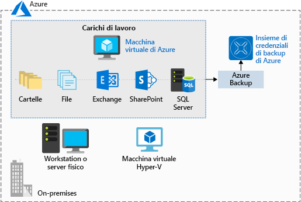

Il backup e ripristino dei dati è una parte necessaria della pianificazione di qualsiasi valida infrastruttura. Potrebbe trattarsi di un bug che cancella i dati o potrebbe essere necessario recuperare alcuni dati archiviati a fini di controllo. Adottando una valida strategia di backup, non si avranno problemi quando sarà necessario ripristinare dati o software.

**Backup di Azure** è un'offerta di _backup come servizio_ che protegge i computer fisici o le macchine virtuali indipendentemente da dove si trovano: in locale o nel cloud.

Backup di Azure può essere usato per svariati scenari di backup dei dati, ad esempio i seguenti:

- File e cartelle in computer con sistema operativo Windows (fisici o virtuali, locali o cloud)
- Snapshot con riconoscimento dell'applicazione (servizio Copia Shadow del volume)
- Carichi di lavoro dei server Microsoft più diffusi, ad esempio Microsoft SQL Server, Microsoft SharePoint e Microsoft Exchange
- Supporto nativo per Macchine virtuali di Azure, sia Windows che Linux
- Computer client Linux e Windows 10

## Vantaggi dell'uso di Backup di Azure

Le tradizionali soluzioni di backup non sempre sfruttano pienamente la piattaforma Azure sottostante. La soluzione tende quindi a essere costosa o inefficiente. La soluzione offre troppo spazio di archiviazione oppure troppo poco, non offre i tipi corretti di archiviazione o comporta attività amministrative lunghe e complesse. Backup di Azure è stato progettato per operare in parallelo con altri servizi di Azure e offre numerosi vantaggi specifici.

- **Gestione automatica dell'archiviazione**. Backup di Azure alloca e gestisce automaticamente l'archivio di backup e usa un modello di pagamento in base al consumo. Si paga solo per le risorse usate.

- **Scalabilità illimitata**. Backup di Azure usa le potenti funzionalità e la scalabilità di Azure per garantire una disponibilità elevata.

- **Più opzioni di archiviazione**. Backup di Azure offre l'archiviazione con ridondanza locale, in cui tutte le copie dei dati esistono nella stessa area, e l'archiviazione con ridondanza geografica, in cui i dati vengono replicati in un'area secondaria.

- **Trasferimento dei dati senza limiti**. Backup di Azure non limita la quantità di dati trasferiti in ingresso o in uscita. Backup di Azure non addebita costi per i dati trasferiti.

- **Crittografia dei dati**. La crittografia dei dati consente la trasmissione e l'archiviazione sicure dei dati in Azure.

- **Backup coerente con l'applicazione**. Un backup coerente con l'applicazione indica che un punto di ripristino ha tutti i dati necessari per ripristinare la copia di backup. Backup di Azure fornisce backup coerenti con le applicazioni.

- **Conservazione a lungo termine**. Azure non limita il periodo di conservazione dei dati di backup.

## Uso di Backup di Azure

Backup di Azure utilizza diversi componenti che vengono scaricati e distribuiti in ogni computer di cui si vuole eseguire il backup. Il componente distribuito dipende dall'elemento che si intende proteggere.

- Agente di Backup di Azure
- System Center Data Protection Manager
- Server di Backup di Azure
- Estensione macchina virtuale di Backup di Azure

Backup di Azure usa l'insieme di credenziali di Servizi di ripristino per archiviare i dati di backup. Un insieme di credenziali è supportato dai BLOB di Archiviazione di Azure, che ne fanno un supporto di archiviazione a lungo termine molto efficiente ed economico. Con l'insieme di credenziali è possibile selezionare i computer di cui eseguire un backup e definire un criterio di backup (quando acquisire gli snapshot e per quanto tempo archiviarli).