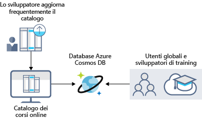

Analizzando i vantaggi dell'archiviazione dei dati di Azure, emerge che offre le migliori opzioni per archiviare il portale di formazione.Looking at the benefits of Azure data storage, you understand that it offers the best options for storing your learning portal. Si analizzeranno ora in dettaglio i vantaggi e le opzioni disponibili per vedere come possono adattarsi alle esigenze aziendali.Now let's explore the benefits and options in detail to see how it fits your business needs.

## Come l'archiviazione dei dati di Azure può soddisfare le esigenze di archiviazione aziendaliHow Azure data storage can meet your business storage needs

Azure offre diverse opzioni adatte a soddisfare specifiche esigenze di archiviazione dei dati.Azure provides several storage options that accommodate specific types of data storage needs. Esaminiamone brevemente alcune.Let's take a brief look at some of them.

:::row:::
  :::column:::
    
  :::column-end:::
    :::column span="3"::: **Database SQL di Azure**:::column span="3"::: **Azure SQL Database**

Il **database SQL di Azure** è un database cloud relazionale affidabile e completamente gestito.**Azure SQL Database** is a robust, fully managed, relational cloud database. È possibile usare questa funzionalità per archiviare i dati che si aggiornano e a cui si accede di frequente, ad esempio i dati personali e le informazioni relative alla formazione del personale.You can use this feature to store data that you frequently access and update, such as personal and training-related information for your staff. È anche possibile eseguire la migrazione dei database SQL Server esistenti senza apportare modifiche alle applicazioni.You can also migrate your existing SQL Server databases without changing your applications. La figura seguente illustra i tipi di dati dello scenario del portale di formazione online che verrebbero archiviati in un database SQL di Azure.The following illustration shows the types of data from the online learning portal scenario that would be stored in an Azure SQL database.

:::column-end:::
:::row-end:::
:::row:::
  :::column:::
    
  :::column-end:::
    :::column span="3"::: **Azure Cosmos DB**:::column span="3"::: **Azure Cosmos DB**

Azure Cosmos DB è un servizio di database distribuito a livello globale.Azure Cosmos DB is a globally distributed database service. Supporta dati senza schema e consente di creare applicazioni **Always On** altamente reattive con le quali poter gestire i dati in continuo cambiamento.It supports schema-less data that lets you build highly responsive and **Always On** applications to support constantly changing data. È possibile usare questa funzionalità per archiviare i dati che vengono aggiornati e gestiti da utenti in tutto il mondo.You can use this feature to store data that is updated and maintained by users around the world. La figura seguente illustra un esempio di database di Azure Cosmos DB usato per archiviare i dati a cui accedono gli utenti di tutto il mondo.The following illustration shows a sample Azure Cosmos DB database that's used to store data that's accessed by people located across the globe.

:::column-end:::
:::row-end:::
:::row:::
  :::column:::
    
  :::column-end:::
    :::column span="3"::: **Archiviazione BLOB di Azure**:::column span="3"::: **Azure Blob storage**

Archiviazione BLOB di Azure consente di trasmettere file video o audio di grandi dimensioni direttamente nel browser dell'utente da qualsiasi parte del mondo.Azure Blob storage lets you stream large video or audio files directly to the user's browser from anywhere in the world. Archiviazione BLOB consente anche di memorizzare i dati a scopo di backup e ripristino, ripristino di emergenza e archiviazione.Blob storage is also used to store data for backup and restore, disaster recovery, and archiving. Offre la possibilità di archiviare fino a 8 TB di dati per le macchine virtuali.It has the ability to store up to 8 TB of data for virtual machines. La figura seguente illustra un esempio d'uso di Archiviazione BLOB di Azure.The following illustration shows an example usage of Azure blob storage.

:::column-end:::
:::row-end:::
:::row:::
  :::column:::
    
  :::column-end:::
    :::column span="3"::: **Azure Data Lake Storage Gen2**:::column span="3"::: **Azure Data Lake Storage Gen2**

La funzionalità Data Lake consente di eseguire analisi relative all'uso dei dati e preparare i report.The Data Lake feature allows you to perform analytics on your data usage and prepare reports. Data Lake è un repository di grandi dimensioni che archivia dati strutturati e non strutturati.Data Lake is a large repository that stores both structured and unstructured data.

**Azure Data Lake Storage Gen2** combina i vantaggi in termini di scalabilità e costi offerti dall'archiviazione di oggetti con l'affidabilità e le prestazioni delle funzionalità di file system per Big Data.**Azure Data Lake Storage Gen2** combines the scalability and cost benefits of object storage with the reliability and performance of the Big Data file system capabilities. La figura seguente illustra come Azure Data Lake consenta di archiviare tutti i dati aziendali rendendoli disponibili per l'analisi.The following illustration shows how Azure Data Lake stores all your business data and makes it available for analysis.

:::column-end:::
:::row-end:::
:::row:::
  :::column:::
    
  :::column-end:::
    :::column span="3"::: **File di Azure**:::column span="3"::: **Azure Files**

Il servizio File di Azure offre condivisioni file completamente gestite nel cloud.Azure Files offers fully managed file shares in the cloud. Le applicazioni in esecuzione in Azure possono condividere facilmente i file tra le macchine virtuali.Applications running in Azure can easily share files between VMs. È possibile usare le condivisioni file di Azure simultaneamente per le distribuzioni cloud o locali di Windows, Linux e macOS.You can use Azure file shares at the same time for cloud or on-premises deployments of Windows, Linux, and macOS. La figura seguente illustra l'uso di File di Azure per la condivisione di dati tra due aree geografiche.The following illustration shows Azure Files being used to share data between two geographical locations. File di Azure usa il protocollo SMB (Server Message Block) che assicura la crittografia dei dati inattivi e in transito.Azure Files uses the Server Message Block (SMB) protocol which ensures the data is encrypted at rest and in transit.

:::column-end:::
:::row-end:::
:::row:::
  :::column:::
    
  :::column-end:::
    :::column span="3"::: **Code di Azure**:::column span="3"::: **Azure Queue**

Il servizio Archiviazione code di Azure consente di archiviare grandi quantità di messaggi a cui è possibile accedere da qualsiasi parte del mondo.Azure Queue storage is a service for storing large numbers of messages that can be accessed from anywhere in the world. Per avere un'idea chiara, si consideri che la dimensione massima di un messaggio nella coda è di 64 KB e una coda può contenere milioni di messaggi.To put it in perspective, a single queue message is up to 64 KB in size, and a queue can contain millions of messages.

Generalmente sono presenti uno o più componenti mittente e uno o più componenti destinatario.Typically, there are one or more sender components and one or more receiver components. I componenti mittente aggiungono messaggi alla coda, mentre i componenti destinatario recuperano i messaggi dall'inizio della coda per l'elaborazione.Sender components add message to the queue, while receiver components retrieve messages from the front of the queue for processing. La figura seguente illustra più applicazioni mittente che aggiungono messaggi alla coda di Azure e un'applicazione destinataria che recupera i messaggi.The following illustration shows multiple sender applications adding messages to the Azure Queue and one receiver application retrieving the messages.

È possibile usare l'archiviazione code per eseguire le operazioni seguenti:You can use queue storage to:

- Creare un backlog di lavoro e passare messaggi tra i diversi server Web di Azure.Create a backlog of work and to pass messages between different Azure web servers.
- Gestire il carico tra vari server Web o infrastrutture e gestire i picchi di traffico.Distribute load among different web servers/infrastructure and to manage bursts of traffic.
- Creare resilienza in caso di errore dei componenti quando più utenti accedono contemporaneamente ai dati.Build resilience against component failure when multiple users access your data at the same time.

:::column-end:::
:::row-end:::
:::row:::
  :::column:::
    
  :::column-end:::
    :::column span="3"::: **Archiviazione Standard di Azure**:::column span="3"::: **Azure Standard Storage**

Le macchine virtuali in Azure archiviano sistemi operativi, applicazioni e dati usando dischi.Virtual machines in Azure use disks to store operating systems, applications, and data. Archiviazione Standard di Azure offre un supporto per dischi affidabile e a basso costo per le macchine virtuali in cui vengono eseguiti carichi di lavoro che non hanno importanza cruciale.Azure Standard Storage delivers reliable, low-cost disk support for VMs running workloads that are not mission critical. Con Archiviazione Standard, i dati vengono archiviati in unità disco rigido (HDD).With Standard Storage, the data is stored on hard disk drives (HDDs).

Per le macchine virtuali è possibile usare dischi SSD e HDD Standard per carichi di lavoro meno critici e dischi SSD Premium per applicazioni di produzione cruciali.When working with VMs, you can use standard SSD and HDD disks for less critical workloads, and premium SSD disks for mission-critical production applications. I dischi di Azure offrono costantemente una durabilità di livello aziendale, con una percentuale di frequenza di errori annualizzata pari a ZERO, ovvero la migliore del settore.Azure Disks have consistently delivered enterprise-grade durability, with an industry-leading ZERO% annualized failure rate. La figura seguente illustra una macchina virtuale di Azure che usa dischi separati per archiviare dati diversi.The following illustration shows an Azure virtual machine using separate disks to store different data.

:::column-end:::
:::row-end:::
:::row:::
  :::column:::
    
  :::column-end:::
    :::column span="3"::: **Livelli di archiviazione**:::column span="3"::: **Storage tiers**

Per l'archiviazione di oggetti BLOB, in Azure sono disponibili tre livelli:Azure offers three storage tiers for blob object storage:

1. **Livello di archiviazione ad accesso frequente**: ottimizzato per l'archiviazione di dati a cui si accede di frequente.**Hot storage tier**: optimized for storing data that is accessed frequently.

1. **Livello di archiviazione ad accesso sporadico**: ottimizzato per l'archiviazione di dati a cui si accede poco frequentemente e che rimangono archiviati per almeno 30 giorni.**Cool storage tier**: optimized for data that is infrequently accessed and stored for at least 30 days.

1. **Livello di archiviazione archivio**: ottimizzato per l'archiviazione dei dati a cui si accede raramente e che rimangono archiviati per almeno 180 giorni con requisiti di latenza flessibili.**Archive storage tier**: for data that is rarely accessed and stored for at least 180 days with flexible latency requirements.

:::column-end:::
:::row-end:::
:::row:::
  :::column:::
    
  :::column-end:::
    :::column span="3"::: **Crittografia e replica**:::column span="3"::: **Encryption and replication**

Azure offre protezione e disponibilità elevata dei dati grazie a funzionalità di crittografia e replica.Azure provides security and high availability to your data through encryption and replication features.

#### Crittografia per i servizi di archiviazioneEncryption for storage services

Per le risorse sono disponibili i tipi di crittografia seguenti:The following encryption types are available for your resources:

1. **Crittografia del servizio di archiviazione di Azure** per dati inattivi consente di proteggere i dati in base ai criteri di sicurezza e ai requisiti di conformità dell'organizzazione.**Azure Storage Service Encryption (SSE)** for data at rest helps you secure your data to meet the organization's security and regulatory compliance. Questa funzionalità esegue la crittografia dei dati prima di archiviarli e ne esegue la decrittografia prima di recuperarli.It encrypts the data before storing it and decrypts the data before retrieving it. La crittografia e la decrittografia sono trasparenti all'utente.The encryption and decryption are transparent to the user.

1. **Crittografia lato client**, in cui i dati sono già crittografati dalle librerie client.**Client-side encryption** is where the data is already encrypted by the client libraries. Azure archivia i dati in stato crittografato quando sono inattivi e ne esegue la decrittografia in fase di recupero.Azure stores the data in the encrypted state at rest, which is then decrypted during retrieval.

#### Replica per la disponibilità delle risorse di archiviazioneReplication for storage availability

Quando si crea un account di archiviazione viene impostato un tipo di replica.A replication type is set up when you create a storage account. La funzionalità di replica garantisce che i dati siano durevoli e sempre disponibili.The replication feature ensures that your data is durable and always available. Azure offre repliche geografiche e a livello di area per proteggere i dati da calamità naturali e altre situazioni di emergenza locali, come incendi o inondazioni.Azure provides regional and geographic replications to protect your data against natural disasters and other local disasters like fire or flooding.

  :::column-end:::
:::row-end:::