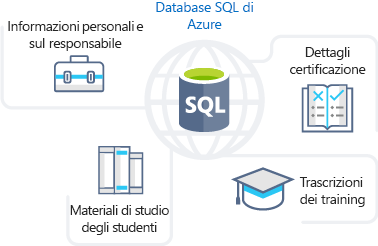
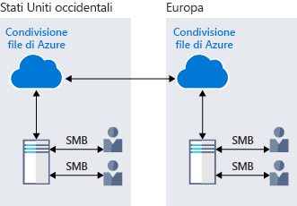
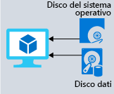

Esaminando i vantaggi dell'archiviazione dei dati di Azure, aver compreso che offre le opzioni migliori per l'archiviazione del portale della formazione. Ora verranno esaminati i vantaggi e le opzioni in modo dettagliato per vedere come adatta alle proprie esigenze di business.

## La modalità di archiviazione di dati di Azure possa soddisfare le esigenze di archiviazione aziendali

Azure offre diverse opzioni di archiviazione adatte a tipi specifici delle esigenze di archiviazione.

### Database SQL di Azure

**Database SQL di Azure** è un database cloud relazionale, completamente gestito e affidabile. È possibile usare questa funzionalità per archiviare i dati che si aggiornano e a cui si accede di frequente, ad esempio i dati personali e le informazioni relative alla formazione del personale. È anche possibile eseguire la migrazione dei database SQL Server esistenti senza apportare modifiche alle applicazioni. La figura seguente mostra i tipi di dati dallo scenario del portale di formazione online che verrà archiviato nel database SQL di Azure.

### Azure Cosmos DB

Azure Cosmos DB è un database distribuito a livello globale. Supporta anche i dati senza schema che consente di compilare altamente reattive e *Always On* applicazioni per supportare dati costantemente modificati. È possibile usare questa funzionalità per archiviare i dati che viene aggiornati e gestiti da parte degli utenti in tutto il mondo. La figura seguente illustra un database di Azure Cosmos DB di esempio usato per archiviare i dati di cui si accedono tramite più persone che tutto il mondo.

### Archiviazione BLOB di Azure

Archiviazione Blob di Azure consente di flusso grandi file video o audio direttamente al browser utente ovunque nel mondo. Archiviazione BLOB consente anche di memorizzare i dati a scopo di backup e ripristino, ripristino di emergenza e archiviazione. Archiviazione BLOB di Azure può supportare fino a 8 TB di dati per l'archiviazione dei file per le macchine virtuali. La figura seguente mostra un esempio di utilizzo di spazio di archiviazione blob di Azure.

### Azure Data Lake Storage Gen2

La funzionalità di Data Lake consente di eseguirvi l'utilizzo dei dati di analitica e preparare i report. Data Lake è un repository di grandi dimensioni che archivia dati strutturati e non.

**Azure Data Lake Storage Gen2** combina i vantaggi in termini di scalabilità e costi offerti dall'archiviazione di oggetti con l'affidabilità e le prestazioni delle funzionalità di file system per Big Data. Nella figura seguente illustra come Azure Data Lake vengono archiviati tutti i dati aziendali e lo rende disponibile per l'analisi.

### File di Azure

Il servizio File di Azure offre condivisioni file completamente gestite nel cloud. Le applicazioni in esecuzione in Azure possono condividere facilmente i file tra le macchine virtuali. È possibile usare le condivisioni file di Azure simultaneamente per le distribuzioni cloud o locali di Windows, Linux e macOS. La figura seguente mostra i file di Azure viene usato per condividere dati tra due aree geografiche. File di Azure Usa il protocollo Server Message Block (SMB) che garantisce i dati vengono crittografati quando sono inattivi e in transito.

### Archiviazione code di Azure

Archiviazione code di Azure è un servizio che consente di archiviare grandi quantità di messaggi a cui è possibile accedere da qualsiasi parte del mondo. La dimensione massima di un messaggio nella coda è di 64 KB e una coda può contenere milioni di messaggi.

In genere, sono presenti uno o più componenti di mittente e uno o più componenti di ricevitore. I componenti mittenti aggiungono messaggi alla coda. I componenti destinatari recuperano i messaggi dall'inizio della coda per l'elaborazione. L'illustrazione seguente mostra più applicazioni mittenti che aggiungono messaggi alla coda di Azure e un'applicazione destinataria che li recupera.

Archiviazione code viene usato principalmente per le operazioni seguenti:

- Creare un backlog di lavoro e passare messaggi tra i diversi server Web di Azure.
- Gestire il bilanciamento del carico tra i vari server Web o infrastrutture e gestire i picchi di traffico.
- Creare resilienza in caso di errore dei componenti quando più utenti accedono simultaneamente ai dati.

### Archiviazione Standard di Azure

Le macchine virtuali in Azure archiviano sistemi operativi, applicazioni e dati usando dischi. Archiviazione Standard di Azure offre un supporto per dischi affidabile e a basso costo per le macchine virtuali in cui vengono eseguiti carichi di lavoro che non hanno importanza cruciale. Con Archiviazione Standard, i dati vengono archiviati in unità disco rigido (HDD).

Per le macchine virtuali è possibile usare dischi SSD e HDD Standard per carichi di lavoro meno critici e dischi SSD Premium per applicazioni di produzione cruciali. I dischi di Azure offrono costantemente una durabilità di livello aziendale, con una percentuale di frequenza di errori annualizzata pari a ZERO, ovvero la migliore del settore. La figura seguente mostra una macchina virtuale di Azure usano dischi separati per archiviare dati diversi.

### Livelli di archiviazione

Azure offre tre livelli di archiviazione per archiviazione di oggetti blob:

1. **Livello di archiviazione ad accesso frequente**: ottimizzato per l'archiviazione dei dati a cui si accede di frequente. 

1. **Livello di archiviazione ad accesso sporadico**: ottimizzato per i dati di accesso frequente e archiviati per almeno 30 giorni.

1. **Livello di archiviazione archivio**: per i dati si accede raramente e archiviati per almeno 180 giorni con requisiti di latenza flessibili.

### Crittografia/replica

Azure offre sicurezza e disponibilità elevata ai dati tramite le funzionalità di crittografia e la replica.

#### Crittografia per i servizi di archiviazione

I seguenti tipi di crittografia sono disponibili per le risorse:

1. **Crittografia del servizio di archiviazione di Azure** per dati inattivi consente di proteggere i dati in base ai criteri di sicurezza e ai requisiti di conformità dell'organizzazione. Questa funzionalità esegue la crittografia dei dati prima di archiviarli e ne esegue la decrittografia prima di recuperarli. La crittografia e la decrittografia sono trasparenti all'utente.

1. **Crittografia lato client**, in cui i dati sono già crittografati dalle librerie client. Azure archivia i dati in stato crittografato quando sono inattivi e quindi ne esegue la decrittografia in fase di recupero.

#### Replica per la disponibilità delle risorse di archiviazione

Quando si crea un account di archiviazione viene impostato un tipo di replica. La funzionalità di replica garantisce che i dati siano durevoli e sempre disponibili. Azure offre le repliche geografiche e a livello di area per proteggere i dati da calamità naturali e altre situazioni di emergenza locali, ad esempio incendio o flood.