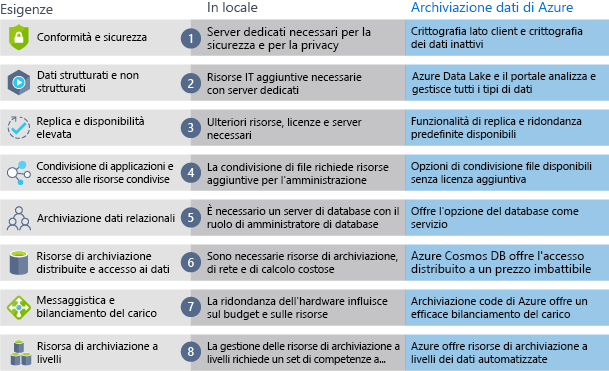

Ora che si sono appresi i vantaggi e le funzionalità di Archiviazione di Azure, verranno illustrate le differenze tra Archiviazione di Azure e archiviazione locale.

## Archiviazione di Azure e archiviazione locale

Il termine "locale" si riferisce all'archiviazione e alla manutenzione dei dati presenti su hardware e server locali. Nel confronto tra archiviazione locale e Archiviazione di Azure è necessario prendere in considerazione diversi fattori.

### Convenienza
Una soluzione di archiviazione locale richiede hardware dedicato che è necessario acquistare, installare, configurare e gestire. Le spese iniziali o i costi di capitale possono essere significativi. Il cambiamento dei requisiti nel corso del tempo spesso rende necessari investimenti in nuovo hardware. E se la domanda improvvisamente aumenta, sarà necessario investire in hardware capace di gestire picchi di domanda ma anche di rimanere inattivo o sottoutilizzato nei periodi di minore attività.

Archiviazione di Azure offre un modello di prezzi con pagamento in base al consumo spesso interessante per le aziende che possono considerare questi costi come spese operative senza dover sostenere costi di capitale iniziali. La soluzione è anche scalabile poiché consente l'aumento delle prestazioni o del numero di istanze in base alla domanda e la relativa riduzione quando la domanda diminuisce. Vengono addebitati solo i servizi dati usati in base alle esigenze.

### Affidabilità 
L'archiviazione locale richiede strategie di backup dei dati, bilanciamento del carico e ripristino di emergenza. Queste strategie possono risultare complesse e costose poiché per ognuna di esse sono spesso necessari server dedicati che richiedono un investimento significativo in hardware e risorse IT.

Archiviazione di Azure offre backup dei dati, bilanciamento del carico, ripristino di emergenza e replica dei dati come servizi per garantire sicurezza dei dati e disponibilità elevata.

### Tipi di archiviazione
Per una soluzione a volte sono necessari più tipi di archiviazione diversi, ad esempio archiviazione su file e database. Un approccio locale spesso richiede numerosi server e strumenti di amministrazione per ogni tipo di archiviazione.

Archiviazione di Azure offre diverse opzioni di archiviazione, tra cui l'accesso distribuito e l'archiviazione a livelli. Ciò consente di integrare una combinazione di tecnologie di archiviazione con la possibilità di scegliere il tipo di archiviazione migliore per ogni parte della soluzione.

### Flessibilità
I requisiti e le tecnologie cambiano. In una distribuzione locale ciò può comportare la necessità di lunghe e costose attività di provisioning e distribuzione di nuovi server e parti dell'infrastruttura.

Archiviazione di Azure offre la flessibilità necessaria per creare nuovi servizi in pochi minuti. Grazie a questa flessibilità, è possibile cambiare rapidamente i back-end di archiviazione senza la necessità di un investimento significativo in hardware.

La figura seguente illustra le differenze tra l'archiviazione locale e l'archiviazione dei dati in Azure.

