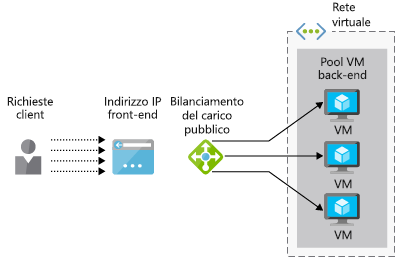
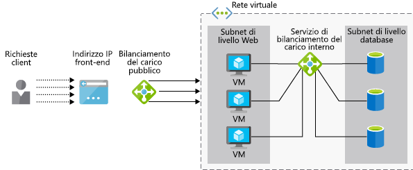

L'azienda vuole verificare se Azure Load Balancer supporta l'applicazione ERP (Enterprise Resource Planning).Your company wants to see if Azure Load Balancer will support your Enterprise Resource Planning (ERP) application. L'applicazione ha un'interfaccia Web per gli utenti e viene eseguita su più server.Your application has a web interface for users and runs on multiple web servers. Ogni server ha una copia locale del database ERP che viene sincronizzata su tutti i server.Each server has a local copy of the ERP database, which is synced across all servers.

Di seguito si esaminerà come un servizio di bilanciamento del carico può garantire la disponibilità elevata dei servizi.Here, you will look at how a load balancer can help provide high availability of services. Si identificherà la differenza tra le opzioni Basic e Standard del servizio di bilanciamento del carico e si osserverà come creare un servizio di bilanciamento del carico per Macchine virtuali di Azure.You will identify the difference between the basic and standard load balancer options and see how to create a load balancer for Azure Virtual Machines.

## Che cos'è il bilanciamento del carico?What is load balancing?

Il _bilanciamento del carico_ include varie tecniche per distribuire i carichi di lavoro, ad esempio di calcolo, di archiviazione e di rete, in più dispositivi._Load balancing_ describes various techniques for distributing workloads across multiple devices, such as compute, storage, and networking devices. L'obiettivo del bilanciamento del carico è ottimizzare l'uso di più risorse, in modo da garantirne la massima efficienza in caso di aumento del numero di istanze nell'infrastruttura e da assicurare il mantenimento dei servizi se alcuni componenti risultano non disponibili.The goal of load balancing is to optimize the use of multiple resources, to make the most efficient use of these resources as an infrastructure is scaled out, and to ensure services are maintained if some components are unavailable.

Di seguito verrà esaminato il supporto del bilanciamento del carico offerto da Azure per le macchine virtuali (VM).Here, we'll look at Azure's load balancing support for virtual machines (VMs).

### Che cos'è la disponibilità elevata?What is high availability?

La disponibilità elevata misura la capacità di un'applicazione o un servizio di rimanere accessibile nonostante un errore in qualsiasi componente del sistema.High availability (HA) measures the ability of an application or service to remain accessible despite a failure in any system component. Idealmente, non dovrebbe verificarsi alcuna perdita evidente di servizio.Ideally, there will not be any noticeable loss of service.

Il bilanciamento del carico è fondamentale per garantire la disponibilità elevata perché consente a più VM di fungere da pool di server.Load balancing is fundamental to the delivery of HA because it allows multiple VMs to act as a pool of servers. Il pool può continuare a gestire le richieste anche se alcune VM si arrestano in modo anomalo o vengono portate offline a scopo di manutenzione.The pool can continue to service requests even if some VMs crash or are taken offline for maintenance.

## Che cos'è Azure Load Balancer?What is Azure Load Balancer?

**Azure Load Balancer** è un servizio di Azure che distribuisce le richieste in ingresso tra più VM di un pool.**Azure Load Balancer** is an Azure service that distributes incoming requests across multiple VMs in a pool. Distribuisce il traffico di rete in ingresso tra un set di VM integre evitando le VM che non possono rispondere.It distributes incoming network traffic across a set of healthy VMs and avoids any VM that is not able to respond.

 Azure Load Balancer opera al livello 4 (TCP, UDP) del modello a 7 livelli OSI.Azure Load Balancer operates at Layer-4 (TCP, UDP) of the OSI 7-layer model. Può essere configurato per supportare scenari di applicazione TCP e UDP con traffico in ingresso verso VM di Azure nonché scenari in uscita in cui altri servizi di Azure passano traffico TCP e UDP a endpoint esterni tramite VM di Azure.It can be configured to support TCP and UDP application scenarios where the traffic is inbound to Azure VMs, as well as outbound scenarios where other Azure services are passing TCP and UDP traffic out through Azure VMs to external endpoints.

#### Che cos'è un servizio di bilanciamento del carico?What is a Load Balancer?

> [!VIDEO https://www.microsoft.com/videoplayer/embed/RE2yBWo]

## Servizi di bilanciamento del carico pubblici e interniPublic vs. internal load balancers

Un'istanza di Azure Load Balancer può essere _pubblica_ o _interna_ a seconda dell'origine delle richieste in ingresso.An Azure Load Balancer can be either _public_ or _internal_ depending on the source of incoming requests.

Un **servizio di bilanciamento del carico pubblico** gestisce le richieste client provenienti dall'esterno dell'infrastruttura di Azure.A **public load balancer** handles client requests from outside the Azure infrastructure. L'indirizzo IP pubblico viene assegnato al servizio di bilanciamento del carico e instrada le richieste in ingresso a un set di risorse presenti in una rete virtuale privata.The public IP address is assigned to the load balancer and it routes the inbound requests to a set of resources that are on a private virtual network. Questo approccio viene solitamente adottato per garantire la disponibilità elevata dei server Web.This approach is commonly used for making web servers highly available. La figura seguente illustra un servizio di bilanciamento del carico pubblico.The following illustration shows a public load balancer.

Un **servizio di bilanciamento del carico interno** elabora le richieste provenienti dall'interno di una rete virtuale o tramite una VPN.An **internal load balancer** processes requests from within a virtual network (or through a VPN). Distribuisce le richieste alle risorse all'interno della rete virtuale.It distributes requests to resources within that virtual network. Il servizio di bilanciamento del carico, gli indirizzi IP front-end e le reti virtuali non sono direttamente accessibili da Internet.The load balancer, front-end IP addresses, and virtual networks are not directly accessible from the Internet. La figura seguente illustra un'architettura contenente sia un servizio di bilanciamento del carico pubblico che uno interno.The following illustration shows an architecture containing both a public and internal load balancer. Il servizio di bilanciamento del carico pubblico gestisce le richieste esterne, mentre quello interno inoltra le richieste alle VM e ai database interni per l'elaborazione.The public load balancer handles external requests while the internal load balancer forwards the requests to the internal VMs and databases for processing.

## Come funziona Azure Load Balancer?How does Azure Load Balancer work?

Azure Load Balancer usa le informazioni configurate nelle _regole_ e nei _probe di integrità_ per determinare come il traffico in ingresso ricevuto nel _front-end_ di Load Balancer viene distribuito alle istanze di VM di un _pool di indirizzi back-end_.Azure Load Balancer uses information configured in _rules_ and _health probes_ to determine how inbound traffic that is received on the load balancer _front end_ is distributed to VM instances in a _backend address pool_. Di seguito sono descritti i singoli componenti.Let's examine each of these components.

### Che cos'è il front-end del servizio di bilanciamento del carico?What is the load balancer front end?

Il front-end del servizio di bilanciamento del carico è una configurazione IP contenente uno o più indirizzi IP pubblici che consente l'accesso al servizio e alle relative applicazioni tramite Internet.The load balancer front end is an IP configuration, containing one or more public IP addresses, that enables access to the load balancer and its applications over the Internet.

### Che cos'è il pool di indirizzi back-end?What is the backend address pool?

Le macchine virtuali si connettono a un servizio di bilanciamento del carico tramite la scheda di interfaccia di rete virtuale (vNIC).Virtual machines connect to a load balancer using their virtual network interface (vNIC). Il pool di indirizzi back-end contiene gli indirizzi IP delle schede di interfaccia di rete virtuali connesse al servizio di bilanciamento del carico.The backend address pool contains the IP addresses of the vNICs that are connected to the load balancer. Se si inseriscono tutte le VM in un set di disponibilità, è possibile usare il set per aggiungere facilmente le VM al pool back-end durante la configurazione del servizio di bilanciamento del carico.If you place all your VMs in an availability set, you can use this to easily add your VMs to a backend pool when you're configuring the load balancer.

### Che cos'è un probe di integrità?What is a health probe?

I servizi di bilanciamento del carico usano i _probe di integrità_ per determinare quali macchine virtuali possono gestire le richieste.Load balancers use _health probes_ to determine which virtual machines can service requests. Il servizio di bilanciamento del carico distribuirà il traffico solo alle VM disponibili e operative.The load balancer will only distribute traffic to VMs that are available and operational.

Un probe di integrità monitora porte specifiche in ogni VM.A health probe monitors specific ports on each VM. È possibile definire il tipo di risposta corrispondente all'integrità. Da un'applicazione Web, ad esempio, si può richiedere una risposta `HTTP 200 Available`.You can define what type of response corresponds to "health"; for example, you might require an `HTTP 200 Available` response from a web application. Per impostazione predefinita, una VM verrà contrassegnata come non disponibile dopo due errori consecutivi a intervalli di 15 secondi.By default, a VM will be marked as "unavailable" after two consecutive failures at 15-second intervals.

### Regole del servizio di bilanciamento del caricoLoad balancer rules

Le _regole_ del servizio di bilanciamento del carico definiscono come verrà distribuito il traffico alle VM back-end.Load balancer _rules_ define how traffic is distributed to backend VMs. L'obiettivo è distribuire equamente le richieste tra le VM integre del pool back-end.The goal is to distribute requests fairly across the healthy VMs in the backend pool.

Azure Load Balancer usa un algoritmo basato su hash per riscrivere le intestazioni dei pacchetti in ingresso.Azure Load Balancer uses a hash-based algorithm to rewrite the headers of inbound packets. Per impostazione predefinita, Load Balancer crea un hash da:By default, Load Balancer creates a hash from:

- Indirizzo IP di origineSource IP address
- Porta di origineSource port
- Indirizzo IP di destinazioneDestination IP address
- Porta di destinazioneDestination port
- Numero di protocollo IPIP protocol number

Questo meccanismo garantisce che tutti i pacchetti in un flusso client di pacchetti vengano inviati alla stessa istanza di VM back-end.This mechanism ensures that all packets within a packet client flow are sent to the same backend VM instance. Un nuovo flusso da un client userà una diversa porta di origine allocata in modo casuale.A new flow from a client will use a different randomly allocated source port. Ciò significa che verrà modificato l'hash e il servizio di bilanciamento del carico può inviare il flusso a un endpoint back-end diverso.This means that the hash will change, and the load balancer may send this flow to a different backend endpoint.

## SKU Basic e Standard di Load BalancerBasic vs. Standard Load Balancer SKUs

Sono disponibili due versioni di Azure Load Balancer: **Basic** e **Standard**,There are two versions of Azure Load Balancer: **Basic** and **Standard**. con differenze di scalabilità, funzionalità e prezzo.They differ in scale, features, and pricing. Ad esempio:For example:

- La versione Standard supporta il routing del traffico protetto tramite HTTPS.Standard supports secure traffic routing over HTTPS.
- La dimensione dei pool back-end può essere maggiore nella versione Standard (1000 nello SKU Standard e 100 nello SKU Basic).Backend pool size can be much larger in Standard (1000 vs. 100 in the Basic SKU).
- Il traffico può essere indirizzato a un pool di endpoint più grande, che include diversi set di scalabilità, set di disponibilità e macchine virtuali.Traffic can be directed to a larger pool of endpoints, including blends of scale sets, availability sets, and VMs. Lo SKU Basic è limitato a un singolo set di disponibilità, set di scalabilità o macchina virtuale.The Basic SKU  is restricted to a single availability set, scale set, or VM.
- Il supporto delle porte a disponibilità elevata consente di bilanciare il carico di flussi TCP e UDP in tutte le porte simultaneamente quando viene usato come servizio di bilanciamento del carico interno.Support for High Availability (HA) ports to load-balance TCP and UDP flows on all ports simultaneously when you're using it as an internal load balancer.
- Lo SKU Basic è gratuito, mentre lo SKU Standard comporta l'addebito di costi in base alle regole e alla velocità effettiva.Basic is no-cost, while Standard is charged based on rules and throughput.

Poiché lo SKU Standard è una versione avanzata dello SKU Basic, qualsiasi scenario idoneo alla versione Basic funzionerà anche nella versione Standard.Standard is a superset of Basic, so any scenario suitable for Basic should also work on Standard. Lo SKU Basic viene in genere usato per prototipi e test, mentre lo SKU Standard è consigliato per la produzione.The Basic SKU is generally intended for prototyping and testing while Standard is recommended for production.

## Avviare la distribuzione di un servizio di bilanciamento del carico pubblico BasicStart the deployment of a basic public load balancer

Per creare un sistema di VM con carico bilanciato, è necessario creare il servizio di bilanciamento del carico e una rete virtuale che conterrà le macchine virtuali e quindi aggiungere le VM alla rete virtuale.To create a load-balanced VM system, you need to create the load balancer itself, create a virtual network to contain your virtual machines, and then add VMs to the virtual network.

Per creare il servizio di bilanciamento del carico con il portale di Azure, si definiscono gli elementi seguenti:To create the load balancer using the Azure portal, you define the following:

- Nome del servizio di bilanciamento del caricoLoad balancer name
- Tipo: pubblico o internoType: public or internal
- SKU: Basic o StandardSKU: Basic or Standard
- Indirizzo IP pubblico: dinamico o staticoPublic IP address: dynamic or static
- Gruppo di risorse e localitàResource group and location

Poiché le VM back-end verranno tutte connesse alla stessa rete virtuale, è necessario configurare le risorse seguenti:Your backend VMs will all be connected to the same virtual network, so you need to configure this resource next:

- Nome della rete virtualeVirtual network name
- Spazio indirizzi da usare, ad esempio 172.20.0.0/16Address space to use, such as 172.20.0.0/16
- Gruppo di risorseResource group
- Nome della subnet da usareName for the subnet to use
- Spazio indirizzi della subnet (che deve essere incluso nello spazio principale), ad esempio 172.20.0.0/24Address space for the subnet (must be within the main space), such as 172.20.0.0/24

Poiché si prevede un traffico in ingresso, è necessario creare regole di sicurezza di rete usando un gruppo di sicurezza di rete (NSG).Since we expect inbound traffic, we'll have to create some network security rules using a network security group (NSG). In questo caso, è opportuno aprire la porta 80 per il traffico HTTP.In this case, we'll want to open port 80 for HTTP traffic.

Infine, è necessario creare e distribuire le macchine virtuali e configurarle per l'uso della rete virtuale.Finally, we then need to create and deploy the virtual machines and configure them to use your virtual network. Viene anche creato un set di disponibilità per raggrupparle insieme.We will also create an availability set to group them together. I set di disponibilità definiscono il livello di tolleranza di errore in un gruppo di VM, ma per il bilanciamento del carico facilitano anche l'assegnazione delle VM ai pool back-end.Availability sets define the level of fault tolerance across a group of VMs, but for load balancing, they also help you assign your VMs to backend pools.

È stato illustrato come usare Azure Load Balancer nell'ambito di una soluzione a disponibilità elevata.You have now seen how to use Azure Load Balancer as part of a high-availability solution. Successivamente, questi passaggi verranno usati per distribuire il servizio di bilanciamento del carico personalizzato.Next, you will use these steps to deploy your own load balancer.