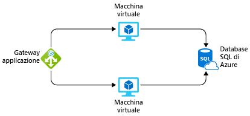

Supponiamo che sia stato chiesto di creare un sistema in Azure e di fare una stima dei costi che il sistema avrebbe nei 12 mesi successivi.Imagine that you've been asked to build a system on Azure, and you've been asked for an estimate of what it might cost to run over the next 12 months. Si sa già che i prezzi di Azure sono pienamente trasparenti e che ogni mese vengono fatturati solo i servizi usati.You already know that Azure pricing is fully transparent and that you're billed monthly for only the services that you use. Come si può ricavare tale stima senza distribuire ed eseguire i servizi o senza determinare manualmente i prezzi di ogni servizio dalle pagine sui prezzi dei servizi di Azure?How would you get that estimate without deploying and running those services or without manually pricing out each service from the Azure service pricing pages?

## Introduzione al calcolo dei prezzi di AzureIntroducing the Azure pricing calculator

Per agevolare i clienti nella stima dei costi, Microsoft ha sviluppato il **calcolatore prezzi di Azure**.To make estimates easy for customers to create, Microsoft developed the **Azure pricing calculator**. Questo calcolatore è uno strumento gratuito basato sul Web in cui si inseriscono i servizi di Azure e si modificano le proprietà e le opzioni dei serviziThe Azure pricing calculator is a free web-based tool that allows you to input Azure services and modify properties and options of the services. e il calcolatore restituisce i costi per ciascun servizio e il costo totale per la stima completa.It outputs the costs per service and total cost for the full estimate.

In un'altra finestra o scheda del browser aprire il [calcolatore prezzi di Azure](https://azure.microsoft.com/pricing/calculator/).In another browser window or tab, open the [Azure pricing calculator](https://azure.microsoft.com/pricing/calculator/). Nella pagina del calcolatore prezzi sono presenti tre schede:On the pricing calculator page, you'll see three tabs:

1. **Prodotti.****Products.** In questa scheda si esegue la maggior parte delle attività.This tab is where you'll do most of your activity. Questa scheda contiene l'elenco di tutti i servizi di Azure ed è qui che si aggiungono o si rimuovono i servizi per formulare la stima.This tab has all the Azure services listed and is where you'll add or remove services to formulate your estimate.
2. **Stime.****Estimates.** Questa scheda include tutte le stime salvate in precedenza.This tab has all of your previously saved estimates. Questo processo verrà esaminato più avanti.We'll go through this process in a moment.
3. **DOMANDE FREQUENTI.****FAQ.** Questa scheda contiene le risposte ad alcune domande frequenti.Just as it says, this tab has answers to some frequently asked questions.

Iniziamo con la scheda **Prodotti**. A sinistra è presente l'elenco completo delle categorie dei servizi.Let's start with the **Products** tab. You'll see the full listing of service categories down the left-hand side. Se si fa clic su una qualsiasi di queste categorie, vengono visualizzati i servizi corrispondenti.Clicking on any of the categories will display the services in that category. È disponibile anche una casella di ricerca che consente di cercare il servizio desiderato tra tutti i servizi.There's also a search box where you can search through all services for the service you're looking for. Se si fa clic sul servizio, questo viene aggiunto alla stima.Clicking on the service will add that service to your estimate. È possibile aggiungere un solo servizio o tanti servizi in base alle esigenze, inclusi i multipli dello stesso servizio (ad esempio più macchine virtuali).You can add just one service, or you can add as many as you need, including multiples of the same service (for example, multiple virtual machines).

Dopo aver aggiunto i servizi, occorre determinarne i prezzi.After you've added the services, you'll want to price them. Scorrendo la pagina verso il basso vengono visualizzati dettagli personalizzabili sul servizio che riguardano la determinazione del prezzo.Scrolling down on the page will show you customizable details for that service that apply to pricing. Nelle macchine virtuali ad esempio è possibile selezionare dettagli come la regione, il sistema operativo e la dimensione di istanza. Tutte informazioni che influiranno sul piano tariffario per la macchina virtuale.For example, on virtual machines, you can select details such as the region, operating system, and instance size, all of which will impact the pricing for the VM. Verrà visualizzato un subtotale per il servizio.You'll see a subtotal for the service. Se si continua a scorrere la pagina verso il basso, si vedrà il totale completo per tutti i servizi inclusi nella stima.And scrolling further down, you'll see a full total for all services included in the estimate. Insieme al totale saranno visualizzati i pulsanti per esportare, salvare e condividere la stima.Along with the total, you'll see buttons where you can export, save, and share the estimate.

## Stimare una soluzioneEstimate a solution

Partendo da questo scenario originale, si immagini che il sistema sia destinato a essere eseguito in due macchine virtuali di Azure e a connettersi a un'istanza di database SQL di Azure.From our original scenario, let's imagine that this system will run on two Azure VMs and will connect to an Azure SQL Database instance. Si intende includere anche un firewall di livello 7 in modo da garantire funzionalità avanzate di bilanciamento del carico.We also want to have a layer 7 firewall in place to ensure we have enhanced load-balancing capabilities. La figura seguente illustra un gateway applicazione connesso a due macchine virtuali connesse a una singola istanza del database SQL di Azure.The following illustration shows an application gateway connected to two virtual machines that are connected to a single Azure SQL Database instance.

È possibile usare il calcolatore prezzi di Azure per determinare il costo della soluzione ed esportare la stima per condividerla con il team.We can use the Azure pricing calculator to figure out what the solution will cost and export our estimate to share with the team.

> [!TIP]
> Assicurarsi che nel calcolatore non siano presenti elementi elencati nella stima.Make sure you have a clean calculator with nothing listed in the estimate. Se nella stima sono presenti elementi, fare clic sull'icona del cestino di ogni elemento per reimpostare la stima.If you have anything present in your estimate, click the trash can icon on each item to reset the estimate.

Nella scheda **Prodotti** del calcolatore prezzi di Azure selezionare i servizi seguenti per aggiungerli alla stima:In the Azure pricing calculator, on the **Products** tab, add the following services to the estimate by clicking on them:

* Macchine virtuali nella categoria CalcoloVirtual Machines in the Compute category
* Database SQL di Azure nella categoria DatabaseAzure SQL Database in the Databases category
* Gateway applicazione nella categoria ReteApplication Gateway in the Networking category

È possibile configurare i dettagli di ogni servizio nella scheda **Stime** oppure ottenere una stima generale dei costi.We can configure the details of each, on the **Estimates** tab, to get a solid estimate of our costs. Usare la regione **Stati Uniti occidentali** per tutte le risorse.Use the **West US** region for all resources.

* **Macchine virtuali.****Virtual Machines.** Si tratta di un'applicazione ASP.NET, quindi sarà necessario usare una macchina virtuale con **sistema operativo Windows**.This is an ASP.NET application, so we'll need to use a **Windows OS** VM. Questa applicazione non richiede una potenza di calcolo eccessiva, quindi selezionare la dimensione di istanza **D2 v3**.This application doesn't require a massive amount of computing power, so select the **D2 v3** instance size. Saranno necessarie due macchine virtuali che verranno eseguite continuamente (730 ore al mese).We'll need two virtual machines, and they will run all the time (730 hours/month). Verrà usata l'archiviazione Premium in unità SSD per queste macchine virtuali e occorrerà un solo disco per macchina virtuale di dimensioni **E10**, per un totale di due dischi.We're going to use premium SSD storage for these VMs and will require just one disk per VM of size **E10**, for a total of two disks.

* **Database SQL.****SQL Database.** Per il database si eseguirà il provisioning di un **singolo tipo di database** usando il **modello basato su vCore**.For the database, we're going to provision a **single database type** using the **vCore model**. Si vuole usare un database di quinta generazione per utilizzo generico con 8 vCore.We want a General Purpose, Gen 5 database with 8 vCores. Occorreranno 32 GB di spazio di archiviazione.We'll need 32 GB of storage.

* **Gateway applicazione.****Application Gateway.** Per il gateway applicazione si userà il livello Web application firewall, per garantire un livello di protezione per l'ambiente.For Application Gateway, we're going to use the Web Application Firewall tier, so we have some protection for our environment. Verranno usate solo due istanze e le dimensioni medie, poiché il carico non sarà elevato.And we're going to go with just two instances and medium size, as our load isn't going to be high. Si prevede di elaborare 1 TB di dati al mese.We expect to process 1 TB of data per month. Non si prevede di elaborare dati in Europa (Zona 1).We don't expect to process any data in Europe (Zone 1).

Esaminando la stima, si noterà un costo riepilogativo per ogni servizio che è stato aggiunto e un totale completo per l'intera stima.Looking through your estimate, you should see a summary cost for each service you've added and a full total for the entire estimate. In questo caso la stima dovrebbe essere di circa **$ 2.100 al mese**.In this case, your estimate should be around **$2,100.00 per month**. È possibile provare a modificare alcune delle opzioni, in particolare la _località_ in cui vengono collocate le risorse per vedere la stima aumentare o diminuire.You can try playing with some of the options - particularly the _location_ you place these resources in to see the estimate go up and down. 

> [!TIP]
> Se si hanno risorse che non sono dipendenti dall'ubicazione, posizionandole in aree meno costose è possibile realizzare notevoli risparmi.If you have resources that are not location-sensitive, you can save a lot of money by locating them in less expensive regions. Verificare con il calcolatore dei prezzi consente di determinare la posizione più conveniente in cui collocare questi servizi.Checking the pricing calculator can help you determine the most cost-effective place to put these services.

## Condividere e salvare la stimaShare and save your estimate

La stima per la soluzione è a questo punto pronta.We now have an estimate for our solution. È possibile salvare questa stima, per potervi tornare in un secondo momento e modificarla se necessario.We can save this estimate, so we can come back to it later and adjust it if necessary. È anche possibile esportarla in Excel per ulteriori analisi o condividerla tramite un URL.We can also export it to Excel for further analysis or share the estimate via a URL.

Per esportare la stima, fare clic su `Export` nella parte inferiore della stima.To export the estimate, click `Export` at the bottom of the estimate. La stima verrà scaricata in formato Excel (con estensione **xlsx**) e includerà tutti i servizi aggiunti.This will download your estimate in Excel (**.xlsx**) format and will include all the services you added to your estimate.

È possibile condividere il foglio di calcolo di Excel o fare clic sul pulsante `Share` del calcolatore.We can either share the Excel spreadsheet, or we can click on the `Share` button in the calculator. Verrà proposto un URL che potrà essere usato per condividere la stima.This gives you a URL that you can use to share this estimate. Tutti gli utenti con questo collegamento saranno in grado di accedere alla stima, rendendo così più semplice la condivisione con il team.Anyone with this link will be able to access it, making it easy to share with your team.

Se si è connessi con l'account di Azure, è possibile salvare la stima, per poterci tornare in un secondo momento.If you are logged in with your Azure account, you can save the estimate, so you can come back to it later. Proseguire e fare clic sul pulsante **Salva**.Go ahead and click the **Save** button. Se si è connessi, verrà visualizzata una notifica che indica che la stima è stata salvata.If you are signed in, you should see a notification that your estimate was saved. Se non si è connessi, verrà visualizzato un messaggio per accedere e salvare la stima.If you aren't signed in, you'll see a message to sign in to save your estimate. Dopo avere salvato la stima, tornare all'inizio della pagina e selezionare la scheda **Stime**. La stima sarà visibile in questa scheda.After you've saved the estimate, scroll back up to the top of the page and select the **Estimates** tab. You will see your estimate there. È quindi possibile selezionarla per riaprirla o eliminarla se non serve più.You can then select it to pull it back up or delete it if you no longer need it.

È stata eseguita una stima dei costi per un set di servizi di Azure senza alcuna spesa aggiuntiva.We have arrived at a cost estimate for a set of Azure services without spending any money. Non è stato creato nulla e si dispone di una stima completa condivisibile su cui si possono effettuare ulteriori analisi o modifiche in futuro.We didn't create anything, and we have a fully sharable estimate that we can do further analysis or modifications on in the future. È possibile usare la stima non solo per creare stime per sistemi in cui si conoscono i servizi specifici che si prevede di usare, ma anche per confrontare i servizi e l'impatto che hanno sui costi complessivi.You can use this not only to create estimates for systems where you know the specific services you plan to use but also to compare how different services might impact your overall costs. Un esempio è Microsoft SQL Server in una macchina virtuale rispetto a Database SQL di Azure.An example is Microsoft SQL Server on a VM vs. Azure SQL Database.