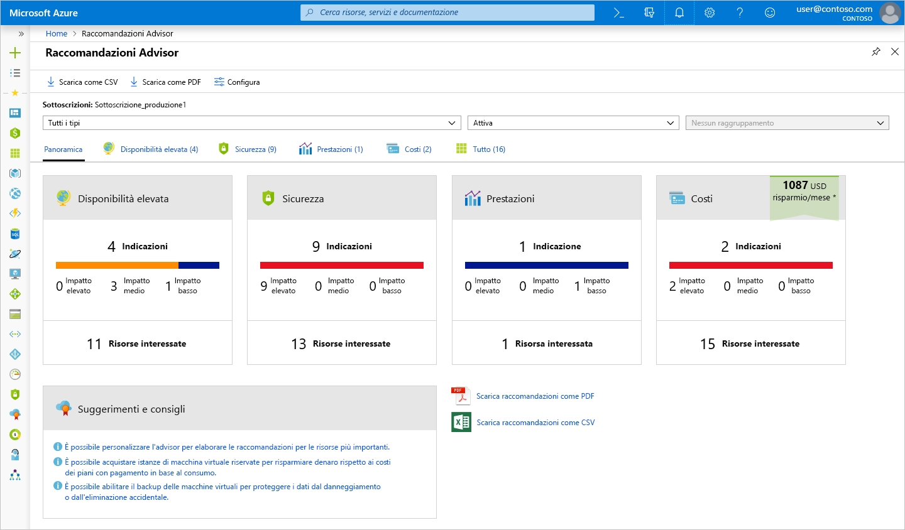
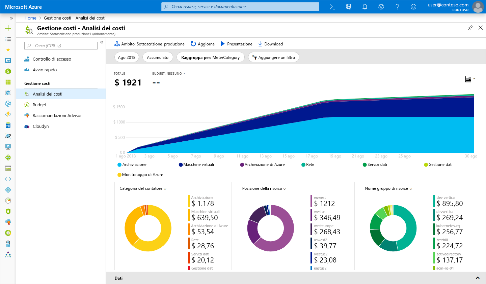
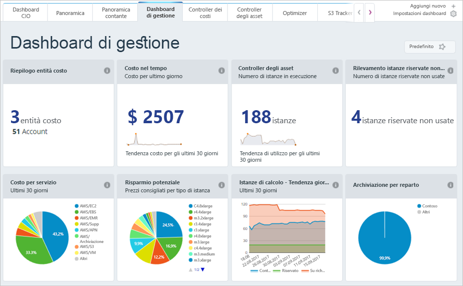

È stato spiegato come stimare i costi prima di distribuire servizi in Azure, ma cosa accade se sono già state distribuite alcune risorse? Come ottenere visibilità sui costi già maturati? Se è stata distribuita la soluzione precedente in Azure e si intende verificare di aver dimensionato correttamente le macchine virtuali e prevederne i costi, come possiamo procedere? Ecco alcuni strumenti di Azure che è possibile usare per risolvere questo problema.

## Cos'è Azure Advisor?

**Azure Advisor** è un servizio gratuito integrato in Azure che fornisce indicazioni sulla disponibilità elevata, sicurezza, prestazioni e costi. Advisor analizza i servizi distribuiti e cerca di migliorare l'ambiente in queste quattro aree. Questo documento è incentrato sui consigli sui costi, ma è opportuno esaminare anche le altre indicazioni.

Advisor fornisce consigli sui costi nelle aree seguenti:

1. **Ridurre i costi eliminando i circuiti ExpressRoute il cui provisioning è stato annullato.**
    Identifica i circuiti ExpressRoute che sono rimasti nello stato provider *Senza provisioning* per più di un mese e consiglia di eliminare il circuito se non si intende effettuarne il provisioning con il provider di connettività.

1. **Acquistare istanze riservate per risparmiare denaro rispetto ai costi dei piani con pagamento in base al consumo.**
    Esamina l'utilizzo della macchina virtuale negli ultimi 30 giorni e determina se sarà possibile risparmiare denaro acquistando istanze riservate. Advisor mostra le aree e le dimensioni con le massime potenzialità di risparmio e indica il risparmio stimato conseguibile con l'acquisto di istanze riservate.

1. **Ridimensionare o arrestare le macchine virtuali sottoutilizzate.**
    Monitora l'utilizzo delle macchine virtuali per 14 giorni, in modo da identificare quelle sottoutilizzate. Le macchine virtuali con un utilizzo medio della CPU del 5% o inferiore e un utilizzo di rete di 7 MB o inferiore per quattro o più giorni sono considerate macchine virtuali sottoutilizzate. La soglia di uso medio della CPU è regolabile fino al 20%. Identificando queste macchine virtuali, è possibile decidere di ridimensionarle in un tipo di istanza ridotto, diminuendo i costi.

[!include]

Di seguito è indicato dove è possibile trovare Azure Advisor nel portale. 

1. Accedere al [portale di Azure](https://portal.azure.com?azure-portal=true) usando l'account Microsoft. 

1. Fare clic su **Tutti i servizi** e, nella categoria **Strumenti di gestione**, è disponibile **Advisor**. È anche possibile digitare `Advisor` nella casella del filtro per visualizzare solo questo servizio.

1. Fare clic su Advisor per visualizzare il dashboard dei consigli associati alla sottoscrizione. Verrà visualizzata una casella per ogni categoria di consigli.

> [!NOTE]
> Potrebbero non essere presenti consigli sui costi in Advisor. È possibile che le valutazioni non siano ancora state completate o semplicemente che Advisor non abbia consigli da fornire.

Facendo clic sulla casella **Costo** verranno visualizzati consigli dettagliati in cui è possibile vedere quelli offerti da Advisor.

Facendo clic su un consiglio, verranno visualizzati i relativi dettagli. Sarà quindi possibile eseguire un'azione specifica, ad esempio il ridimensionamento delle macchine virtuali per ridurre la spesa.

Questi consigli rappresentano posizioni in cui è possibile che il denaro venga speso in modo inefficiente. Si tratta di una posizione ideale in cui iniziare e continuare a controllare per ridurre i costi. In questo esempio viene fornita l'opportunità di risparmiare circa 700 dollari al mese seguendo questi consigli. Questi risparmi si accumulano, pertanto verificare di controllare periodicamente la presenza di consigli su tutte le quattro aree.

## Gestione costi di Azure

Gestione costi di Azure è un altro strumento gratuito incorporato di Azure che può essere usato per ottenere maggiori informazioni dettagliate in merito ai servizi soggetti alla spesa per il cloud. È possibile visualizzare suddivisioni cronologiche dei servizi soggetti a spese e il relativo monitoraggio a fronte dei budget impostati. È possibile impostare budget, pianificare report e analizzare le aree di costo.

## Cloudyn

Cloudyn, un'affiliata Microsoft, consente di tenere traccia dell'uso del cloud e delle spese per le risorse di Azure e altri provider cloud, tra cui Amazon Web Services e Google. I report del dashboard di facile comprensione agevolano l'allocazione dei costi e i chargeback. Gestione costi aiuta a ottimizzare la spesa per il cloud identificando le risorse sottoutilizzate che potranno quindi essere gestite e adattate. L'uso di Azure è gratuito e sono disponibili opzioni a pagamento per il supporto Premium e per visualizzare i dati provenienti da altri cloud.

Come si può notare, esistono diversi strumenti disponibili gratuitamente in Azure che è possibile usare per tenere traccia e stimare la spesa per il cloud e per identificare eventuali inefficienze nell'ambiente in termini di costi. È opportuno consultare periodicamente i report e i consigli resi disponibili con questi strumenti per realizzare risparmi nel footprint del cloud.