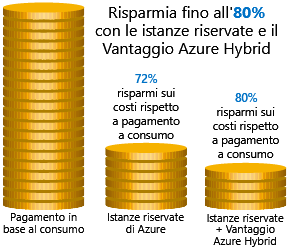
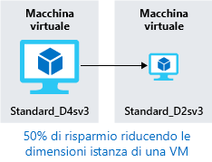
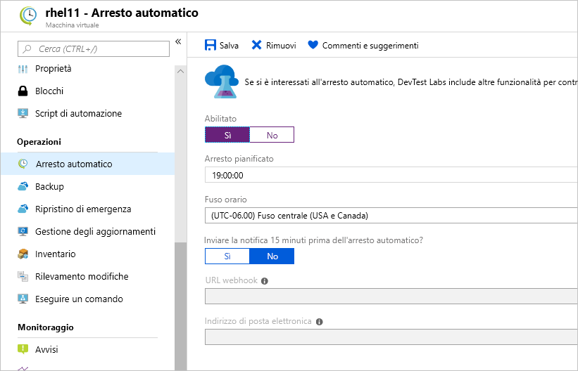

Sono stati illustrati argomenti quali la creazione di stime dei costi per gli ambienti che si intende creare, la descrizione di alcuni strumenti per ottenere dettagli sugli elementi soggetti a spese e le proiezioni delle spese future. Verrà ora spiegato come ridurre i costi di infrastruttura.

## Usare le istanze riservate

In presenza di carichi di lavoro di VM statici e prevedibili per natura, in particolare quelli in esecuzione tutto l'anno, 24 ore su 24, 7 giorni su 7, l'uso delle istanze riservate rappresenta il metodo ideale per conseguire un potenziale risparmio fino al 70-80%, a seconda delle dimensioni della VM. La figura seguente illustra come l'utilizzo delle istanze riservate di Azure consente di risparmiare fino al 72% e come l'utilizzo di istanze riservate con Vantaggio Azure Hybrid consente di risparmiare fino all'80% sui costi.

Le istanze riservate vengono acquistate per periodi di uno o tre anni, con pagamento anticipato per l'intero periodo. Dopo l'acquisto, Microsoft associa la prenotazione alle istanze in esecuzione e riduce le ore dalla prenotazione. Le prenotazioni possono essere acquistate tramite il portale di Azure. E poiché le istanze riservate rappresentano uno sconto di ore di elaborazione, sono disponibili per le VM di Windows e Linux.

## Ridimensionare le macchine virtuali sottoutilizzate

Come indicato in precedenza, Gestione costi di Azure e Azure Advisor potrebbero consigliare di ridimensionare o arrestare le VM. Il ridimensionamento di una macchina virtuale è il processo che consente di portarla a una dimensione appropriata. Si supponga di avere un server in esecuzione come controller di dominio con le dimensioni di uno **Standard_D4sv3**, ma che la VM sia inattiva al 90% nella maggior parte dei casi. Ridimensionando la VM a uno **Standard_D2sv3_v3**, i costi di elaborazione si riducono del 50%. I costi sono lineari e raddoppiati per ogni dimensione maggiore nella stessa serie. In questo caso, potrebbe addirittura risultare vantaggioso modificare la serie di istanze in una serie di VM meno costosa. La figura seguente mostra come è possibile ottenere un risparmio del 50% riducendo la VM di una dimensione all'interno della stessa serie.

Dimensioni delle macchine virtuali sono una nota spese non necessarie comuni in Azure e uno che può essere risolto facilmente. È possibile modificare la dimensione di una VM mediante il portale di Azure, Azure PowerShell o l'interfaccia della riga di comando di Azure.

> [!TIP]
> Per ridimensionare una VM, è necessario arrestarla, ridimensionarla e riavviarla. Questa operazione potrebbe richiedere qualche minuto, a seconda del volume della modifica. Pianificare un'interruzione del servizio o spostare il traffico in un'altra istanza mentre si esegue questa attività.

## Deallocare le macchine virtuali durante gli orari di minore attività

L'uso di carichi di lavoro di macchine virtuali solo in determinati momenti, ma in esecuzione ogni ora di ogni giorno, determina uno spreco di denaro. Queste VM rappresentano candidati ideali da arrestare se non in uso e riavviare in base a una pianificazione, consentendo di risparmiare costi di calcolo mentre la VM è deallocata.

Questo approccio costituisce una strategia ottimale per ambienti di sviluppo. Spesso le attività di sviluppo possono verificarsi solo durante le ore lavorative, offrendo la flessibilità necessaria per deallocare questi sistemi durante gli orari di minore attività e impedendo l'accumulo dei costi di calcolo. Azure offre ora una [soluzione di automazione](https://docs.microsoft.com/azure/automation/automation-solution-vm-management) completamente disponibile per l'ambiente in uso.

È anche possibile usare la funzionalità di arresto automatico in una macchina virtuale per pianificare arresti automatizzati.

## Eliminare le macchine virtuali inutilizzate

 Può sembrare ovvio ma, se un servizio non viene usato, è consigliabile arrestarlo. Non è insolito avere sistemi non di produzione o per un modello di verifica ancora attivi su un progetto non più necessario. Esaminare periodicamente l'ambiente e il lavoro per identificare questi sistemi. L'arresto di questi sistemi può comportare vantaggi di vario tipo, garantendo un risparmio dei costi di infrastruttura, ma anche un risparmio potenziale sulla gestione delle licenze e sulle operazioni.

## Eseguire la migrazione a servizi PaaS o SaaS

Se si decide di spostare i carichi di lavoro nel cloud, un'evoluzione naturale è quella di iniziare con i servizi IaaS (Infrastructure-as-a-Service, infrastruttura distribuita come servizio) e quindi spostarli in un modello PaaS (Platform-as-a-Service, piattaforma distribuita come servizio) a seconda delle esigenze, in un processo iterativo.

I servizi PaaS offrono in genere risparmi notevoli sui costi operativi e delle risorse. Il problema è che, a seconda del tipo di servizio, saranno necessari livelli diversi di impegno per passare a questi servizi in termini di tempo e risorse. Potrebbe essere semplice spostare un database SQL Server in un database SQL di Azure e molto più impegnativo spostare un'applicazione a più livelli in un contenitore o un'architettura serverless. È consigliabile valutare costantemente l'architettura delle applicazioni per determinare eventuali efficienze conseguibili mediante i servizi PaaS.

Grazie ad Azure è semplice testare questi servizi con un livello di rischio minimo, offrendo la possibilità di provare nuovi modelli di architettura senza troppe difficoltà. Detto questo, il percorso è in genere più lungo e potrebbe non essere d'aiuto nell'immediato, se si intende ottenere risparmi a breve termine in termini di costi. Il Centro architetture Azure è il luogo ideale in cui ricavare idee per trasformare l'applicazione, nonché procedure consigliate in un'ampia gamma di architetture e servizi di Azure.
