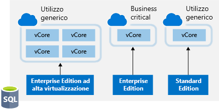
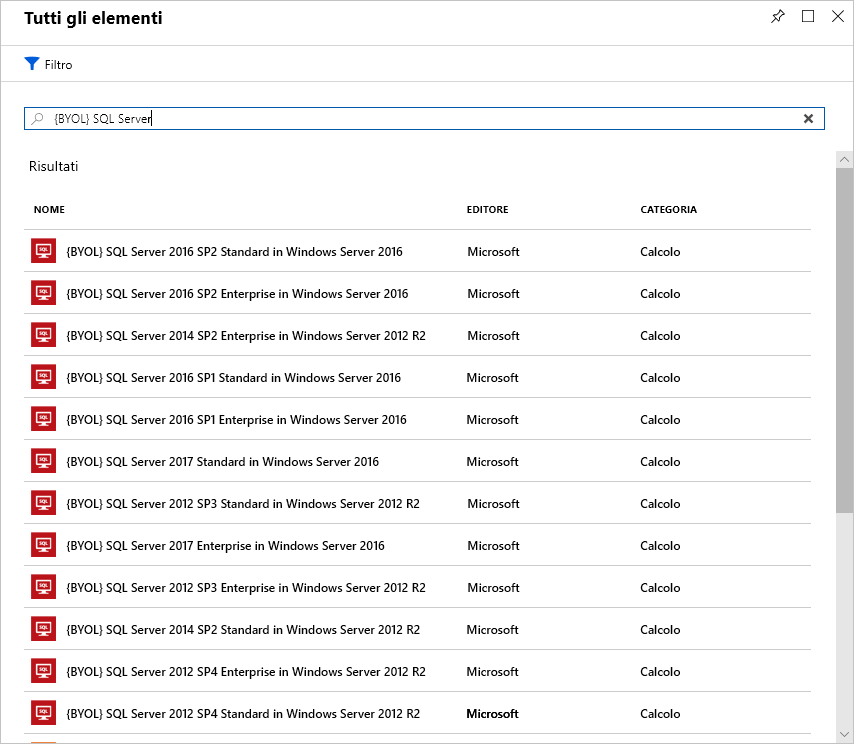

La gestione delle licenze è un'altra area che può avere un impatto significativo sui costi del cloud. Esaminiamo alcuni modi in cui è possibile ridurre i costi di licenza.

## Vantaggio Azure Hybrid per Windows Server

Molti clienti hanno investito in licenze per Windows Server e ora vorrebbero trasferire questo investimento in Azure. Il Vantaggio Azure Hybrid offre ai clienti il diritto di usare queste licenze per le macchine virtuali in Azure. Ciò significa che non sono previsti costi per la licenza di Windows Server e che verrà invece addebitata la tariffa Linux.

Per essere idonee a questo vantaggio, le licenze di Windows devono avere la copertura di Software Assurance. Vengono considerate anche le indicazioni seguenti:

- Ogni licenza a due processori o ogni set di licenze a 16 core ha diritto a due istanze fino a 8 core o a un'istanza fino a 16 core.
- Le licenze per la Standard Edition possono essere usate solo una volta in locale o in Azure. Non è quindi possibile usare la stessa licenza per una macchina virtuale di Azure e un computer locale.
- I vantaggi della Datacenter Edition permettono l'utilizzo simultaneo in locale e in Azure, pertanto la licenza copre due computer Windows in esecuzione.

> [!NOTE]
> La maggior parte dei clienti possiede licenze basate sul numero di core, pertanto si userà tale modello per il calcolo. Per informazioni sul tipo di licenza di cui si dispone, contattare il rivenditore della licenza o il team dell'account Microsoft.

Usufruire del vantaggio è facile. Può essere attivato e disattivato in qualsiasi momento con le macchine virtuali esistenti o essere applicato in fase di distribuzione per le nuove macchine virtuali. Il Vantaggio Azure Hybrid (soprattutto se combinato con istanze riservate) può offrire risparmi sostanziali sulle licenze.

## Vantaggio Azure Hybrid per SQL Server

Il Vantaggio Azure Hybrid per SQL Server consente di massimizzare il valore degli investimenti correnti per la licenza e di accelerare la migrazione nel cloud. Il Vantaggio Azure Hybrid per SQL Server è un vantaggio basato su Azure che consente di usare le licenze di SQL Server con Software Assurance attivo per usufruire di una tariffa ridotta.

È possibile applicare questo vantaggio anche se la risorsa di Azure è attiva, ma la tariffa ridotta viene applicata a partire dal momento in cui si seleziona la risorsa nel portale di Azure. Non verranno rilasciati crediti retroattivamente.

### Opzioni basate su vCore per il database SQL di Azure

Per il database SQL di Azure il Vantaggio Azure Hybrid funziona nel modo seguente:

- Se si dispone di licenze basate su core per la Standard Edition con Software Assurance attivo, è possibile ottenere un vCore a livello di servizio Utilizzo generico per ogni core di licenza che si possiede in locale.
- Se si dispone di licenze basate su core per l'Enterprise Edition con Software Assurance attivo, è possibile ottenere un vCore a livello di servizio Business Critical per ogni core di licenza che si possiede in locale. Il Vantaggio Azure Hybrid per SQL Server per il livello di servizio Business Critical è disponibile solo per i clienti che dispongono di licenze Enterprise Edition.
- Se si dispone di licenze basate su core per l'Enterprise Edition altamente virtualizzata con Software Assurance attivo, è possibile ottenere quattro vCore a livello di servizio Utilizzo generico per ogni core di licenza che si possiede in locale. Si tratta di un vantaggio della virtualizzazione esclusivo disponibile solo per il database SQL di Azure.

La figura seguente mostra le opzioni basate su vCore disponibili in ogni livello di servizio con licenze Vantaggio Azure Hybrid per SQL Server.

Per SQL Server in Macchine virtuali di Azure, il Vantaggio Azure Hybrid funziona nel modo seguente:

- Se si dispone di licenze basate su core per l'Enterprise Edition con Software Assurance attivo, è possibile ottenere un core di SQL Server Enterprise Edition in Macchine virtuali di Azure per ogni core di licenza che si possiede in locale.
- Se si dispone di licenze basate su core per la Standard Edition con Software Assurance attivo, è possibile ottenere un core di SQL Server Standard Edition in Macchine virtuali di Azure per ogni core di licenza che si possiede in locale.

Questo vantaggio può avere un impatto significativo sui costi di Azure con i carichi di lavoro SQL Server.

## Usare offerte di sottoscrizione sviluppo/test

Le offerte [Sviluppo/test Enterprise](https://azure.microsoft.com/offers/ms-azr-0148p/) e [Sviluppo/test con pagamento in base al consumo](https://azure.microsoft.com/offers/ms-azr-0023p/) sono un vantaggio che consente di risparmiare sui costi negli ambienti non di produzione. Questo vantaggio offre molti sconti, in particolare per i carichi di lavoro di Windows, eliminando i costi di licenza e fatturando solo la tariffa Linux per le macchine virtuali. Questo vale anche per SQL Server e qualsiasi altro software Microsoft che è coperto da una sottoscrizione di Visual Studio (precedentemente nota come MSDN). 

I requisiti per questo vantaggio prevedono che sia applicato solo a carichi di lavoro non di produzione e che tutti gli utenti di questi ambienti (inclusi i tester) siano coperti da una sottoscrizione di Visual Studio. In altre parole, questo vantaggio applicato ai carichi di lavoro non di produzione consente di risparmiare nei carichi di lavoro delle macchine virtuali di Windows, SQL Server e altre macchine virtuali Microsoft.

Di seguito sono riportati i dettagli completi per ciascuna offerta. Un cliente con contratto Enterprise può usufruire dell'offerta Sviluppo/test Enterprise, mentre un cliente senza contratto Enterprise e che usa invece account in base al consumo può usufruire dell'offerta Sviluppo/test con pagamento in base al consumo.

## Bring Your Own Licence di SQL Server

Se si dispone di un contratto Enterprise e si è già investito in licenze di SQL Server, che sono state liberate con lo spostamento delle risorse in Azure, è possibile eseguire il provisioning delle immagini **Bring Your Own License** (BYOL) da Azure Marketplace, ottenendo così la possibilità di usufruire di queste licenze inutilizzate e ridurre il costo della VM di Azure. Questa operazione è sempre stata possibile eseguendo il provisioning di una VM Windows e installando SQL Server manualmente, ma questo approccio semplifica il processo di creazione grazie all'uso delle immagini certificate Microsoft. Per trovare queste immagini, cercare **BYOL** nel Marketplace.

> [!IMPORTANT]
> Per usare queste immagini BYOL certificate è necessaria una sottoscrizione Contratto Enterprise.

## Uso di SQL Server Developer Edition

A molte persone non è chiaro che SQL Server Developer Edition è un prodotto gratuito per **uso in ambienti non di produzione**. La Developer Edition include le stesse funzionalità dell'Enterprise Edition, ma per carichi di lavoro non di produzione. Consente pertanto di risparmiare in modo significativo sui costi di licenza.

Cercare le immagini di SQL Server Developer Edition su Azure Marketplace e usarle a scopi di sviluppo o test, eliminando così i costi aggiuntivi per SQL Server.

> [!TIP]
> Per informazioni complete sulle licenze, vedere la [Guida ai prezzi documentati](https://docs.microsoft.com/azure/virtual-machines/windows/sql/virtual-machines-windows-sql-server-pricing-guidance).

## Usare dimensioni di istanze vincolate per i carichi di lavoro del database

Molti clienti hanno requisiti elevati per la memoria, l'archiviazione o la larghezza di banda di I/O, ma un numero ridotto di core di CPU. Basandosi su questa richiesta generalizzata, Microsoft ha reso disponibili le dimensioni di macchina virtuale più comuni (DS, ES, GS e MS) in nuove dimensioni che limitano il numero di vCPU a metà o a un quarto della dimensione di macchina virtuale originale, mantenendo al contempo le stesse quantità di memoria, spazio di archiviazione e larghezza di banda di I/O.

| Dimensioni macchina virtuale | vCPU | Memoria | Numero massimo di dischi | Massima velocità effettiva di I/O | Costo annuale della licenza di SQL Server Enterprise | Costo totale per ogni anno (calcolo + licenze) |
|---------|-------|--------|-----------|--------------------|-----------------------------------------------|---------------------------|
| Standard_DS14v2   | 16 | 112 GB | 32 | 51.200 operazioni di I/O al secondo o 768 MB/s |           |           |
| Standard_DS14-4v2 | **4**  | 112 GB | 32 | 51.200 operazioni di I/O al secondo o 768 MB/s | 75% in meno | 57% in meno |
| Standard_GS5      | 32 | 448    | 64 | 80.000 operazioni di I/O al secondo o 2 GB/s   |           |           |
| Standard_GS5-8    | **8**  | 448    | 64 | 80.000 operazioni di I/O al secondo o 2 GB/s   | 75% in meno | 42% in meno |

Poiché i prodotti di database, ad esempio SQL Server e Oracle, sono concessi in licenza per CPU, i clienti possono ridurre il costo della licenza fino al 75%, mantenendo comunque le prestazioni elevate necessarie per i database.