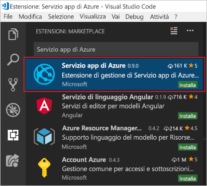

<span data-ttu-id="dc8fb-101">In questa unità verranno installati Visual Studio Code e l'estensione Servizio app di Azure, che consentiranno di predisporre l'ambiente ottimale per lo sviluppo per Microsoft Azure e la distribuzione di un'app Web.</span><span class="sxs-lookup"><span data-stu-id="dc8fb-101">In this unit, you will install Visual Studio Code and the Azure App Service extension, which will get you ready to develop for Microsoft Azure and to deploy a web app.</span></span>

## <a name="exercise-steps"></a><span data-ttu-id="dc8fb-102">Passaggi dell'esercizio</span><span class="sxs-lookup"><span data-stu-id="dc8fb-102">Exercise steps</span></span>

<span data-ttu-id="dc8fb-103">Prima di tutto identificare il sistema operativo in uso e seguire i passaggi nella sezione appropriata di seguito per installare Visual Studio Code.</span><span class="sxs-lookup"><span data-stu-id="dc8fb-103">First, identify which operating system you are using, and follow the steps in the appropriate section below to install Visual Studio Code.</span></span>

### <a name="windows"></a><span data-ttu-id="dc8fb-104">Windows</span><span class="sxs-lookup"><span data-stu-id="dc8fb-104">Windows</span></span>

1. <span data-ttu-id="dc8fb-105">Scaricare il programma di installazione di Visual Studio Code per Windows.</span><span class="sxs-lookup"><span data-stu-id="dc8fb-105">Download the Visual Studio Code installer for Windows.</span></span>

1. <span data-ttu-id="dc8fb-106">Eseguire il programma di installazione.</span><span class="sxs-lookup"><span data-stu-id="dc8fb-106">Run the installer.</span></span> <span data-ttu-id="dc8fb-107">L'operazione non richiederà molto tempo.</span><span class="sxs-lookup"><span data-stu-id="dc8fb-107">This won't take long.</span></span>

1. <span data-ttu-id="dc8fb-108">Aprire Visual Studio Code passando alla cartella di installazione (il percorso predefinito è C:\Programmi\Microsoft VS Code per un computer a 64 bit).</span><span class="sxs-lookup"><span data-stu-id="dc8fb-108">Open VS Code by navigating to the installation folder (the default path is C:\Program Files\Microsoft VS Code for a 64-bit machine).</span></span>

### <a name="macos"></a><span data-ttu-id="dc8fb-109">macOS</span><span class="sxs-lookup"><span data-stu-id="dc8fb-109">macOS</span></span>

1. <span data-ttu-id="dc8fb-110">Scaricare Visual Studio Code per macOS.</span><span class="sxs-lookup"><span data-stu-id="dc8fb-110">Download Visual Studio Code for macOS.</span></span>

1. <span data-ttu-id="dc8fb-111">Fare doppio clic sull'archivio scaricato per espandere il contenuto.</span><span class="sxs-lookup"><span data-stu-id="dc8fb-111">Double-click on the downloaded archive to expand the contents.</span></span>

1. <span data-ttu-id="dc8fb-112">Trascinare Visual Studio Code.app nella cartella Applicazioni, rendendolo disponibile in Launchpad.</span><span class="sxs-lookup"><span data-stu-id="dc8fb-112">Drag Visual Studio Code.app to the Applications folder, making it available in the Launchpad.</span></span>

1. <span data-ttu-id="dc8fb-113">Aggiungere Visual Studio Code a Dock facendo clic con il pulsante destro del mouse sull'icona e scegliendo Opzioni > Mantieni nel Dock.</span><span class="sxs-lookup"><span data-stu-id="dc8fb-113">Add VS Code to your Dock by right-clicking on the icon, and choosing Options > Keep in Dock.</span></span>

### <a name="linux--debian-and-ubuntu"></a><span data-ttu-id="dc8fb-114">Linux - Debian e Ubuntu</span><span class="sxs-lookup"><span data-stu-id="dc8fb-114">Linux – Debian and Ubuntu</span></span>

1. <span data-ttu-id="dc8fb-115">Scaricare e installare il [pacchetto DEB (64 bit)](https://go.microsoft.com/fwlink/?LinkID=760868), tramite un centro software con interfaccia grafica, se disponibile, o tramite la riga di comando (sostituendo `<file>` con il nome del file DEB scaricato):</span><span class="sxs-lookup"><span data-stu-id="dc8fb-115">Download and install the [.deb package (64-bit)](https://go.microsoft.com/fwlink/?LinkID=760868), either through the graphical software center, if it's available, or through the command line (replacing `<file>` with the .deb filename you downloaded):</span></span>

    ```bash
    sudo dpkg -i <file>.deb
    sudo apt-get install -f # Install dependencies
    ```

### <a name="linux--rhel-fedora-and-centos"></a><span data-ttu-id="dc8fb-116">Linux - RHEL, Fedora e CentOS</span><span class="sxs-lookup"><span data-stu-id="dc8fb-116">Linux – RHEL, Fedora, and CentOS</span></span>

1. <span data-ttu-id="dc8fb-117">Usare lo script seguente per installare la chiave e il repository:</span><span class="sxs-lookup"><span data-stu-id="dc8fb-117">Use the following script to install the key and repository:</span></span>

    ```bash
    sudo rpm --import https://packages.microsoft.com/keys/microsoft.asc
    sudo sh -c 'echo -e "[code]\nname=Visual Studio Code\nbaseurl=https://packages.microsoft.com/yumrepos/vscode\nenabled=1\ngpgcheck=1\ngpgkey=https://packages.microsoft.com/keys/microsoft.asc" > /etc/yum.repos.d/vscode.repo'
    ```

1. <span data-ttu-id="dc8fb-118">Aggiornare la cache dei pacchetti e installare il pacchetto usando dnf (Fedora 22 e versioni successive):</span><span class="sxs-lookup"><span data-stu-id="dc8fb-118">Update the package cache, and install the package by using dnf (Fedora 22 and above):</span></span>

    ```bash
    dnf check-update
    sudo dnf install code
    ```

### <a name="linux--opensuse-and-sle"></a><span data-ttu-id="dc8fb-119">Linux - openSUSE e SLE</span><span class="sxs-lookup"><span data-stu-id="dc8fb-119">Linux – openSUSE and SLE</span></span>

1. <span data-ttu-id="dc8fb-120">Il repository yum funziona anche per sistemi basati su openSUSE e SLE.</span><span class="sxs-lookup"><span data-stu-id="dc8fb-120">The yum repository also works for openSUSE and SLE based systems.</span></span> <span data-ttu-id="dc8fb-121">Lo script seguente installerà la chiave e il repository:</span><span class="sxs-lookup"><span data-stu-id="dc8fb-121">The following script will install the key and repository:</span></span>

    ```bash
    sudo rpm --import https://packages.microsoft.com/keys/microsoft.asc
    sudo sh -c 'echo -e "[code]\nname=Visual Studio Code\nbaseurl=https://packages.microsoft.com/yumrepos/vscode\nenabled=1\ntype=rpm-md\ngpgcheck=1\ngpgkey=https://packages.microsoft.com/keys/microsoft.asc" > /etc/zypp/repos.d/vscode.repo'
    ```

1. <span data-ttu-id="dc8fb-122">Aggiornare la cache dei pacchetti e installare il pacchetto con:</span><span class="sxs-lookup"><span data-stu-id="dc8fb-122">Update the package cache and install the package by using:</span></span>

    ```bash
    sudo zypper refresh
    sudo zypper install code
    ```

> [!NOTE]
> <span data-ttu-id="dc8fb-123">Per altri dettagli sull'installazione o l'aggiornamento di Visual Studio Code in varie distribuzioni Linux, vedere la [documentazione per l'esecuzione di Visual Studio Code in Linux](https://code.visualstudio.com/docs/setup/linux).</span><span class="sxs-lookup"><span data-stu-id="dc8fb-123">For further details about installing or updating VS Code on various Linux distributions, please see the [Running VS Code on Linux documentation](https://code.visualstudio.com/docs/setup/linux).</span></span>

## <a name="install-azure-app-service-extension"></a><span data-ttu-id="dc8fb-124">Installare l'estensione di Servizio app di Azure</span><span class="sxs-lookup"><span data-stu-id="dc8fb-124">Install Azure App Service extension</span></span>

<span data-ttu-id="dc8fb-125">Dopo aver installato Visual Studio Code, aprirlo.</span><span class="sxs-lookup"><span data-stu-id="dc8fb-125">Once you have installed VS Code, open it.</span></span>

1. <span data-ttu-id="dc8fb-126">Passare alla scheda Estensioni.</span><span class="sxs-lookup"><span data-stu-id="dc8fb-126">Go to the Extensions tab.</span></span>

1. <span data-ttu-id="dc8fb-127">Cercare Servizio app di Azure.</span><span class="sxs-lookup"><span data-stu-id="dc8fb-127">Search for Azure App Service.</span></span>

1. <span data-ttu-id="dc8fb-128">Fare clic su Installa.</span><span class="sxs-lookup"><span data-stu-id="dc8fb-128">Click Install.</span></span>

    <span data-ttu-id="dc8fb-129">Lo screenshot seguente illustra l'estensione di Servizio app di Azure selezionata nei risultati di ricerca delle estensioni in Visual Studio Code.</span><span class="sxs-lookup"><span data-stu-id="dc8fb-129">The following screenshot shows the Azure App Service extension selected from the Visual Studio Code extension search results.</span></span>

    

<span data-ttu-id="dc8fb-131">Verrà così installata l'estensione.</span><span class="sxs-lookup"><span data-stu-id="dc8fb-131">This will install the extension.</span></span> <span data-ttu-id="dc8fb-132">Sarà poi possibile connettersi alla sottoscrizione di Azure e sviluppare e distribuire un'app Web, per dispositivi mobili o API in Servizio app di Azure.</span><span class="sxs-lookup"><span data-stu-id="dc8fb-132">You will be ready to connect to your Azure subscription, and develop for and deploy your web, mobile, or API app to an Azure App Service.</span></span>
