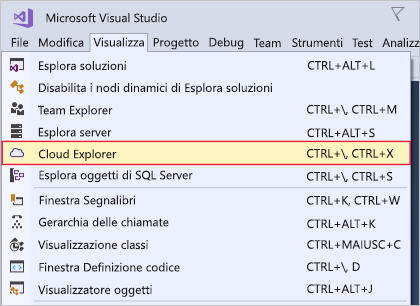

In questo esercizio verrà installato Visual Studio nel computer di sviluppo macOS o Windows.

## Passaggi dell'esercizio

::: zone pivot="windows"

### Windows

1. Scaricare il programma di installazione di Visual Studio da https://visualstudio.microsoft.com/downloads/.

1. Eseguire il programma di installazione.

1. Nella scheda **Carichi di lavoro** selezionare il carico di lavoro **Sviluppo di Azure**.

    Lo screenshot seguente mostra il carico di lavoro per il programma di installazione di Visual Studio selezionato per consentire lo sviluppo di Azure all'interno di Visual Studio.

    

1. (Facoltativo) Installare il carico di lavoro Sviluppo ASP.NET e Web per prepararsi per la creazione di applicazioni Web per Azure.

1. Fare clic su **Installa** e attendere il completamento dell'installazione di Visual Studio. Nei sistemi in cui Visual Studio è già installato questo pulsante potrebbe chiamarsi **Modifica**.

1. Al termine dell'installazione aprire Visual Studio.

1. Passare al menu Visualizza in Visual Studio e assicurarsi di avere l'opzione **Cloud Explorer**.

    Lo screenshot seguente mostra l'opzione di menu Cloud Explorer che sarà presente se è installato il carico di lavoro Sviluppo di Azure.

    

::: zone-end

::: zone pivot="macos"

### macOS

1. Passare a https://visualstudio.microsoft.com/ e scaricare il programma di installazione di Visual Studio per Mac.

1. Fare clic sul file VisualStudioInstaller.dmg per montare il programma di installazione e quindi eseguirlo facendo doppio clic sul logo.

1. Accettare le condizioni di licenza e privacy quando vengono visualizzate.

1. Il programma di installazione richiederà i componenti da installare. I componenti di Azure fanno già parte di Visual Studio per Mac, ma è consigliabile installare la piattaforma **.NET Core** per sviluppare esperienze Web per Azure.

    Lo screenshot seguente mostra la piattaforma .NET Core necessaria per aggiungere funzionalità di sviluppo di Azure a Visual Studio per Mac.

    

1. Fare clic su **Installa e aggiorna** quando si è soddisfatti delle selezioni e attendere il completamento del programma di installazione.

1. Se viene chiesto di elevare le autorizzazioni necessarie, usare le credenziali di amministratore per eseguire questa operazione.

1. Una volta completato il programma di installazione, avviare Visual Studio per Mac.

::: zone-end