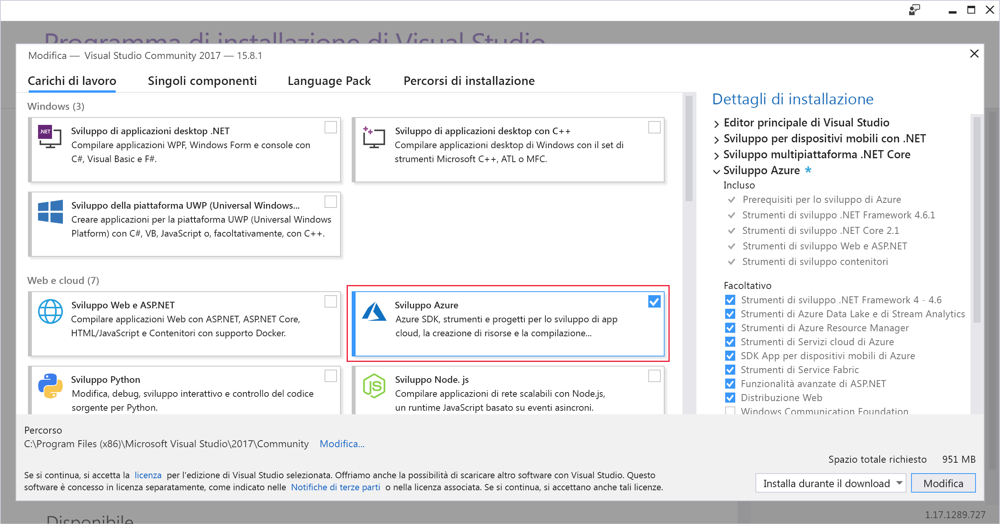

In questo esercizio verrà installato Visual Studio nel computer di sviluppo macOS o Windows.Here, you'll install Visual Studio on either your Windows or your macOS development machine.

## Passaggi dell'esercizioExercise steps

::: zone pivot="windows"::: zone pivot="windows"

### WindowsWindows

1. Scaricare il programma di installazione di Visual Studio da https://visualstudio.microsoft.com/downloads/.Download the Visual Studio installer from https://visualstudio.microsoft.com/downloads/.

1. Eseguire il programma di installazione.Run the installer.

1. Nella scheda **Carichi di lavoro** selezionare il carico di lavoro **Sviluppo di Azure**.On the **Workloads** tab, select the **Azure development** workload.

    Lo screenshot seguente mostra il carico di lavoro per il programma di installazione di Visual Studio selezionato per consentire lo sviluppo di Azure all'interno di Visual Studio.The following screenshot shows the Visual Studio Installer workload selected to allow Azure development within Visual Studio.

    

1. (Facoltativo) Installare il carico di lavoro Sviluppo ASP.NET e Web per prepararsi per la creazione di applicazioni Web per Azure.(Optional) Install the ASP.NET and web development workload to be ready to create web applications for Azure.

1. Fare clic su **Installa** e attendere il completamento dell'installazione di Visual Studio.Click **Install**, and wait for Visual Studio to install. Nei sistemi in cui Visual Studio è già installato questo pulsante potrebbe chiamarsi **Modifica**.For systems with Visual Studio already installed, this button may say **Modify**.

1. Al termine dell'installazione aprire Visual Studio.When the installation is complete, open Visual Studio.

1. Passare al menu Visualizza in Visual Studio e assicurarsi di avere l'opzione **Cloud Explorer**.Go to the View menu in Visual Studio and make sure you have the **Cloud Explorer** option.

    Lo screenshot seguente mostra l'opzione di menu Cloud Explorer che sarà presente se è installato il carico di lavoro Sviluppo di Azure.The following screenshot shows the Cloud Explorer menu option that will be present if you have the Azure development workload installed.

    

::: zone-end::: zone-end

::: zone pivot="macos"::: zone pivot="macos"

### macOSmacOS

1. Passare a https://visualstudio.microsoft.com/ e scaricare il programma di installazione di Visual Studio per Mac.Go to https://visualstudio.microsoft.com/ and download the Visual Studio for Mac installer.

1. Fare clic sul file VisualStudioInstaller.dmg per montare il programma di installazione e quindi eseguirlo facendo doppio clic sul logo.Click the VisualStudioInstaller.dmg file to mount the installer, then run it by double-clicking the logo.

1. Accettare le condizioni di licenza e privacy quando vengono visualizzate.Acknowledge the Privacy and License terms when presented.

1. Il programma di installazione richiederà i componenti da installare.The installer will ask which components you wish to install. I componenti di Azure fanno già parte di Visual Studio per Mac, ma è consigliabile installare la piattaforma **.NET Core** per sviluppare esperienze Web per Azure.Azure components are already part of Visual Studio for Mac, but it is recommended to install the **.NET Core** platform to develop web experiences for Azure.

    Lo screenshot seguente mostra la piattaforma .NET Core necessaria per aggiungere funzionalità di sviluppo di Azure a Visual Studio per Mac.The following screenshot shows the .NET Core platform required to add Azure development capabilities to Visual Studio for Mac.

    

1. Fare clic su **Installa e aggiorna** quando si è soddisfatti delle selezioni e attendere il completamento del programma di installazione.Click **Install and Update** once you are happy with the selections, and wait for the installer to complete.

1. Se viene chiesto di elevare le autorizzazioni necessarie, usare le credenziali di amministratore per eseguire questa operazione.If you are prompted to elevate the permissions needed, use your administrator credentials to do so.

1. Una volta completato il programma di installazione, avviare Visual Studio per Mac.Once the installer is complete, start Visual Studio for Mac.

::: zone-end::: zone-end