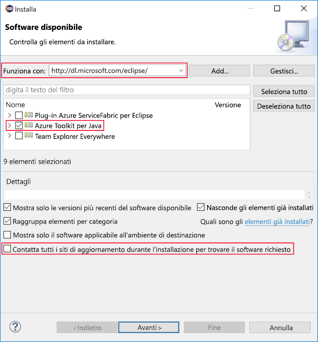

Qui si installerà Eclipse e Azure Toolkit nel proprio computer di sviluppo.Here you'll install Eclipse and the Azure Toolkit on your development machine. Al termine dell'esercizio si avranno a disposizione tutti gli strumenti necessari per creare un'applicazione Java collegata ad Azure.By the end of the exercise, you'll have everything you need to create a Java application connected to Azure.

## Installare l'IDE di EclipseInstall Eclipse IDE

1. Scaricare [l'IDE Eclipse appropriato per il proprio sistema operativo](https://www.eclipse.org/downloads/packages/installer).Download the appropriate [Eclipse IDE for your operating system](https://www.eclipse.org/downloads/packages/installer).

1. Avviare il programma di installazione di Eclipse dopo averlo scaricato.Start the Eclipse installer once downloaded.

    1. In Windows fare doppio clic sul file scaricato.On Windows, double-click the downloaded file.

    1. In macOS e Linux decomprimere il programma di installazione dal file scaricato ed eseguirlo.On macOS and Linux, unzip the installer from the downloaded file and run it.

        > [!NOTE]
        > Il programma di installazione potrebbe richiedere di installare Java Development Kit, se risulta mancante.The installer may prompt you to install the Java Development Kit, if it is missing.

1. Selezionare i pacchetti da installare.Select the packages to install. Per gli sviluppatori Java, scegliere l'opzione per l'IDE di Eclipse Java o Jave EE.For Java developers, choose either the Java or Java EE Eclipse IDE option.

1. Selezionare la destinazione di installazione nel computer.Select the installation destination on your machine.

1. Avviare Eclipse per verificare che sia stato installato correttamente.Launch Eclipse to validate that it installed correctly.

## Installare Azure Toolkit for EclipseInstall Azure Toolkit for Eclipse

La procedura per l'installazione di Azure Toolkit è identica in Windows, macOS e Linux.Installing the Azure Toolkit is the same across Windows, macOS, and Linux.

1. Avviare Eclipse.Start Eclipse.

1. Passare a **Help** > **Install New Software** (Guida, Installa nuovo software).Go to **Help** > **Install New Software...**.

    Lo screenshot seguente mostra la posizione nel menu della voce **Install New Software** (Installa nuovo software).The following screenshot shows the menu location of the **Install New Software...** item.

    

1. Verrà aperta la finestra di dialogo **Available Software** (Software disponibile).The **Available Software** dialog will open. Nella casella di testo **Work with** (Usa) immettere `http://dl.microsoft.com/eclipse/` e premere INVIO.In the **Work with:** text box, type `http://dl.microsoft.com/eclipse/` and press Enter.

1. Nei risultati selezionare l'opzione **Azure Toolkit for Java**.In the results, check the **Azure Toolkit for Java** option. Assicurarsi di deselezionare l'opzione **Contact all update sites during install to find required software** (Contattare tutti i siti di aggiornamento durante l'installazione per trovare il software richiesto).Make sure you uncheck the **Contact all update sites during install to find required software** option, if it isn't already.

    La schermata seguente mostra la configurazione di installazione **Available Software** (Software disponibile) sopra descritta.The following screenshot shows the **Available Software** install configuration as described above.

    

1. Fare clic su **Avanti**.Click **Next**.

1. Rivedere e accettare i contratti di licenza quando richiesto e fare clic su **Fine**.Review and accept the license agreements when prompted, and click **Finish**.

1. Eclipse scarica e installa Azure Toolkit.Eclipse will download and install the Azure Toolkit.

1. Se richiesto, riavviare Eclipse.Restart Eclipse if required.

1. Convalidare l'installazione di Azure Toolkit verificando che sia disponibile la voce di menu **Tools** > **Azure** (Strumenti, Azure) in Eclipse.Validate the Azure Toolkit installation by verifying that you can find a **Tools** > **Azure** menu option in Eclipse.
