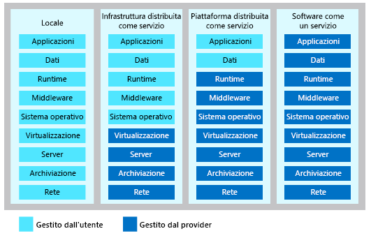

Quando si parla di cloud computing, esistono tre categorie principali. È importante conoscerle in quanto vengono usate nelle conversazioni, nella documentazione e nella formazione.

Ecco le tre categorie di servizi cloud comuni:

- Infrastruttura distribuita come servizio (IaaS, Infrastructure as a Service)
- Piattaforma distribuita come servizio (PaaS, Platform as a Service)
- Software come un servizio (SaaS, Software as a Service)

Un aspetto a cui prestare attenzione è che queste categorie sono livelli che si sovrappongono l'uno all'altro. Il modello PaaS ad esempio aggiunge un livello sopra il modello IaaS, offrendo così un livello di astrazione. L'astrazione offre il vantaggio di nascondere i dettagli di scarso interesse e quindi di raggiungere il codice più rapidamente. Lo svantaggio è che si ha meno controllo sull'hardware sottostante. L'illustrazione seguente illustra un elenco di risorse gestite dall'utente e dal provider di servizi in ogni categoria del servizio cloud.

### Infrastruttura distribuita come servizio (IaaS, Infrastructure as a Service)

Il modello IaaS è la categoria più flessibile di servizi cloud e offre il controllo completo sull'hardware che esegue l'applicazione. Con il modello IaaS l'hardware non viene acquistato ma noleggiato.

Di seguito sono riportati alcuni esempi di IaaS:

- Macchine virtuali
- Firewall
- Dischi rigidi
- Servizi di bilanciamento del carico

### Piattaforma distribuita come servizio (PaaS, Platform as a Service)

Il modello PaaS offre un ambiente per la compilazione, i test e la distribuzione di applicazioni software. L'obiettivo del modello PaaS è di aiutare a creare un'applicazione il più rapidamente possibile senza doversi preoccupare di gestire l'infrastruttura sottostante. Quando ad esempio si distribuisce un'applicazione Web con il modello PaaS, non è necessario installare un sistema operativo, un server Web o anche gli aggiornamenti del sistema. 

Un esempio di modello PaaS è il Servizio app di Azure.

### Software come un servizio (SaaS, Software as a Service)

Il modello SaaS offre un modo per distribuire le applicazioni tramite Internet. Un'applicazione SaaS viene più comunemente chiamata applicazione basata sul Web. Il termine applicazione SaaS deriva invece dal fatto che l'applicazione viene ospitata nel server di un provider SaaS. Con il modello SaaS, non ci si deve preoccupare dell'installazione o della configurazione. È sufficiente usarla con un Web browser o un'applicazione software. 

Un esempio di applicazione SaaS è Microsoft Office 365.

## Riepilogo

Le tecnologie IaaS, PaaS e SaaS sono tutti livelli sovrapposti l'uno all'altro. La categoria di servizi è più consona alle proprie esigenze dipenderà dal livello di controllo che si vuole avere sull'hardware sottostante.
