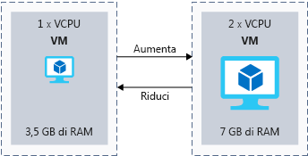

Il server necessita di risorse sufficienti per gestire la domanda giornaliera. Una tipica strategia consiste nel scegliere, in fase di creazione, una dimensione di macchina virtuale che sia sufficiente per i carichi di lavoro tipici e quindi eseguire il ridimensionamento quando cambia la domanda.

Nello scenario dell'azienda che vende giocattoli, questa strategia sarebbe utile per gestire le risorse per la crescita a medio termine. È possibile aumentare la dimensione della macchina virtuale per gestire l'aumento della domanda man mano che il business aumenta.

## <a name="what-is-virtual-machine-size"></a>Che cos'è la dimensione di una macchina virtuale?

La _dimensione_ di una macchina virtuale rappresenta una misura di CPU, memoria, disco e larghezza di banda di rete prevista. La macchine virtuali sono disponibili in un numero predefinito di dimensioni. La dimensione **Standard_F32s_v2**, ad esempio, ha 32 CPU virtuali, 64 GiB di memoria, un'unità SSD locale da 256 GiB e 14.000 Mbps di larghezza di banda di rete prevista.

Quando si crea una nuova macchina virtuale in Azure, è necessario sceglierne la dimensione. Le dimensioni maggiori hanno costi maggiori. L'obiettivo è quello di scegliere una dimensione che consenta di gestire il carico di lavoro senza configurare più potenza del necessario.

## <a name="what-is-virtual-machine-type"></a>Che cos'è un tipo di macchina virtuale?

Il _tipo_ di una macchina virtuale rappresenta il carico di lavoro per cui la macchina virtuale è stata ottimizzata. Ad esempio, alcune macchine virtuali sono destinate ad attività a elevato utilizzo della CPU, come l'hosting di un server Web. Altre sono destinate a processi incentrati sull'archiviazione, come l'esecuzione di un database.

Ci sono _tipi_ che corrispondono a ciascun componente hardware principale in un computer moderno: **calcolo**, **memoria**, **archiviazione** e **GPU**. C'è anche un tipo **per utilizzo generico**, se è necessaria una combinazione bilanciata di risorse. Nella tabella seguente sono elencati i tipi e le dimensioni delle macchine virtuali che fanno parte di ogni tipo, insieme a una breve descrizione del carico di lavoro di destinazione.

|Tipo|Dimensioni|Descrizione|
|---|---|---|
|Utilizzo generico|B, Ds_v3, D_v3, alcune macchine virtuali DS_v2, alcune macchine virtuali D_v2, A_v2|Le macchine virtuali per utilizzo generico hanno un rapporto CPU-memoria bilanciato. Le macchine virtuali per utilizzo generico sono ideali per server di test o sviluppo, database medio-piccoli o server Web con traffico medio-basso.|
|Con ottimizzazione per il calcolo|Fs_v2, Fs, F|Le macchine virtuali con ottimizzazione per il calcolo hanno un rapporto CPU-memoria più alto rispetto a quelle per utilizzo generico, per le attività che richiedono potenza di elaborazione aggiuntiva, ad esempio server applicazioni, appliance di rete o server Web con traffico medio.|
|Con ottimizzazione per la memoria|Es_v3, E_v3, M, GS, G, alcune macchine virtuali DS_v2, alcune macchine virtuali D_v2|Le macchine virtuali ottimizzate per la memoria hanno un rapporto memoria-CPU elevato. Queste macchine sono ideali per server di database relazionali, server che richiedono o eseguono numerose attività di memorizzazione nella cache o server che eseguono analisi in memoria.|
|Con ottimizzazione per l'archiviazione|Ls|Queste macchine virtuali sono configurate per velocità effettiva del disco elevata e operazioni di I/O per Big Data e database SQL e NoSQL.|
|GPU|NV, NC, NC_v2, NC_v3, ND|Le macchine virtuali GPU sono specializzate per attività come operazioni complesse di rendering di grafica e modifica di video, oltre che per il training e l'inferenza dei modelli (serie ND) con apprendimento profondo. Per queste macchine è possibile scegliere una singola GPU o più GPU.|
|High Performance Computing|H|In queste macchine virtuali sono disponibili le CPU più potenti e più veloci. È anche possibile aggiungere interfacce di rete a velocità effettiva elevata (RDMA).|

## <a name="clusters"></a>Cluster

L'hardware server fisico nelle aree di Azure è raggruppato in cluster. Ogni cluster può supportare diverse dimensioni di macchine virtuali a seconda dell'hardware fisico.

Quando si crea una macchina virtuale e si sceglie una dimensione specifica, viene effettuato il provisioning della macchina virtuale in un cluster hardware appropriato per la dimensione scelta. Anche se è possibile ridimensionare le macchine virtuali dopo la creazione, le opzioni di ridimensionamento possono essere limitate dal cluster hardware scelto per la dimensione iniziale.

## <a name="what-is-vertical-scaling"></a>Che cos'è la scalabilità verticale?

La _scalabilità verticale_ è il processo di modifica della _dimensione_ di una macchina virtuale. È possibile _aumentare le prestazioni_ scegliendo una dimensione più potente per gestire un aumento della domanda oppure _ridurre le prestazioni_ per allocare meno risorse e ridurre i costi. La figura seguente mostra un esempio di modifica della dimensione di una macchina virtuale.



È possibile ridimensionare una macchina virtuale usando il portale di Azure, Azure PowerShell o l'interfaccia della riga di comando di Azure.

### <a name="resize-in-the-portal"></a>Eseguire il ridimensionamento nel portale

Nel portale di Azure è possibile ridimensionare una macchina virtuale selezionando la macchina virtuale, facendo clic sulla voce **Dimensione** e selezionando un'opzione nel pannello **Scegli una dimensione**. 

Se la macchina virtuale è in esecuzione, le dimensioni disponibili che è possibile selezionare dipendono dalle dimensioni disponibili nell'area. Vengono visualizzate solo le opzioni di ridimensionamento compatibili con lo stesso cluster hardware in cui la macchina virtuale è attualmente in esecuzione. Questo concetto è talvolta detto *famiglia di dimensioni*. Se si sceglie una nuova dimensione mentre la macchina virtuale è in esecuzione, la macchina virtuale verrà riavviata automaticamente per applicare la nuova dimensione.

Se la dimensione desiderata non è visibile nel portale quando la macchina virtuale è in esecuzione, è possibile arrestare la macchina virtuale per visualizzare altre opzioni. Quando la macchina si trova nello stato **Arrestato (deallocato)**, è possibile selezionare dimensioni di altro hardware nella stessa area.

### <a name="resize-with-powershell"></a>Eseguire il ridimensionamento con PowerShell

È possibile usare PowerShell per applicare la scalabilità verticale in modo interattivo o tramite script. Gli script sono ideali per scenari complessi, ad esempio se è necessario ridimensionare più macchine virtuali contemporaneamente. Sono utili anche se è necessario eseguire il ridimensionamento al di fuori delle ore lavorative, per evitare di interrompere il lavoro degli utenti.

Il cmdlet seguente elenca le dimensioni delle macchine virtuali della stessa famiglia di dimensioni dell'hardware corrente:

```PowerShell
Get-AzureRmVMSize -ResourceGroupName "myResourceGroup" -VMName "MyVM"
```

Se la dimensione desiderata è visualizzata, usare il cmdlet seguente per modificare la dimensione della macchina virtuale:

```PowerShell
$vm = Get-AzureRmVM -ResourceGroupName "myResourceGroup" -VMName "MyVM"
$vm.HardwareProfile.VmSize = "<newVMsize>"
Update-AzureRmVM -VM $vm -ResourceGroupName "myResourceGroup"
```

Se la dimensione desiderata non è visualizzata mentre la macchina è in esecuzione, usare i comandi seguenti per deallocare la macchina virtuale, ridimensionarla e riavviarla:

```PowerShell
Stop-AzureRmVM -ResourceGroupName "myResourceGroup" -Name "MyVM" -Force
$vm = Get-AzureRmVM -ResourceGroupName "myResourceGroup" -VMName "MyVM"
$vm.HardwareProfile.VmSize = "<newVMSize>"
Update-AzureRmVM -VM $vm -ResourceGroupName "myResourceGroup"
Start-AzureRmVM -ResourceGroupName "myResourceGroup" -Name "MyVM"
```

Le macchine virtuali in Azure possono essere ridimensionate in base alle esigenze per migliorare le prestazioni o ridurre i costi. L'esecuzione manuale del ridimensionamento, con il portale o uno script, è utile per gestire una crescita graduale del business o quando si sa in anticipo che la domanda sta per cambiare. Nello scenario dell'azienda che vende giocattoli, è possibile aumentare le prestazioni prima di una festività per gestire il picco della domanda e successivamente ridurle.
