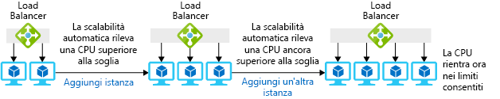

Per ottenere le risorse necessarie, è possibile usare un'unica macchina virtuale di grandi dimensioni oppure più macchine virtuali di dimensioni inferiori con un bilanciamento del carico che distribuisce le richieste tra le VM.You can get the resources you need using either one large virtual machine or several small VMs with a load balancer to distribute requests among the VMs.

Il pool di macchine virtuali ha il vantaggio di consentire l'aggiunta o la rimozione rapida di macchine virtuali a seconda delle richieste.The VM pool has the nice advantage that you can add or remove VMs quickly when demand changes. Nello scenario dell'azienda che vende giocattoli, questa strategia sarebbe utile per gestire i picchi imprevisti di richieste.In the toy company scenario, this strategy would be useful to handle unexpected spikes in demand. Si potrebbero aggiungere macchine virtuali al pool quando il numero di richieste aumenta e rimuoverle quando torna alla normalità.You could add VMs to the pool when demand increased and remove them when demand returned to normal. Il pool assicura anche la ridondanza: in caso di guasto di una macchina virtuale, le altre possono continuare a gestire le richieste senza alcuna interruzione del servizio.The pool also gives you redundancy; if one VM fails, the others can continue to handle requests with no interruption in service.

In questa sezione vedremo come effettuare il provisioning di più macchine virtuali usando i set di scalabilità e come aggiungere e rimuovere automaticamente istanze al variare dei volumi delle richieste.In this section, you will see how to provision multiple VMs using scale sets and how to automatically add and remove instances in response to changing demand. 

## Che cos'è la scalabilità orizzontale?What is horizontal scaling?

La *scalabilità orizzontale* è il processo di aggiunta o rimozione di macchine virtuali da un pool per regolare la quantità di risorse disponibili.*Horizontal scaling* is the process of adding or removing virtual machines from a pool to adjust the amount of available resources. L'aggiunta di macchine virtuali è detta _aumento_ e la rimozione è detta _riduzione_.Adding machines is called _scaling out_, and removing machines is called _scaling in_. Le soluzioni che usano la scalabilità orizzontale includono un servizio di bilanciamento del carico o un gateway che distribuisce le richieste tra le macchine virtuali del pool.Solutions that use horizontal scaling include a load balancer or gateway to distribute requests among the VMs in the pool. La figura seguente mostra un esempio di modifica del numero di istanze di macchine virtuali.The following illustration shows an example of changing the number of virtual machine instances.

Questa tecnica è ottimale per le applicazioni che possono essere eseguite su più server identici.This technique works best for applications that can be run across multiple, identical servers. Se ad esempio il server Web e le pagine Web vengono duplicati su più macchine virtuali, daranno la stessa risposta indipendentemente dal server che riceve la richiesta.For example, you can duplicate your web server and web pages on multiple VMs, and they will all give the same response no matter which server receives the request. Una macchina virtuale che esegue il database back-end non è invece un candidato ideale, in quanto l'esecuzione di più copie del database implica la necessità di mantenere tali copie sincronizzate.On the other hand, a VM that runs your backend database is not an ideal candidate because running multiple copies of the database requires some effort to keep the copies in sync.

## Che cos'è un set di scalabilità?What is a scale set?

Un *set di scalabilità* è costituito da un pool di macchine virtuali identiche, un servizio di bilanciamento del carico o un gateway che distribuisce le richieste e un set di regole facoltativo che controlla quando le macchine virtuali vengono aggiunte o rimosse dal pool.A *scale set* is a pool of identical virtual machines, a load balancer or gateway to distribute requests, and an optional set of rules that control when VMs are added or removed from the pool. In questo contesto "identiche" significa che ogni macchina virtuale nel set viene creata con la stessa immagine e con le stesse dimensioni.Here, "identical" means that each VM in the set is created using the same image and has the same size.

La configurazione di ogni nuova macchina virtuale con il software necessario è invece più flessibile.You have some flexibility in how a new VM is configured with the software you need. È possibile iniziare con un'immagine predefinita del sistema operativo di base e quindi usare script per installare o copiare i file automaticamente dopo l'installazione del sistema operativo.You can start with a predefined image for the base OS and then use scripts to install or copy files automatically after the OS is set up. In alternativa, è possibile creare un'immagine di macchina virtuale personalizzata con il sistema operativo e il software applicativo già installati.Alternately, you can create a custom virtual machine image with the operating system and your application software already installed.

## Come distribuire le richiesteHow to distribute requests

Per distribuire le richieste alle istanze di macchina virtuale in un set di scalabilità, è possibile usare un servizio di bilanciamento del carico o un gateway applicazione.You can use either a load balancer or an application gateway to distribute requests to the VM instances in a scale set.

Un servizio di bilanciamento del carico di Azure opera al livello OSI 4 (TCP e UDP) ed esegue il routing del traffico da un indirizzo IP e una porta di origine a un indirizzo IP e una porta di destinazione.An Azure load balancer operates at OSI layer 4 (TCP and UDP) and routes traffic based on source IP address and port combined with the destination IP address and port. Può fornire affinità, che consiste nel routing del traffico proveniente dallo stesso indirizzo IP di origine allo stesso server di destinazione, per garantire la coerenza in una sessione client.It can provide affinity, where traffic from the same source IP address is routed to the same destination server to provide consistency across a client session. Il servizio di bilanciamento del carico ha anche un meccanismo di probe integrità che determina la disponibilità delle istanze server.The load balancer also has a health probe mechanism that determines the availability of server instances. Se una macchina virtuale smette di rispondere al probe di integrità, il servizio di bilanciamento del carico eviterà di eseguire il routing di nuove connessioni a tale VM.If a virtual machine becomes unresponsive to the health probe, the load balancer will avoid routing any new connections to that machine.

Un gateway applicazione opera al livello OSI 7, ovvero il livello dell'applicazione.An application gateway operates at OSI layer 7 (the application layer). Ad esempio, se le macchine virtuali eseguono un server Web, il gateway può usare l'URL richiesto per eseguire il routing.For example, if your VMs are running a web server, then the gateway can use the requested URL to perform routing. Questo significa che è possibile inoltrare le richieste con `*/customers*` nell'URL a un pool di server e le richieste con `*/partners*` nell'URL a un altro pool.This means you could forward requests with `*/customers*` in the URL to one pool of servers and requests with `*/partners*` in the URL to a different pool. Il gateway applicazione può anche fornire il reindirizzamento da HTTP a HTTPS, la terminazione SSL (Secure Sockets Layer) per ridurre i requisiti di elaborazione sulle macchine virtuali per la crittografia e un web application firewall (WAF) che usa regole per rilevare gli exploit Web noti ed evitare che le richieste di questo tipo raggiungano i server Web.The application gateway can also provide HTTP to HTTPS redirection, Secure Sockets Layer (SSL) termination to reduce the processing requirement on the virtual machines for encryption, and a web application firewall (WAF) that uses rules to detect known web exploits and prevent these requests from reaching the web servers.

## Che cos'è la scalabilità automatica?What is autoscaling?

La _scalabilità automatica_ è il processo di aumento o riduzione automatica in base a un set di regole._Autoscaling_ is the process of automatically scaling out or in based on a set of rules. Le regole possono essere attivate dal carico delle macchine virtuali o in base a una pianificazione.The rules can be triggered by machine load or a schedule. La figura seguente mostra come la funzionalità di scalabilità automatica gestisce le istanze per gestire il carico.The following illustration shows how the autoscale feature manages instances to handle the load.

Per abilitare la scalabilità automatica per un set di scalabilità, è necessario creare un profilo di scalabilità automatica.To enable autoscaling for a scale set, you must create an autoscale profile. Il profilo definisce il numero minimo e massimo di istanze di macchina virtuale per il set e le regole di scalabilità.The profile defines the minimum and maximum number of VM instances for the set and the scaling rules. Le regole di scalabilità automatica sono costituite dagli elementi seguenti:Autoscale rules have the following elements:

* Origine metrica: l'origine delle informazioni o dei dati che attiva la regola di scalabilità automatica.Metric source - The source of information or data that triggers the autoscale rule. Sono disponibili quattro opzioni:There are four options:
  * *Set di scalabilità corrente*: fornisce metriche basate sull'host che non richiedono ulteriori agenti.*Current scale set* provides host-based metrics that do not require any additional agents.
  * *Account di archiviazione*.*Storage account*. L'estensione di diagnostica di Azure scrive le metriche delle prestazioni nell'archiviazione di Azure.The Azure diagnostic extension writes performance metrics to Azure Storage. Queste metriche vengono usate per attivare le regole di scalabilità automatica.These metrics are used to trigger autoscale rules.
  * *Coda del bus di servizio di Azure*: può specificare messaggi basati sull'applicazione o altri messaggi del bus di servizio di Azure per l'attivazione della scalabilità automatica.*Azure Service Bus queue* can specify application-based or other Azure Service Bus messages to trigger autoscaling.
  * *Azure Application Insights*: usa un pacchetto di strumentazione che deve essere installato nell'applicazione eseguita nel set di scalabilità per lo streaming dei dati di metrica direttamente dall'applicazione.*Azure Application Insights* uses an instrumentation package that needs to be installed in the application running on the scale set to stream metric data directly from the application.
* Criteri regola: metrica specifica che si vuole usare per attivare una regola di scalabilità automatica.Rule criteria - This is the specific metric you want to use to trigger an autoscale rule. Se si usano metriche basate sull'host, questi criteri possono includere aspetti come l'utilizzo della CPU, il volume del traffico di rete, le operazioni su disco o i crediti CPU.If you are using host-based metrics, this can include aspects such as CPU usage, volume of network traffic, disk operations, or CPU credits. Ad esempio è possibile configurare una regola di aumento se le operazioni di scrittura su disco al secondo superano una determinata soglia.For example, you could configure a rule to scale out if disk write operations per second exceed a threshold. Tramite l'estensione di diagnostica di Azure o Application Insights è possibile usare qualsiasi misura disponibile per attivare la regola, ma è necessario configurare l'agente appropriato.Using the Azure diagnostic extension or Application Insights enables you to use any available measure to trigger the rule but requires configuration of the appropriate agent.
* Tipo di aggregazione: specifica come si vogliono misurare i dati di metrica e offre le opzioni seguenti:Aggregation type - This specifies how you want to measure the metric data and will be one of the following options:
  * MediaAverage
  * MinimoMinimum
  * MassimoMaximum
  * TotaleTotal
  * UltimoLast
  * ConteggioCount
* Operatore: l'operatore indica quanto una metrica deve essere diversa da una soglia definita per attivare l'azione delle regole.Operator - The operator denotes how a metric must be different to a defined threshold to trigger the rules action. È particolarmente importante per stabilire se la regola dovrà aumentare o ridurre le istanze.This is particularly important when identifying whether the rule will scale out or in. Gli operatori possono essere:Operators can be:
  * Maggiore diGreater than
  * Maggiore o uguale aGreater than or equal to
  * Minore diLess than
  * Minore o uguale aLess than or equal to
  * Uguale aEqual to
  * Diverso daNot equal to
* Azione: determina come cambierà il numero di istanze all'attivazione della regola.Action - This determines how the number of instances will change when the rule is triggered. Sono disponibili le azioni seguenti:The following actions are available:
  * *Aumenta numero di* un numero fisso di macchine virtuali.*Increase count by* a fixed number of virtual machines.
  * *Aumenta percentuale di* una percentuale delle istanze esistenti.*Increase percent by* a percentage of existing instances.
  * *Aumenta numero a* un numero specifico di macchine virtuali.*Increase count to* a specific number of virtual machines.
  * *Riduci numero di* un numero fisso di macchine virtuali.*Decrease count by* a fixed number of virtual machines.
  * *Riduci percentuale di* una percentuale delle istanze esistenti.*Decrease percent by* a percentage of existing instances.
  * *Riduci numero di* un numero specifico di macchine virtuali.*Decrease count to* a specific number of virtual machines.

È possibile anche creare regole di scalabilità automatica che vengono attivate in base a una pianificazione.You can also create autoscale rules that trigger on a schedule. Ad esempio, è possibile definire una regola che aumenta il numero di istanze al mattino, quando le richieste sono numerose, e le riduce dopo pranzo, quando il numero di richieste generalmente diminuisce.For example, you might define a rule that scales out in the morning when you know demand is high and then scales in after lunch when demand typically decreases.

## Come creare un set di scalabilitàHow to create a scale set

È possibile creare un set di scalabilità con il portale di Azure, Azure PowerShell o l'interfaccia della riga di comando di Azure.You can create a scale set using the Azure portal, Azure PowerShell, or the Azure CLI.

### Portale di AzureAzure portal

Se si usa il portale di Azure per creare il set di scalabilità, occorre specificare l'immagine del sistema operativo da usare per le macchine virtuali e il numero di macchine virtuali da creare all'avvio.If you use the Azure portal to create the scale set, you will specify the operating system image to use for the virtual machines and how many VM instances to create at startup. È necessario specificare anche le dimensioni della macchina virtuale per ogni istanza e se si userà il servizio di bilanciamento del carico o il gateway applicazione per il bilanciamento del carico.You will also specify the size of virtual machine for each instance and whether to use the Azure load balancer or the application gateway for load balancing. Se si sceglie un servizio di bilanciamento del carico, il portale creerà un probe di integrità predefinito sulla porta 80 dedicato a tale servizio.If you choose a load balancer, the portal will create a default health probe on port 80 for it.

### Azure PowerShellAzure PowerShell

È possibile creare un set di scalabilità di macchine virtuali con il cmdlet di PowerShell `New-AzureRmVmss`.You can create a virtual machine scale set with the `New-AzureRmVmss` PowerShell cmdlet. Questo cmdlet può creare un nuovo set di scalabilità e un servizio di bilanciamento del carico e controllare le assegnazioni di indirizzo IP e rete virtuale.This cmdlet can create a new scale set, a load balancer, and control IP address and virtual network assignments. Se non sono specificate impostazioni nel cmdlet, `New-AzureRmVmss` usa le impostazioni predefinite seguenti:Unless settings are specified in the cmdlet, `New-AzureRmVmss` will use the following default settings:

* Creare due istanze di macchina virtualeCreate two virtual machine instances
* Usare l'immagine di Windows Server 2016 DatacenterUse the Windows Server 2016 Datacenter image
* Usare le dimensioni di macchina virtuale standard DS1_v2Use the Standard DS1_v2 virtual machine size
* Creare un servizio di bilanciamento del caricoCreate a load balancer
* Creare le regole di bilanciamento del carico per le porte 3389 e 5985 per Windows e per la porta 22 per LinuxCreate load balancer rules for ports 3389 and 5985 for Windows, port 22 for Linux

`New-AzureRmVmss` non crea un probe di integrità per il bilanciamento del carico.`New-AzureRmVmss` does not create a health probe for the load balancer. La procedura consigliata indica di crearlo tramite `Add-AzureRmLoadBalancerProbeConfig` dopo aver creato il set di scalabilità.The best practice would be to create this using `Add-AzureRmLoadBalancerProbeConfig` after you have created the scale set.

La scalabilità orizzontale con i set di scalabilità offre più server per l'esecuzione dell'applicazione.Horizontal scaling with scale sets gives you multiple servers to run your application. L'uso di più server consente di gestire carichi elevati e garantisce che i servizi rimangano disponibili anche in caso di arresto anomalo di un server.Using multiple servers lets you handle high loads and ensures your services remain available even if a server crashes. È possibile aggiungere la scalabilità automatica ai set di scalabilità in modo che il sistema si adatti automaticamente alle variazioni impreviste dei volumi delle richieste.You can add autoscale to your scale sets, so your system automatically adjusts to unexpected changes in demand.