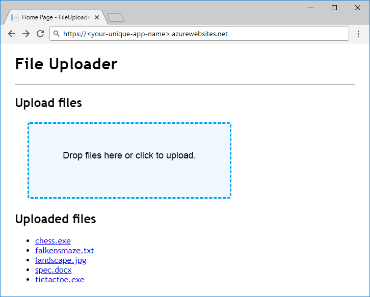

Dopo aver compreso come verranno archiviati i dati tra gli account di archiviazione, contenitori e blob, possiamo pensare alle risorse di Azure da creare per supportare l'app.

### <a name="storage-accounts"></a>Account di archiviazione

La creazione di account di archiviazione è un'attività di amministrazione e gestione che avviene prima di distribuire ed eseguire l'app. Gli account sono in genere creati da uno script di configurazione o distribuzione dell'ambiente, un modello di Azure Resource Manager, o manualmente dall'amministratore. Le applicazioni diverse dagli strumenti di amministrazione generalmente non dispongono delle autorizzazioni per creare gli account di archiviazione.

### <a name="containers"></a>Contenitori

A differenza della creazione di account di archiviazione, la creazione del contenitore è un'attività semplice che è opportuno eseguire all'interno di un'app. Non è insolito che le app creino ed eliminino i contenitori, in quanto parte del proprio lavoro.

Per le app che si basano su un set noto di contenitori con nomi hard-coded o preconfigurati, la procedura tipica consiste nel consentire all'app di creare i contenitori di cui necessita all'avvio o al primo utilizzo se non sono già presenti. Consentire all'app di creare contenitori anziché crearli come parte della distribuzione dell'app elimina la necessità per l'applicazione e per il processo di distribuzione di conoscere i nomi dei contenitori usati dall'app.

## <a name="exercise"></a>Esercizio

Eseguire un'app ASP.NET Core incompleta aggiungendo il codice per usare l'archiviazione BLOB di Azure. Questo esercizio riguarda più l'esplorazione dell'API dell'archiviazione BLOB che la progettazione di un'organizzazione e dello schema di denominazione, ma di seguito viene presentata una breve panoramica dell'applicazione e delle modalità di archiviazione dei dati.



L'app funziona come una cartella condivisa che accetta i caricamenti di file e li rende disponibili per il download. Non usa un database per organizzare i blob &mdash; ma corregge i nomi dei file caricati e li usa come nomi di blob direttamente. Tutti i file caricati vengono archiviati in un singolo contenitore.

Il codice con cui si inizierà viene compilato ed eseguito, ma le parti responsabili per l'archiviazione e il caricamento dei dati sono vuote. Dopo aver completato il codice, l'app verrà distribuita nel servizio app di Azure e testata.

[!include[](../../../includes/azure-sandbox-activate.md)]

Configurare l'infrastruttura di archiviazione per l'app.

### <a name="storage-account"></a>Account di archiviazione

Azure Cloud Shell verrà usato con l'interfaccia della riga di comando di Azure per creare un account di archiviazione. È necessario specificare un nome univoco per l'account di archiviazione. Prenderne nota per usarlo in seguito. Nell'esempio seguente viene usato "Stati Uniti orientali", ma è possibile modificare il valore con qualsiasi area disponibile nell'elenco.

[!include[](../../../includes/azure-sandbox-regions-first-mention-note.md)]

Eseguire il comando seguente per creare l'account di archiviazione. 

```azurecli
az storage account create --name <your-unique-storage-account-name> --resource-group <rgn>[sandbox resource group name]</rgn> --location eastus --kind StorageV2
```

> [!NOTE]
> Perché `--kind StorageV2`? Esistono diversi tipi di account di archiviazione. Per la maggior parte degli scenari, è consigliabile usare un account di archiviazione generico v2. L'unico motivo per cui è necessario specificare esplicitamente `--kind StorageV2` è che gli account di archiviazione generici v2 sono ancora relativamente nuovi e non sono ancora l'impostazione predefinita nel portale di Azure o nell'interfaccia della riga di comando di Azure.

### <a name="container"></a>Contenitore

L'applicazione con cui lavoreremo in questo modulo usa un singolo contenitore. È necessario seguire le procedure consigliate per lasciare che l'app crei il contenitore all'avvio. Tuttavia, la creazione del contenitore può essere eseguita dall'interfaccia della riga di comando di Azure: eseguire `az storage container create -h` nel terminale Cloud Shell se si desidera vedere la documentazione.