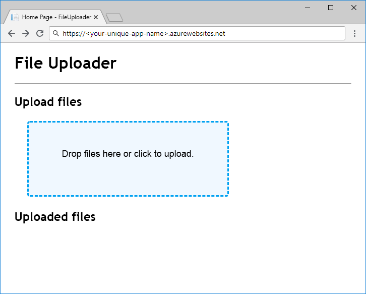

<span data-ttu-id="0b65d-101">Dopo aver ottenuto un riferimento a un blob, è possibile caricare e scaricare i dati.</span><span class="sxs-lookup"><span data-stu-id="0b65d-101">Once we have a reference to a blob, we can upload and download data.</span></span> <span data-ttu-id="0b65d-102">Gli oggetti `ICloudBlob` dispongono di metodi `Upload` e `Download` che supportano le matrici di byte, i flussi e i file come origini e destinazioni.</span><span class="sxs-lookup"><span data-stu-id="0b65d-102">`ICloudBlob` objects have `Upload` and `Download` methods that support byte arrays, streams, and files as sources and targets.</span></span> <span data-ttu-id="0b65d-103">Altri tipi specifici dispongono di metodi aggiuntivi per motivi di praticità &mdash;, ad esempio, `CloudBlockBlob` supporta il caricamento e download di stringhe con `UploadTextAsync` e `DownloadTextAsync`.</span><span class="sxs-lookup"><span data-stu-id="0b65d-103">Specific types have additional methods for convenience &mdash; for example, `CloudBlockBlob` supports uploading and downloading strings with `UploadTextAsync` and `DownloadTextAsync`.</span></span>

## <a name="creating-new-blobs"></a><span data-ttu-id="0b65d-104">Creazione di nuovi BLOB</span><span class="sxs-lookup"><span data-stu-id="0b65d-104">Creating new blobs</span></span>

<span data-ttu-id="0b65d-105">Per creare un nuovo BLOB, chiamare uno dei metodi `Upload` su un riferimento a un BLOB che non esiste nella risorsa di archiviazione.</span><span class="sxs-lookup"><span data-stu-id="0b65d-105">To create a new blob, you call one of the `Upload` methods on a reference to a blob that doesn't exist in storage.</span></span> <span data-ttu-id="0b65d-106">Ciò comporta due operazioni: creazione del BLOB nella risorsa di archiviazione e caricamento dei dati.</span><span class="sxs-lookup"><span data-stu-id="0b65d-106">This does two things: creates the blob in storage and uploads the data.</span></span>

## <a name="moving-data-to-and-from-blobs"></a><span data-ttu-id="0b65d-107">Spostamento dei dati da e verso i BLOB</span><span class="sxs-lookup"><span data-stu-id="0b65d-107">Moving data to and from blobs</span></span>

<span data-ttu-id="0b65d-108">Lo spostamento dei dati da e verso un BLOB è un'operazione di rete che richiede tempo.</span><span class="sxs-lookup"><span data-stu-id="0b65d-108">Moving data to and from a blob is a network operation that takes time.</span></span> <span data-ttu-id="0b65d-109">In Azure Storage SDK per .NET Core, tutti i metodi che richiedono attività di rete restituiscono `Task`s, in modo da assicurarsi che i metodi del controller usino `await` in modo appropriato.</span><span class="sxs-lookup"><span data-stu-id="0b65d-109">In the Azure Storage SDK for .NET Core, all methods that require network activity return `Task`s, so make sure you use `await` in your controller methods appropriately.</span></span>

<span data-ttu-id="0b65d-110">Un consiglio comune quando si lavora con oggetti dati di grandi dimensioni consiste nell'usare flussi anziché strutture in memoria, ad esempio stringhe o matrici di byte.</span><span class="sxs-lookup"><span data-stu-id="0b65d-110">A common recommendation when working with large data objects is to use streams instead of in-memory structures like byte arrays or strings.</span></span> <span data-ttu-id="0b65d-111">Questo evita di memorizzare nel buffer l'intero contenuto in memoria prima di inviarlo alla destinazione.</span><span class="sxs-lookup"><span data-stu-id="0b65d-111">This avoids buffering the full content in memory before sending it to the target.</span></span> <span data-ttu-id="0b65d-112">ASP.NET Core supporta la lettura e la scrittura di flussi da richieste e risposte.</span><span class="sxs-lookup"><span data-stu-id="0b65d-112">ASP.NET Core supports reading and writing streams from requests and responses.</span></span>

## <a name="concurrent-access"></a><span data-ttu-id="0b65d-113">Accesso simultaneo</span><span class="sxs-lookup"><span data-stu-id="0b65d-113">Concurrent access</span></span>

<span data-ttu-id="0b65d-114">È possibile che altri processi possano aggiungere, modificare o eliminare i BLOB usati dall'app.</span><span class="sxs-lookup"><span data-stu-id="0b65d-114">Other processes may be adding, changing, or deleting blobs as your app is using them.</span></span> <span data-ttu-id="0b65d-115">Codificare sempre in modo sicuro e considerare i problemi causati dalla simultaneità, come i BLOB eliminati proprio quando si sta provando a scaricare o i BLOB il cui contenuto viene modificato quando non previsto.</span><span class="sxs-lookup"><span data-stu-id="0b65d-115">Always code defensively and think about problems caused by concurrency, such as blobs that are deleted right as you try to download from them, or blobs whose contents change when you don't expect them to.</span></span> <span data-ttu-id="0b65d-116">Vedere la sezione Altre informazioni, alla fine di questo modulo, sull'uso di lease di BLOB e AccessConditions per gestire l'accesso simultaneo ai BLOB.</span><span class="sxs-lookup"><span data-stu-id="0b65d-116">See the Further Reading section at the end of this module for information about using AccessConditions and blob leases to manage concurrent blob access.</span></span>

## <a name="exercise"></a><span data-ttu-id="0b65d-117">Esercizio</span><span class="sxs-lookup"><span data-stu-id="0b65d-117">Exercise</span></span>

<span data-ttu-id="0b65d-118">È possibile completare l'app mediante l'aggiunta di codice per il caricamento e il download e quindi distribuirla nel servizio app di Azure per effettuare il test.</span><span class="sxs-lookup"><span data-stu-id="0b65d-118">Let's finish our app by adding upload and download code, then deploy it to Azure App Service for testing.</span></span>

### <a name="upload"></a><span data-ttu-id="0b65d-119">Caricamento</span><span class="sxs-lookup"><span data-stu-id="0b65d-119">Upload</span></span>

<span data-ttu-id="0b65d-120">Per caricare un blob, verrà implementato il metodo `BlobStorage.Save` che usa `GetBlockBlobReference` per ottenere un `CloudBlockBlob` dal contenitore.</span><span class="sxs-lookup"><span data-stu-id="0b65d-120">To upload a blob, we'll implement the `BlobStorage.Save` method using `GetBlockBlobReference` to get a `CloudBlockBlob` from the container.</span></span> <span data-ttu-id="0b65d-121">`FilesController.Upload` passa il flusso di file a `Save`, quindi è possibile usare `UploadFromStreamAsync` per eseguire il caricamento per la massima efficienza.</span><span class="sxs-lookup"><span data-stu-id="0b65d-121">`FilesController.Upload` passes the file stream to `Save`, so we can use `UploadFromStreamAsync` to perform the upload for maximum efficiency.</span></span>

<span data-ttu-id="0b65d-122">Nell'editor sostituire `Save` in `BlobStorage.cs` con il codice seguente:</span><span class="sxs-lookup"><span data-stu-id="0b65d-122">In the editor, replace `Save` in `BlobStorage.cs` with the following code:</span></span>

```csharp
public Task Save(Stream fileStream, string name)
{
    CloudStorageAccount storageAccount = CloudStorageAccount.Parse(storageConfig.ConnectionString);
    CloudBlobClient blobClient = storageAccount.CreateCloudBlobClient();
    CloudBlobContainer container = blobClient.GetContainerReference(storageConfig.FileContainerName);
    CloudBlockBlob blockBlob = container.GetBlockBlobReference(name);
    return blockBlob.UploadFromStreamAsync(fileStream);
}
```

> [!NOTE]
> <span data-ttu-id="0b65d-123">Il codice di caricamento basato sul flusso illustrato di seguito è più efficiente rispetto alla lettura del file in una matrice di byte prima dell'invio all'archiviazione BLOB di Azure.</span><span class="sxs-lookup"><span data-stu-id="0b65d-123">The stream-based upload code shown here is more efficient than reading the file into a byte array before sending it to Azure Blob storage.</span></span> <span data-ttu-id="0b65d-124">Tuttavia, la tecnica ASP.NET Core `IFormFile` usata per ottenere il file dal client non è una vera implementazione di flusso end-to-end ed è adatta solo per la gestione di caricamenti di file di piccole dimensioni.</span><span class="sxs-lookup"><span data-stu-id="0b65d-124">However, the ASP.NET Core `IFormFile` technique we use to get the file from the client is not a true end-to-end streaming implementation and is only appropriate for handling uploads of small files.</span></span> <span data-ttu-id="0b65d-125">Vedere la sezione Altre informazioni, alla fine di questo modulo, sui caricamenti di file con flusso completo.</span><span class="sxs-lookup"><span data-stu-id="0b65d-125">See the Further Reading section at the end of this module for information about fully streamed file uploads.</span></span>

### <a name="download"></a><span data-ttu-id="0b65d-126">Download</span><span class="sxs-lookup"><span data-stu-id="0b65d-126">Download</span></span>

<span data-ttu-id="0b65d-127">`BlobStorage.Load` restituisce un `Stream`, vale a dire che il codice non deve spostare fisicamente i byte da un archivio BLOB &mdash; è sufficiente restituire un riferimento al flusso del blob.</span><span class="sxs-lookup"><span data-stu-id="0b65d-127">`BlobStorage.Load` returns a `Stream`, meaning that our code doesn't need to physically move the bytes from Blob storage at all &mdash; we just need to return a reference to the blob stream.</span></span> <span data-ttu-id="0b65d-128">A questo scopo, usare `OpenReadAsync`.</span><span class="sxs-lookup"><span data-stu-id="0b65d-128">We can do that with `OpenReadAsync`.</span></span> <span data-ttu-id="0b65d-129">ASP.NET Core gestirà la lettura e la chiusura del flusso una volta compilata la risposta del client.</span><span class="sxs-lookup"><span data-stu-id="0b65d-129">ASP.NET Core will handle reading and closing the stream when it builds the client response.</span></span>

<span data-ttu-id="0b65d-130">Sostituire `Load` con questo codice e salvare il lavoro:</span><span class="sxs-lookup"><span data-stu-id="0b65d-130">Replace `Load` with this code and save your work:</span></span>

```csharp
public Task<Stream> Load(string name)
{
    CloudStorageAccount storageAccount = CloudStorageAccount.Parse(storageConfig.ConnectionString);
    CloudBlobClient blobClient = storageAccount.CreateCloudBlobClient();
    CloudBlobContainer container = blobClient.GetContainerReference(storageConfig.FileContainerName);
    return container.GetBlobReference(name).OpenReadAsync();
}
```

### <a name="deploy-and-run-in-azure"></a><span data-ttu-id="0b65d-131">Distribuire ed eseguire l'app in Azure</span><span class="sxs-lookup"><span data-stu-id="0b65d-131">Deploy and run in Azure</span></span>

<span data-ttu-id="0b65d-132">L'app è stata completata &mdash; è possibile distribuirla e visualizzarne il funzionamento.</span><span class="sxs-lookup"><span data-stu-id="0b65d-132">Our app is finished &mdash; let's deploy it and see it work.</span></span> <span data-ttu-id="0b65d-133">Creare un'app del servizio app e configurarla con le impostazioni dell'applicazione per la stringa di connessione dell'account di archiviazione e il nome del contenitore.</span><span class="sxs-lookup"><span data-stu-id="0b65d-133">Create an App Service app and configure it with application settings for our storage account connection string and container name.</span></span> <span data-ttu-id="0b65d-134">Ottenere la stringa di connessione dell'account di archiviazione con `az storage account show-connection-string` e impostare il nome del contenitore su `files`.</span><span class="sxs-lookup"><span data-stu-id="0b65d-134">Get the storage account's connection string with `az storage account show-connection-string` and set the name of the container to be `files`.</span></span>

<span data-ttu-id="0b65d-135">Il nome dell'app deve essere globalmente univoco, quindi è necessario sceglierne uno per riempire `<your-unique-app-name>`.</span><span class="sxs-lookup"><span data-stu-id="0b65d-135">The app name needs to be globally unique, so you'll need to choose your own name to fill in `<your-unique-app-name>`.</span></span>

```azurecli
az appservice plan create --name blob-exercise-plan --resource-group blob-exercise-group
az webapp create --name <your-unique-app-name> --plan blob-exercise-plan --resource-group blob-exercise-group
CONNECTIONSTRING=$(az storage account show-connection-string --name <your-unique-storage-account-name> --output tsv)
az webapp config appsettings set --name <your-unique-app-name> --resource-group blob-exercise-group --settings AzureStorageConfig:ConnectionString=$CONNECTIONSTRING AzureStorageConfig:FileContainerName=files
```

<span data-ttu-id="0b65d-136">A questo punto l'app viene distribuita.</span><span class="sxs-lookup"><span data-stu-id="0b65d-136">Now we'll deploy our app.</span></span> <span data-ttu-id="0b65d-137">I comandi seguenti pubblicheranno il sito nella cartella `pub`, la comprimeranno in `site.zip` e quindi distribuiranno il file con estensione zip nel servizio app.</span><span class="sxs-lookup"><span data-stu-id="0b65d-137">The below commands will publish the site to the `pub` folder, zip it up into `site.zip`, and deploy the zip to App Service.</span></span>

> [!NOTE]
> <span data-ttu-id="0b65d-138">Verificare che la shell sia ancora nella directory `mslearn-store-data-in-azure/store-app-data-with-azure-blob-storage/src/start` prima di eseguire i comandi seguenti.</span><span class="sxs-lookup"><span data-stu-id="0b65d-138">Make sure your shell is still in the `mslearn-store-data-in-azure/store-app-data-with-azure-blob-storage/src/start` directory before running the following commands.</span></span>

```azurecli
dotnet publish -o pub
cd pub
zip -r ../site.zip *
az webapp deployment source config-zip --src ../site.zip --name <your-unique-app-name> --resource-group blob-exercise-group
```

<span data-ttu-id="0b65d-139">Aprire `https://<your-unique-app-name>.azurewebsites.net` in un browser per visualizzare l'app in esecuzione.</span><span class="sxs-lookup"><span data-stu-id="0b65d-139">Open `https://<your-unique-app-name>.azurewebsites.net` in a browser to see the running app.</span></span> <span data-ttu-id="0b65d-140">L'aspetto dovrebbe essere simile a quanto riportato di seguito.</span><span class="sxs-lookup"><span data-stu-id="0b65d-140">It should look like the image below.</span></span>



<span data-ttu-id="0b65d-142">Provare a caricare e scaricare alcuni file per testare l'app.</span><span class="sxs-lookup"><span data-stu-id="0b65d-142">Try uploading and downloading some files to test the app.</span></span> <span data-ttu-id="0b65d-143">Dopo aver caricato dei file, eseguire il comando seguente nella shell per visualizzare i BLOB che sono stati caricati nel contenitore:</span><span class="sxs-lookup"><span data-stu-id="0b65d-143">After you've uploaded a few files, run the following in the shell to see the blobs that have been uploaded to the container:</span></span>

```console
az storage blob list --account-name <your-unique-storage-account-name> --container-name files --query [].{Name:name} --output table
```