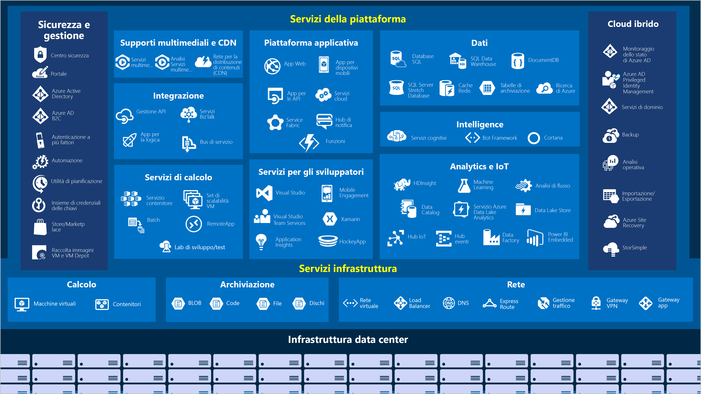
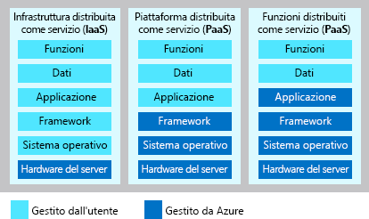

Microsoft Azure è un set di servizi cloud in continua espansione che consente alle organizzazioni di rispondere alle sfide aziendali attuali e future.Microsoft Azure is a continually expanding set of cloud services that help your organization meet your current and future business challenges. Azure offre la libertà di creare, gestire e distribuire applicazioni in un'ampia rete globale usando gli strumenti e i framework preferiti.Azure gives you the freedom to build, manage, and deploy applications on a massive global network using your favorite tools and frameworks. Di seguito viene fornita una rapida panoramica dei principali servizi offerti da Azure.Let's take a quick tour of the high-level services Azure offers.

#### Azure: quadro generaleAzure: the big picture

> [!VIDEO https://www.microsoft.com/videoplayer/embed/RE2yuas]

## Servizi di AzureAzure services

Azure offre un'ampia gamma di servizi basati sul cloud, introducendo ogni mese funzionalità sempre nuove e migliorate.Azure provides a vast range of cloud-based services, with features added and enhanced every month. 

Di seguito sono illustrate in dettaglio alcune delle funzionalità più diffuse:Let's take a closer look at a few of the more commonly-used features: 

- CalcoloCompute
- ReteNetworking
- ArchiviazioneStorage
- Dispositivi mobiliMobile
- DatabaseDatabases
- WebWeb

### CalcoloCompute

I servizi di calcolo sono uno dei motivi principali per cui le aziende passano alla piattaforma Azure.Compute services are one of the primary reasons why companies move to the Azure platform. Azure offre una gamma di opzioni per ospitare applicazioni e servizi, tra cui:Azure provides a range of options for hosting applications and services including:

Di seguito sono riportati alcuni esempi di IaaS, PaaS e FaaS in Azure.Here are some examples of IaaS, PaaS, and FaaS in Azure.

|  TipoType  |  Nome del servizioService name             | Funzione del servizioService function                                                         |
|--------|---------------------------|--------------------------------------------------------------------------|
| IaaSIaaS   | Macchine virtuali di AzureAzure Virtual Machines    | Macchine virtuali Windows o Linux ospitate in AzureWindows or Linux virtual machines (VMs) hosted in Azure                  | 
| IaaSIaaS   | Azure Kubernetes ServiceAzure Kubernetes Service  | Consente la gestione di un cluster di macchine virtuali che eseguono servizi basati su contenitoreEnables management of a cluster of VMs that run containerized services   |
| PaaSPaaS   | Azure Service FabricAzure Service Fabric      | Piattaforma di sistemi distribuiti,Distributed systems platform. eseguita in Azure o in localeRuns in Azure or on-premises               |
| PaaSPaaS   | Azure BatchAzure Batch               | Servizio gestito per applicazioni di calcolo parallele ad alte prestazioniManaged service for parallel and high-performance computing applications |
| PaaSPaaS   | Servizi cloud di AzureAzure Cloud Services      | Servizio gestito per l'esecuzione di applicazioni cloudManaged service for running cloud applications                           |
| FaaSFaaS   | Istanze di contenitore di AzureAzure Container Instances | Rende disponibili contenitori senza che siano necessari servizi di provisioning di macchine virtuali o di livello superioreProvides containers without requiring VM provision or higher services    |
| FaaSFaaS   | Funzioni di AzureAzure Functions           | Servizio FaaS gestitoManaged FaaS service                                                     |

### ReteNetworking

La funzione principale dei servizi di rete di Azure è quella di collegare le risorse di calcolo e fornire l'accesso alle applicazioni.Linking compute resources and providing access to applications is the key function of Azure networking. I servizi di rete di Azure includono una gamma di opzioni per connettere il mondo esterno ai servizi e alle funzionalità nei data center globali di Microsoft Azure.Networking functionality in Azure includes a range of options to connect the outside world to services and features in the global Microsoft Azure datacenters.

Di seguito sono illustrate le caratteristiche dei servizi di rete di Azure:Azure networking facilities have the following features:

|  Nome del servizioService name             | Funzione del servizioService function                                                                     |
| -------------             | -------------                                                                        |
| Rete virtuale di AzureAzure Virtual Network     | Connette le macchine virtuali alle connessioni di rete privata virtuale (VPN) in ingressoConnects VMs to incoming Virtual Private Network (VPN) connections                   |
| Azure Load BalancerAzure Load Balancer       | Bilancia le connessioni in ingresso e in uscita ad applicazioni o endpoint di servizioBalances inbound and outbound connections to applications or service endpoints       |
| Gateway applicazione di AzureAzure Application Gateway | Ottimizza il recapito alle farm di server app aumentando al tempo stesso la sicurezza delle applicazioniOptimizes app server farm delivery while increasing application security             |
| Gateway VPN di AzureAzure VPN Gateway         | Accede a Reti virtuali di Azure attraverso gateway VPN ad alte prestazioniAccesses Azure Virtual Networks through high-performance VPN gateways                |
| DNS di AzureAzure DNS                 | Consente risposte DNS eccezionalmente rapide e altissimi livelli di disponibilità dei dominiProvides ultra-fast DNS responses and ultra-high domain availability                 |
| Rete per la distribuzione di contenuti di AzureAzure Content Delivery Network  | Distribuisce contenuti con requisiti di larghezza di banda elevata a clienti a livello globaleDelivers high-bandwidth content to customers globally                          |
| Protezione DDoS di AzureAzure DDoS Protection     | Protegge le applicazioni ospitate da Azure da eventuali attacchi di tipo DDoS (Distributed Denial of Service)Protects Azure-hosted applications from distributed denial of service (DDOS) attacks |
| Gestione traffico di AzureAzure Traffic Manager     | Distribuisce il traffico di rete tra le aree di Azure a livello mondialeDistributes network traffic across Azure regions worldwide                           |
| Azure ExpressRouteAzure ExpressRoute        | Si connette ad Azure usando connessioni sicure dedicate a larghezza di banda elevataConnects to Azure over high-bandwidth dedicated secure connections                   |
| Azure Network WatcherAzure Network Watcher     | Monitora e diagnostica i problemi di rete con l'analisi basata su scenarioMonitors and diagnoses network issues using scenario-based analysis                  |
| Firewall di AzureAzure Firewall            | Implementa un firewall con livelli elevati di sicurezza e disponibilità e con scalabilità illimitataImplements high-security, high-availability firewall with unlimited scalability      |
| Rete WAN virtuale di AzureAzure Virtual WAN         | Crea una rete WAN unificata per la connessione di siti locali e remotiCreates a unified wide area network (WAN), connecting local and remote sites         |

### ArchiviazioneStorage

Azure offre quattro tipi principali di servizi di archiviazione.Azure provides four main types of storage services. I servizi includono:These services are:

- **Archiviazione BLOB di Azure**: fornisce risorse di archiviazione per oggetti di dimensioni molto grandi, ad esempio file video o bitmap**Azure Blob storage** - provides storage for very large objects, such as video files or bitmaps
- **Archiviazione file di Azure**: consente di creare condivisioni file accessibili e gestibili come un file server**Azure File storage** - creates file shares that you can access and manage like a file server
- **Archiviazione code di Azure**: implementa un archivio per l'accodamento e il recapito affidabile dei messaggi tra le applicazioni**Azure Queue storage** - implements a store for queuing and reliably delivering messages between applications
- **Archiviazione tabelle di Azure**: consiste in un archivio NoSLQ che ospita dati non strutturati, indipendenti da qualsiasi schema**Azure Table storage** - consists of a NoSQL store that hosts unstructured data independent of any schema

Ognuno di questi servizi condivide caratteristiche comuni, che comprendono:Each of these services shares common characteristics, which are:

- Durabilità e disponibilità elevata con ridondanza e replica.Durable and highly available with redundancy and replication.
- Sicurezza tramite crittografia automatica e controllo degli accessi in base al ruolo.Secure through automatic encryption and role-based access control.
- Scalabilità con archiviazione potenzialmente illimitata.Scalable with virtually unlimited storage.
- Gestibilità, con funzionalità automatiche per la manutenzione e la risoluzione di problemi critici.Managed, handling maintenance and any critical problems for you.
- Accessibilità da ogni parte del mondo tramite HTTP o HTTPS.Accessible from anywhere in the world over HTTP or HTTPS.

### Dispositivi mobiliMobile

Azure consente agli sviluppatori di creare app coinvolgenti per iOS, Android e Windows in modo semplice e rapido usando un'ampia gamma di linguaggi nell'ambiente di sviluppo preferito.Azure enables developers to create engaging iOS, Android, and Windows apps quickly and easily in a wide range of languages using their choice of development environment. Le funzionalità che in passato richiedevano tempo e aumentavano i rischi del progetto, come l'aggiunta di una procedura di accesso aziendale e la connessione a risorse locali quali SAP, Oracle, SQL Server e SharePoint, sono ora facili da includere.Features that used to take time and increase project risks, such as adding corporate sign-in and then connecting to on-premises resources such as SAP, Oracle, SQL Server, and SharePoint, are now simple to include.

Tra le altre caratteristiche di questo servizio sono incluse:Other features of this service include:

- Sincronizzazione dei dati offline.Offline data synchronization.
- Connettività ai dati locali.Connectivity to on-premises data.
- Trasmissione di notifiche push.Broadcasting push notifications.
- Scalabilità automatica in base alle esigenze aziendali.Autoscaling to match business needs.

### DatabaseDatabases

Azure offre più servizi di database per archiviare un'ampia gamma di volumi e tipi di dati.Azure provides multiple database services to store a wide variety of data types and volumes. Inoltre, grazie alla connettività globale, questi dati sono immediatamente disponibili agli utenti.And with global connectivity, this data is available to users instantly.

|  Nome del servizioService name              | Funzione del servizioService function                                                                                |
| -------------              | -------------                                                                                   |
| Azure Cosmos DBAzure Cosmos DB            | Database distribuito a livello globale che supporta opzioni NoSQLGlobally distributed database that supports NoSQL options                                       |
| Database SQL di AzureAzure SQL Database         | Database relazionale completamente gestito con scalabilità automatica, intelligenza integrata e sicurezza elevataFully managed relational database with auto-scale, integral intelligence, and robust security    |
| Database di Azure per MySQLAzure Database for MySQL   | Database relazionale MySQL completamente gestito e scalabile con livelli elevati di scalabilità e sicurezzaFully managed and scalable MySQL relational database with high availability and security        |
| Database di Azure per PostgreSQLAzure Database for PostgreSQL   | Database relazionale PostgreSQL completamente gestito e scalabile con livelli elevati di scalabilità e sicurezzaFully managed and scalable PostgreSQL relational database with high availability and security   |
| SQL Server in VMSQL Server on VMs          | Ospita app SQL Server aziendali nel cloudHost enterprise SQL Server apps in the cloud                                                    |
| Azure SQL Data WarehouseAzure SQL Data Warehouse   | Data warehouse completamente gestito con sicurezza integrata a ogni livello di scalabilità senza costi aggiuntiviFully managed data warehouse with integral security at every level of scale at no extra cost    |
| Servizio Migrazione del database di AzureAzure Database Migration Service    | Esegue la migrazione dei database nel cloud senza modifiche al codice delle applicazioniMigrates your databases to the cloud with no application code changes                  |
| Cache Redis di AzureAzure Redis Cache          | Memorizza nella cache i dati statici di uso frequente per ridurre la latenza dei dati e delle applicazioniCaches frequently used and static data to reduce data and application latency                   |
| Database di Azure per MariaDBAzure Database for MariaDB | Database relazionale MySQL completamente gestito e scalabile con livelli elevati di scalabilità e sicurezzaFully managed and scalable MySQL relational database with high availability and security        |

### WebWeb

I servizi Web di Azure includono le funzionalità seguenti:Web services in Azure include the following facilities:

| Nome del servizioService Name | DescrizioneDescription |
|--------------|-------------|
| Servizio app di AzureAzure App Service | Consente di creare rapidamente app cloud potenti per il Web e i dispositivi mobili.Quickly create powerful cloud apps for web and mobile. |
| Hub di notifica di AzureAzure Notification Hubs |Consente di inviare notifiche push a qualsiasi piattaforma da qualsiasi back-end.Send push notifications to any platform from any back end. |
| Gestione API di AzureAzure API Management | Consente di pubblicare API per sviluppatori, partner e dipendenti in modo sicuro e scalabile.Publish APIs to developers, partners, and employees securely and at scale. |
| Ricerca di AzureAzure Search | Offre un servizio di ricerca completamente gestito.Fully managed search as a service. |
| Funzionalità App Web del servizio app di AzureWeb Apps feature of Azure App Service | Consente di creare e distribuire app Web di importanza strategica su vasta scala.Create and deploy mission-critical web apps at scale. |
| Servizio Azure SignalRAzure SignalR Service | Consente di aggiungere facilmente funzionalità Web in tempo reale.Add real-time web functionalities easily. |

Ora che sono state identificate alcune delle aree che possono risultare interessanti per un'azienda che intenda eseguire la migrazione ad Azure verrà illustrato come usare i servizi e le funzionalità.Now that we've identified some of the areas that might interest a company looking to migrate to Azure let's look at what it takes to use the services and features.
