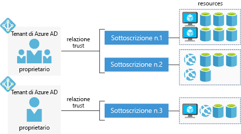

Con un account Azure gratuito, è possibile compilare, testare e Distribuisci applicazioni aziendali, creare esperienze per dispositivi mobili e web personalizzato e ottenere informazioni dettagliate dai tuoi dati tramite machine learning e potente analitica.

## Che cos'è un account Azure?

Un' _account Azure_ è associato a un'identità specifica e contiene informazioni come:

- Nome, indirizzo di posta elettronica e preferenze di contatto
- Informazioni di fatturazione, ad esempio una carta di credito

Un account di Azure è associato a un altro _sottoscrizioni_.

## Informazioni sulla sottoscrizione di Azure

Un' _sottoscrizione di Azure_ è un contenitore logico per il provisioning delle risorse in Microsoft Azure. Contiene i dettagli di tutte le risorse, ad esempio le macchine virtuali, database e così via. Include anche una relazione di trust a un singolo di Azure AD _tenant_ che viene usato per autenticare gli utenti e ruoli per le risorse mantenute attive nella sottoscrizione.

La fatturazione si verifica a livello di sottoscrizione. È possibile impostare i limiti di spesa per ogni sottoscrizione per assicurarsi che non è sorprendente alla fine del mese. 

## Che cos'è un tenant di Azure AD?

Azure Active Directory (Azure Active Directory) è un provider di identità moderna che supporta più protocolli di autenticazione per proteggere le applicazioni e servizi nel cloud. Dispone _non_ identico Windows Active Directory, che è incentrato sulla protezione di Windows desktop e server. Al contrario, Azure AD è tutto sugli standard di autenticazione basata su web, ad esempio OpenID e OAuth.

Un singolo tenant rappresenta un'organizzazione logica e consente più identità accedere e usare le risorse protette da tale tenant. Sempre una sottoscrizione di Azure ha una relazione di trust con un _singolo_ tenant di Azure AD, ma _più_ sottoscrizioni possono condividere un singolo tenant. Questa struttura consente all'organizzazione di gestire più sottoscrizioni e impostare le regole di sicurezza in tutte le risorse contenute al loro interno.

Ecco una semplice rappresentazione dell'account, sottoscrizioni, i tenant e le risorse.

Si noti che ogni tenant di Azure AD ha un _proprietario dell'account_. Si tratta dell'account di Azure originale che è responsabile della fatturazione. È possibile aggiungere altri utenti nel tenant e persino invitare utenti guest dagli altri tenant di Azure AD di accedere alle risorse nelle sottoscrizioni.

## Tipi di account Azure

Azure offre diversi tipi di account che soddisfa le esigenze di diversi tipi di clienti. Gli account usati più di frequente sono:

- Gratuito
- Pagamento in base al consumo
- Contratto Enterprise

### Account Azure gratuito

Un account Azure gratuito include **€ 170 di credito** da spendere nei primi 30 giorni, l'accesso gratuito ai prodotti di Azure più diffusi per 12 mesi e l'accesso a più di 25 prodotti che sono sempre gratuiti. Questo è un modo eccellente per iniziare a usare i nuovi utenti. Per configurare un account gratuito sono necessari un numero di telefono, una carta di credito e un account Microsoft.

> [!NOTE]
> Informazioni di carta di credito vengono usate per la verifica dell'identità solo. Non ricevere addebiti per tutti i servizi, fino a quando non si esegue l'aggiornamento.

### Account Azure con pagamento in base al consumo

Un account con pagamento in base al consumo (PAYG) prevede la fatturazione mensile per i servizi usati. Questo tipo di account è adatto a un'ampia gamma di utenti, dai singoli utenti alle aziende di piccole dimensioni fino alle organizzazioni molto grandi.

### Contratto Enterprise per Azure

Un contratto Enterprise offre la flessibilità necessaria per acquistare servizi cloud e licenze software in base a un unico contratto con sconti per nuove licenze e Software Assurance. È destinato alle organizzazioni di livello aziendale.

## Riepilogo

Singoli utenti, aziende di piccole dimensioni o grandi organizzazioni, devono tutti disporre di un account per poter usare i servizi di Azure. La sequenza tipica consiste nell'iniziare con un account gratuito in modo che è possibile valutare i servizi di Azure. Al termine del periodo di valutazione, si convertirà l'account gratuito in un account con pagamento in base al consumo.